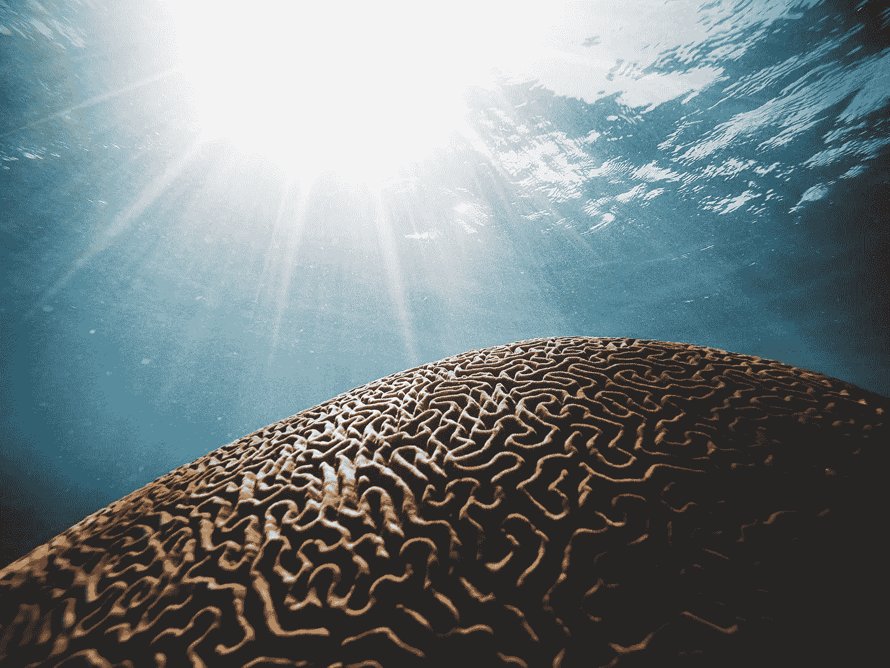

# 对你大脑的简短教育

> 原文：<https://medium.com/swlh/a-brief-education-on-your-brain-e27347e464cb>

## 和一些可能会出错的事情

Photo by [Daniel Hjalmarsson](https://unsplash.com/@artic_studios?utm_source=unsplash&utm_medium=referral&utm_content=creditCopyText) on [Unsplash](https://unsplash.com/search/photos/brain?utm_source=unsplash&utm_medium=referral&utm_content=creditCopyText)

你有没有想过你的思想住在哪里？他们称之为家的地方是哪里？

当你阅读时，你是如何处理信息的？当你打字时，你对指尖下的按键感觉如何？