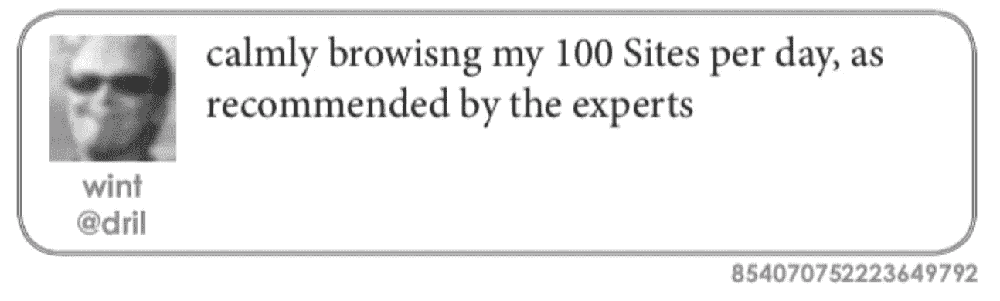

# 互联网文化简史以及一切是如何变得荒谬的

> 原文：<https://medium.com/swlh/a-brief-history-of-internet-culture-and-how-everything-became-absurd-6af862e71c94>

没有办法完全解释互联网文化，因为没有单一的文化。不管怎样，总有人会说这个解释太讽刺或者太严肃或者不完整或者太愚蠢。那么这有什么意义呢？关键是，网络深处发生的事情每年都在现实生活中产生更多的后果，而普通人几乎没有框架…