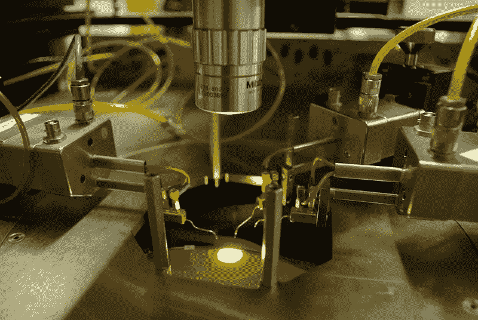

# 一瞥侧信道攻击的迷人世界

> 原文：<https://medium.com/swlh/a-brief-peek-into-the-fascinating-world-of-side-channel-attacks-809f96eabea1>

作为工程师，我们经常需要考虑数据隐私和安全问题。曾经是间谍和政府专属的旁门左道攻击，对于资金不足的攻击者来说，变得越来越可能。设计方法来防止这些攻击，同时仍然有一个可用的设备是具有挑战性的，特别是考虑到一系列有趣的方式，数据安全…