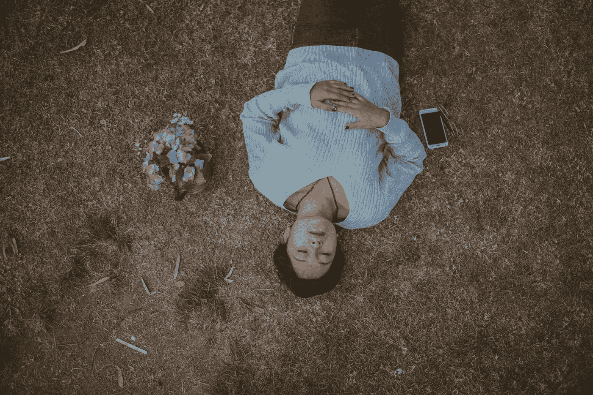

# 正午 Savasana 的一个案例

> 原文：<https://medium.com/swlh/a-case-for-the-midday-savasana-65059b10396d>

Photo by [Cristian Newman](https://unsplash.com/@cristian_newman?utm_source=medium&utm_medium=referral) on [Unsplash](https://unsplash.com?utm_source=medium&utm_medium=referral)

瑜伽是让心灵进入宁静。当头脑安定下来，我们就建立在我们的本质中，那就是无边界的意识。我们的本质通常被头脑的活动所掩盖。”—帕坦加利

*Savasana* :瑜伽姿势致力于放松肌肉后的身体，瑜伽课上的时间用于休息。这是一种有意识的放松，一种主动的不活动，肌肉放松，大脑让思想被动地流动，同时检查它所束缚的身体。

这个体式是大多数瑜伽课程的点睛之笔。瑜伽练习者扫描他们的身体，寻找练习中残留的肌肉活动，一旦发现就有意识地停止。然后，在剩下的体式中，所有对意识、呼吸和身体的控制都被放弃了。这样做的目的是消除任何释放一天压力的心理努力。

这听起来像是我们都可以使用的东西，因为我们在办公桌前收缩我们的臀部屈肌，弓着身子坐在电脑前紧张我们的颈部肌肉，让思想像一场猛烈的风暴一样在我们的脑海中驰骋。身心的完全放松可以作为一天中最完美的重置，这种好处只会随着练习而增加。这种静止的时间不需要局限于瑜伽馆，甚至是家里的舒适。正午*的 savasana* 在任何时候任何环境下都是有益的。

在我的生活中，有很多次后退一步放松让我从放弃的边缘回来。填写求职申请表时，沮丧的话语在我脑海中盘旋，直到它们脱离我的控制。你的简历不够有力；您的应用程序可以更好；你忘了强调这个特征或者那个经历。我的身体开始弓起，直到我几乎折成两半。我绝望了，找工作永远不会结束。

坐下来，哪怕只是一分钟，让我的呼吸平稳下来，集中精力放松我的肌肉，就足以平息负面思想的风暴，让我准备好继续应用程序。我坐得更直，深呼吸，更好地专注于手头的任务。

Savasana ，或者说尸体姿势，是身体上最容易达到的瑜伽姿势之一。在最纯粹的形式中， *savasana* 是仰卧着进行的，双腿张开与瑜伽垫一样宽，手臂放松在身体两侧。瑜伽教练经常建议其他的变化，比如把腿靠在墙上，或者用垫子或其他支撑物支撑膝盖。重要的不是四肢的具体位置，而是身体能够*完全放松*。坐在有头枕的椅子上也能达到预期的效果。

这种放松时间在有组织的瑜伽课上只持续 5 到 10 分钟，它不仅促进了主要肌肉群的脱离，还促进了面部小肌肉的紧张:那些将嘴巴周围的肌肉拉成皱眉头的肌肉，或者那些挤压或扬起眉毛的肌肉。当专注于其他事情时，很容易忽略这些肌肉正在紧张地工作。休息让你有机会从上颚释放舌头，让下巴放松。

当我在演讲或去面试前喝了一点咖啡因，肾上腺素激增时，这个技巧很有帮助。我紧张得几乎要从椅子上飞起来，排练过的词在我脑海中飞快地闪过，速度比我说出来的速度还要快。中午的 savasana 降低了我的心率，让我头脑清醒，让我平静下来，整理思绪。

虽然很容易在身体上完成，*萨瓦萨纳*据说是最难掌握的体式之一。能够专注于研究身体，然后完全放下所有的努力和有意识的思考(不要睡着)，对我来说极具挑战性。当有片刻的自由时，我的思绪会立刻跳回当天的事件。像几乎所有的事情一样，这随着练习而提高，每天这样做可以加速进步。

把 *savasana* 和瑜伽作为一个整体，作为你日常生活的一部分，训练你的头脑变得*灵活，*因为它能够迅速地从努力的时期转换到休息和平静的时期。这种有意识地放松身体和放下思想的技巧促进了压力和紧张的释放，以鼓励清晰和专注。午间休息是朝着与你的身体建立关系、更加意识到你自己的需求以及建立一个非常需要的自我保健的日常生活迈出的一小步。

考虑到这一点，花点时间休息一下。

***Lindsey hilt ner****是一位作家、思想家，也是哲学、个人成长、自我和其他主题的居住者。她于 2018 年毕业于明尼苏达大学，获得数学博士学位。在*[*lindseyhiltner.com*](http://lindseyhiltner.com)找到她。