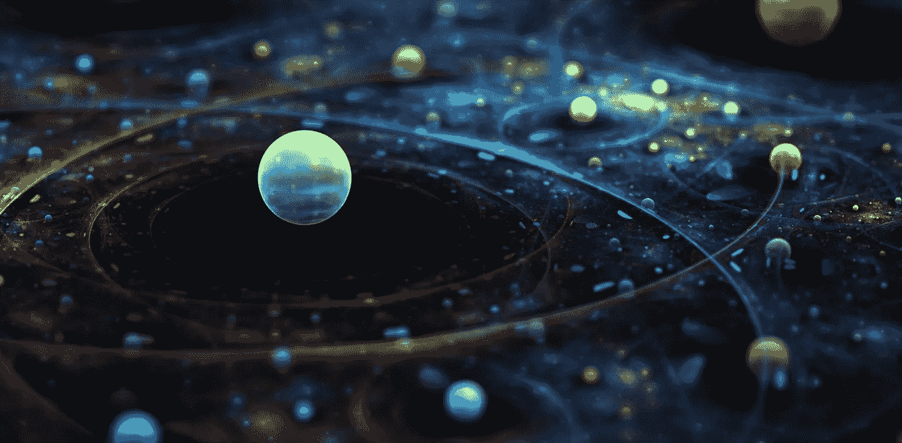

# 广义相对论的一个世纪。第一部分:历史和直觉

> 原文：<https://medium.com/swlh/a-century-of-general-relativity-part-i-history-and-intuition-27bf0c85535a>

F 或者说 2000 年以来，从科学时代开始，从佛经到亚里斯多德的发明再到牛顿理论，**时空**被视为一个背景或者说是一个事情发生的舞台。这部戏剧的演员是行星、恒星、电磁场、你和我。但是随着 [**爱因斯坦的广义相对论**](https://en.wikipedia.org/wiki/General_relativity) 的出现，时空加入了…