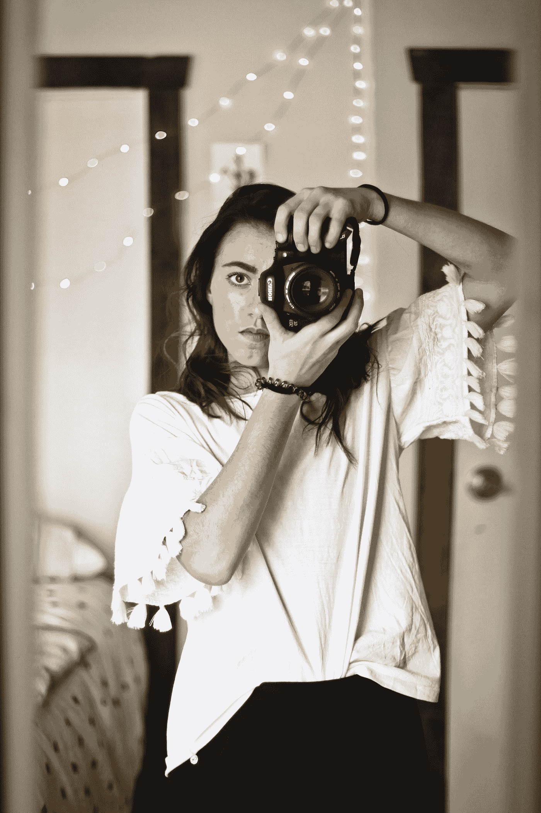

# 一个全面的资源集合，让你成为最好的自己

> 原文：<https://medium.com/swlh/a-comprehensive-collection-of-resources-to-make-you-the-best-possible-version-of-yourself-ee9fb13db3c>

## 通过思考、引导和感觉更好，你会成为最好的人

Photo by [Noémi Macavei-Katócz](https://unsplash.com/@noemiphotography?utm_source=medium&utm_medium=referral) on [Unsplash](https://unsplash.com?utm_source=medium&utm_medium=referral)

我被这个问题迷住了，“还有什么？”

我还能做什么才能真正学会？

*我还能做什么来真实地思考？*

*我还能做些什么来真正地生活？*

在我在这个地球上的第 24 年，也是我迄今为止最好的一年，我认为应该分享一些我学到的故事、想法、演讲和教训，以确保我将继续成长和茁壮。

下面的想法是具体可行的，值得阅读、观看、聆听和实践，这样你就能从今天开始改善自己和他人！

# 更好地思考

这是我写作的主要原因之一。我不仅想通过开动我的大脑来更好地思考，写清楚、简洁的故事来增加价值，而且，我想让读者通过阅读实际上允许他们思考的文章来更好地思考！我希望读者能形成自己的观点，对这个世界和我们经常听到的事情有不同的看法，而不是只看表面。

要更好地思考，请尝试:

## 1.注意

马丁·塞利格曼的 TEDx 演讲关于积极心理学，以及为什么行业专业人士和公众对心理学和心理健康的看法需要改变。

心理学不应该只关注“修复”病态的心理。作为一个社会，我们必须以不同的方式思考如何对待所有人。如果我们也致力于培养社会中最优秀、最聪明的人，那么我们都会过得更好。这是这里的主要论点。

为了更好地思考，你总是想考虑每个故事的不同方面。这个演讲就是一个很好的例子。

**认为更好的分数:9/10**

## 2.(演奏等的)表现，风格；(乐曲)演奏

Lumosity 等网站上的脑力游戏。

 [## 大脑游戏和大脑训练——发光

### 发现你的大脑能做什么。使用排名第一的大脑训练应用程序，提高记忆力，增加注意力，找到平静。获得…

www.lumosity.com](https://www.lumosity.com/) 

大脑游戏被强烈推荐用于痴呆症和阿尔茨海默氏症的预防，因为它们能让你保持思维敏捷，让你的思维变得更加流畅。我们的思想越流畅，我们最终会想得越好！

**认为更好的分数:7/10**

## 3.解释

或者创作故事，用抽象的方式表达简单的想法。

 [## 看似平凡的任务的重要性，以及为什么我们永远不应该忽视它们

### 一个关于个人成长问题的创意故事

medium.com](/swlh/the-importance-of-seemingly-mundane-tasks-and-why-we-should-never-overlook-them-2abb16967400) 

我已经开始爱读关于个人成长和发展理念的虚构故事，这样我就可以解读和定义自己的外卖。它给我带来了新的想法和联系，否则我永远也不会有这样的想法和联系。

当我们不把信息视为理所当然时，我们的大脑会更加努力地创造对我们最有价值的见解和结论。这提高了我们的智力和能力。

**认为更好的分数:9/10**

# 感觉好些

简而言之，我写作和分享是为了让人们感觉良好。感觉很好，失陪了。无论是身体上还是精神上，我所推动、做和工作的几乎每件事都关注于他人如何开辟自己的道路，感受并做到最好。

有很多方法可以让你感觉更好，但我最喜欢的几种方法是尝试一下:

## 4.吃

更胖！在潜入之前仔细阅读和理解这个过程，但是它是奇妙的！

 [## 吃胖，变瘦？医生在 21 天内重塑健康的方法

### 我测试了马克·海曼博士在《纽约时报》畅销书中提出的策略，下面是结果

hackernoon.com](https://hackernoon.com/eat-fat-get-thin-a-physicians-approach-to-reinventing-your-health-in-21-days-541d8ae6fde) 

吃胖，变瘦？似乎值得一试！当我们有高碳水化合物饮食时，身体开始消耗燃烧的脂肪，而不是储存多余的糖。你的身体，尤其是你的内脏会感谢你的！

**感觉更好得分:8/10**

## 5.创造

早晨的例行公事。

 [## 成为一个讨厌的早起的人的秘密

### 我曾多次被指责为“那些烦人的高效率的早起者之一”在那里的时候…

medium.com](/swlh/the-secret-to-becoming-an-annoyingly-productive-early-morning-person-746c9817e983) 

每天早上持续的生产力会让你每天都过得更好、更光明。[尼克·维格纳尔](https://medium.com/u/857388aceb0e?source=post_page-----ee9fb13db3c--------------------------------)，媒介领域最优秀的作家之一，向我们展示了这一点。

**感觉更好得分:8/10**

## 6.包含

不适。尝试让你走出舒适区的新体验。

 [## 通过做这 10 件事来扩大你的舒适区

### 2.坚持每周接触一个新的人

medium.com](/the-post-grad-survival-guide/expand-your-comfort-zone-by-doing-these-10-things-241ff8ffbdb1) 

迈克尔·汤普森为如何开始扩大你的舒适区提供了一个很好的指导。一旦你这样做了，你就会对那些真正带给你目标和满足感的经历产生一种自信和意识。

**感觉更好得分:9/10**

# 更好地领导

前 Godiva 品牌副总裁 Rich Keller 使用他的 S.C.O.R.E .方法和独特的品牌经验，用一个词来定义人们。他告诉我，我的词是“开拓者”，因为我的使命不仅是在我自己的生活中开辟新的道路，而且，我也希望帮助其他人到达未探索的领域。

我希望做到这一点的方法之一是向他人展示有效领导的价值，并向人们展示无论我们的正式头衔如何，我们都是领导者。

因此，要开拓自己的道路，成为更好的领导者，请尝试:

## 7.注意

Drew Dudley 关于日常领导力的 TEDx 演讲。

这是我们所做的一切对某人都很重要的真实写照。无论你是大机构的 CEO，还是图腾柱上最底层的人，你都可以有所作为。这种榜样也会引导你周围的人追求更好。

**领先更好比分:8/10**

## 8.聊天

成功的领导者。

 [## Eric Koester 在 LinkedIn 上写道:“找到合理的借口和你欣赏的人交谈。“很多人…

### 2018 年 11 月 13 日:埃里克·科斯特在 LinkedIn 上发帖

www.linkedin.com](https://www.linkedin.com/feed/update/urn:li:activity:6468172476961603584) 

[Justin Lafazan](https://medium.com/u/27efd60862b7?source=post_page-----ee9fb13db3c--------------------------------),[次世代峰会](https://medium.com/u/55d9e864b626?source=post_page-----ee9fb13db3c--------------------------------)的联合创始人兼首席执行官，向 [Eric Koester](https://medium.com/u/f7c3bcad26c6?source=post_page-----ee9fb13db3c--------------------------------) 解释了他是如何通过简单的接触就与数百名福布斯 30 岁以下的领导人通了电话！

最好的学习方法是听。

**领先更好分数:8/10**

## 9.谅解

马歇尔·戈德史密斯的领导方法。

 [## 根据世界排名第一的执行领导力蔻驰，如何提高你的领导技能

### 利用马歇尔·戈德史密斯以利益相关者为中心的辅导提高领导能力

medium.com](/swlh/how-to-improve-your-leadership-skills-according-to-the-worlds-1-executive-leadership-coach-b6fefec081d1) 

有许多不同的领导方法，但关注直接受负责人领导影响的人的反馈是我听到和实施的最重要的策略之一。

通过遵循这种实践，你时刻都在接受“前馈”,这最大化了学习和发展的机会。

**领先更好分数:9/10**

# 变得更好

想法是伟大的，但直到我们在日常生活中检验它们，我们才能从我们得到的洞察力中获益。我敦促人们思考得更好、感觉更好、领导得更好的总体目标是，我希望各地的人们都变得更好。

要做得更好，请尝试:

## 10.自愿参军

在当地组织。

 [## 列出当地志愿服务机会的网站

### 编辑描述

www.coyotecommunications.com](http://www.coyotecommunications.com/stuff/volunteeringsites.shtml) 

没有什么比回馈那些不幸的人更有意义和重要的了。在这个世界上，我们都有更高的目标感，为社会做出更大的贡献是让他人和自己感觉更好的一种方式。

**变得更好得分:10/10**

## 11.讲话

给一个无家可归的人。

 [## 我问 6 个无家可归的人“你一天中最快乐的部分是什么？”

### 我问 6 个无家可归的人“你一天中最快乐的部分是什么？”这些答案让我热泪盈眶

byrslf.co](https://byrslf.co/i-asked-6-homeless-people-what-is-the-happiest-part-of-your-day-7217e50633a7) 

你最常发现的是，听比说更重要。倾听和理解让你在任何情况下都能形成合适的心态，从长远来看，这将产生巨大的影响。

**做得更好分数:10/10**

## 12.反射的

到目前为止的一年里。理解好的、坏的和丑陋的。

 [## 为了成为一个更好的人，我放弃了 9 个习惯

### 让明天变得比今天更好

byrslf.co](https://byrslf.co/9-habits-i-dropped-to-become-a-better-person-e3782dc18a7b) 

自我反省是转变的关键。直到我们意识到我们可以做些什么来改善，我们将保持静止。花点时间评估你是谁，你想成为谁。这将让你清楚自己应该和想要的感受。

**做得更好分数:10/10**

# 最后的想法

> “舒适是进步的敌人”
> 
> -巴努姆角

如果我们不努力想得更好，感觉更好，领导得更好，那我们怎么会变得更好呢？

安逸和自满是阻碍人们发挥其真正潜力的心态。太多时候，我们会偏离正题，陷入困境，满足于现状。这就是我们保持平均水平的方法。

但是，如果你承诺要改进，如果你有意识地努力自我评估并改变自己，那么你就会变得优秀。

谢谢你抽出时间。知道自己是有价值的，你才能成为自己一直想成为的人。

**更多关于爱情和幸福的美丽故事，请看**[**https://www.journeytocloudnine.com/**](https://www.journeytocloudnine.com/)

## 这篇文章发表在 [The Startup](https://medium.com/swlh) 上，这是 Medium 最大的创业刊物，拥有+428，678 名读者。

## 在此订阅接收[我们的头条新闻](https://growthsupply.com/the-startup-newsletter/)。

