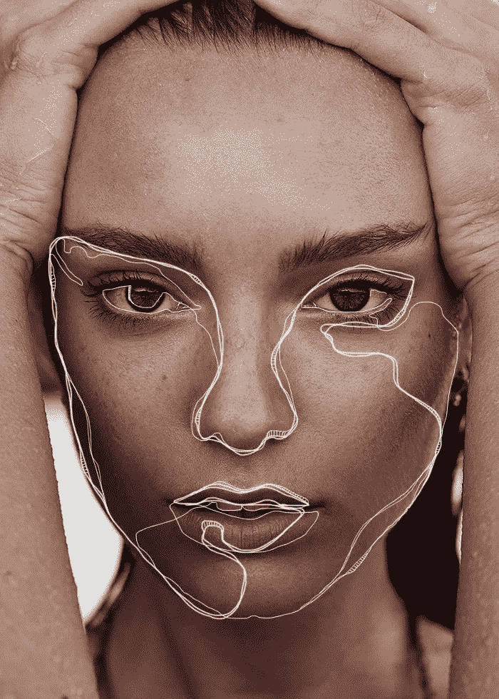

# 与数码艺术家艾玛·雷戈利尼的对话

> 原文：<https://medium.com/swlh/a-conversation-with-emma-regolini-digital-artist-bcf0f9ee1b92>

Photo by [Emma Regolini](https://www.instagram.com/theline_/)

Emma Regolini 是一位数字艺术家，她用简洁的线条来增强美丽的图像和照片。她的案例研究探索了对在线媒体消费和行为的理解。她的作品曾出现在*《时尚芭莎》、*《T2》、《Elle》和*《魅力》杂志*。她的客户包括[摩纳哥俱乐部](https://www.clubmonaco.com/)、[土坯](https://www.adobe.com/)、[纽约的 chill house](https://chillhouse.com/)、 [Bower 泳装](https://chillhouse.com/)等等。在这个鼓舞人心的采访中，艾玛与我们分享了她是如何…