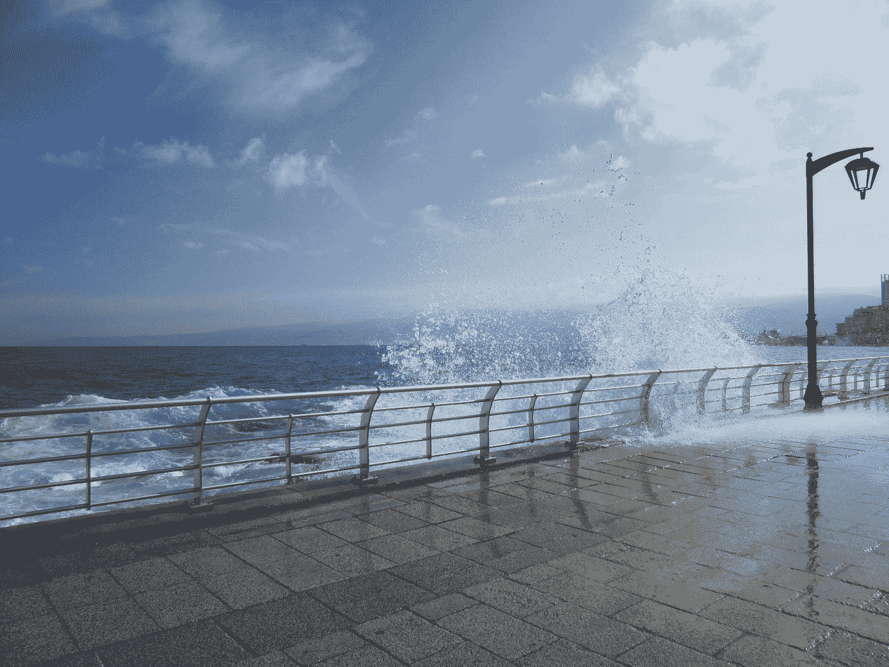

# 与黎巴嫩的对话

> 原文：<https://medium.com/swlh/a-conversation-with-lebanon-631881fba759>

黎巴嫩，我失去的家，仍然存在的家。我渴望的快乐之地在我的内心深处不停地燃烧，被我知道一旦我们再次见面就会涌入我体内的愤怒所抑制。

Photo by [Abbass Zahreddine](https://unsplash.com/@abbass?utm_source=medium&utm_medium=referral) on [Unsplash](https://unsplash.com?utm_source=medium&utm_medium=referral)

亲爱的黎巴嫩，我希望你能收到这封信。*(不，不，不，用那个刮擦，揉皱，然后扔进垃圾箱——当然，这是比喻，因为那是微软的垃圾箱)*。谁开始写一封信…