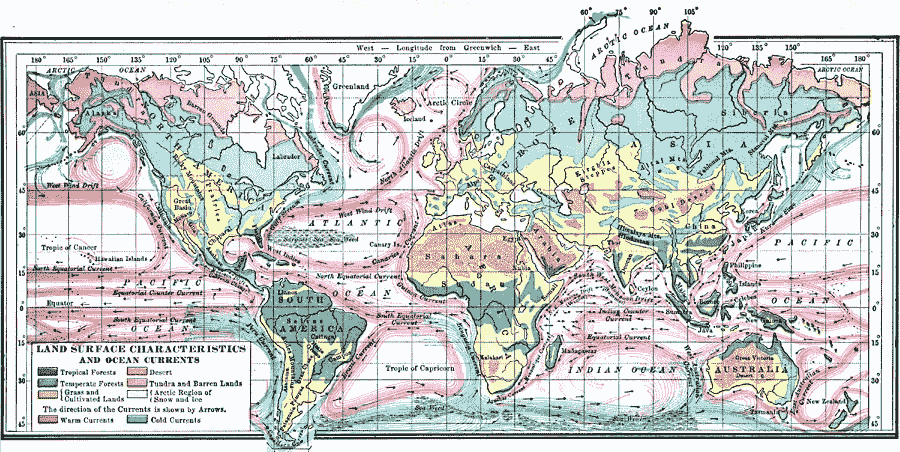

# 导师文化

> 原文：<https://medium.com/swlh/a-culture-of-mentorship-85f9dd63aabb>

这是一个新世界。

越来越多的……恰当地……“导师制”正成为讨论、渴望和推荐的主题，而且，我认为，它正被视为健康、不断发展和演变的商业文化等式中的一种重要资源。

过去，“……找一个好的导师……”或多或少是我们进入商界时给年轻人的标准建议。查找…