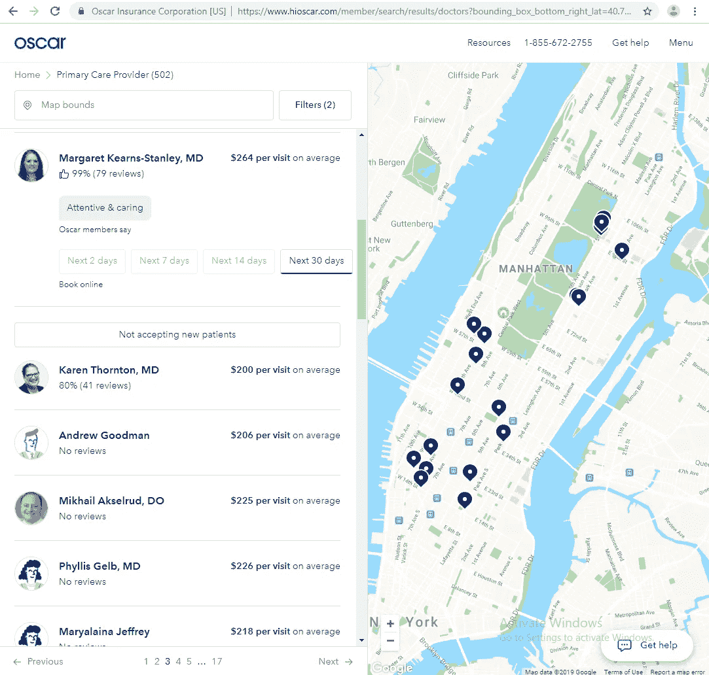

# 选择医生的数据科学方法

> 原文：<https://medium.com/swlh/a-data-science-approach-to-choosing-a-physician-1e22e2894c61>

## [现实世界中的数据科学](https://towardsdatascience.com/tagged/ds-in-the-real-world)

我的医生很棒，*很棒，*因为我搬家了。或者他搬走了。或者我的工作改变了健康保险，他不再被保险了。或者他退休了，开了一辆快餐车，收养了六只贵宾犬——反正为什么不重要——我需要找一个新的医生。

