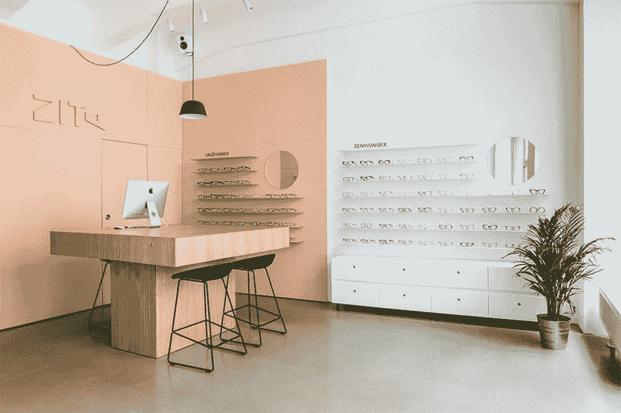
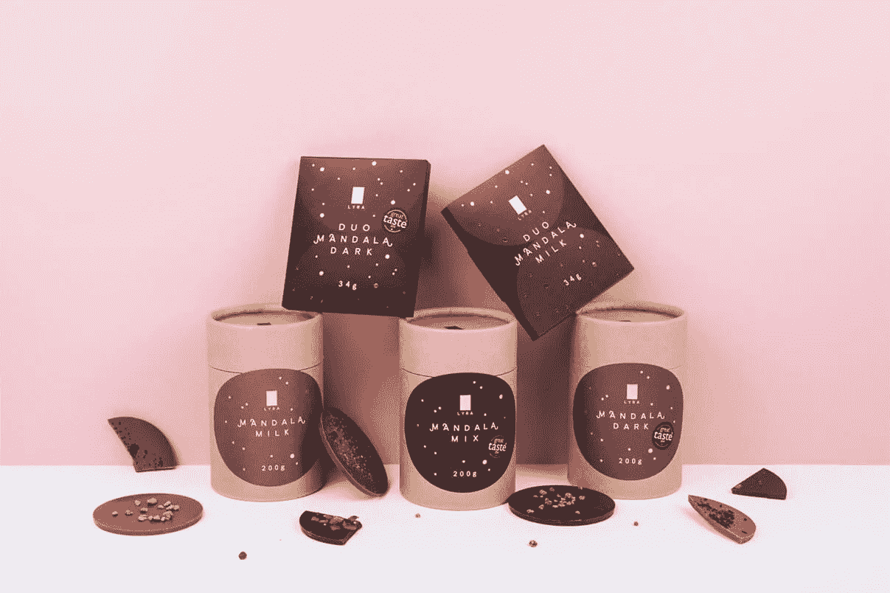

# 可靠的创意专家

> 原文：<https://medium.com/swlh/a-dependable-creative-professional-70767e55aae9>

## 一个梦？

挑战全球设计潮流的设计师？

提供客户服务比代理机构更好的人？

拥有超过 10 000 小时工作经验的世界级设计专家？

迈克尔出场了，他是斯洛伐克真正的自由职业者之一。和他一起工作并向他学习是我的荣幸。

当我们第一次见面时，他分享了一个被反复证明是正确的想法。他说和你的客户交朋友比和你的朋友做生意更好。

> 和你的客户交朋友比和客户交朋友要好。

他的专长是企业形象和包装，但他不回避任何创造性的挑战。

他是关键人物。他超出了你的要求。那很冒险。这需要勇气、毅力和纪律。因为大多数想法都行不通。但是，如果你愿意超越这个范围，你会找到有用的想法。

你不知道你在寻找的想法。吸引[人](https://www.packagingoftheworld.com/2016/03/cualli-xocolatl.html)并赢得[奖项](https://ncd2018.tumblr.com/post/178444628031/na%C5%A1a-lyra-michal-slov%C3%A1k-3-miesto-kateg%C3%B3ria)的解决方案。

在我作为客户和合作者的经历中，我亲眼目睹了这一点。他有一个真正的艺术创作过程，他不会把它放在你的肩膀上。你没看到，但他在流汗。

> 大多数想法都是坏主意。

你看不到是因为他是真正的职业球员。他在最后期限前完成任务，他是可接近的，并且是忠诚的。

他正在努力实现这一目标，即使这意味着他的大部分工作将付之东流。我亲眼见过他搁置多个项目，只是为了帮助客户得到他们想要的东西。

我能绝对依靠的人不多。这家伙就是那种人。伸手[给他](https://michalslovak.com/)。

当我向我的网络分享评论时，我相信它是主动提供的个人内容。我总是很欣赏来自我的网络的好建议，所以我想这也能给你们增加价值。

如果你有什么要补充的，请联系我！

这篇文章发表在我在 martinuhnak.com 的博客上。感谢阅读。

如果你喜欢这篇文章，请点击下面的链接，加入我的圈子。我喜欢听取别人的意见，我会回复所有人。

[**报名信→**](https://mailchi.mp/a7d6819a370d/signupforletters)

## 这篇文章发表在[《创业](https://medium.com/swlh)》上，这是 Medium 最大的创业刊物，有+429，678 人关注。

## 在这里订阅接收[我们的头条新闻](https://growthsupply.com/the-startup-newsletter/)。

