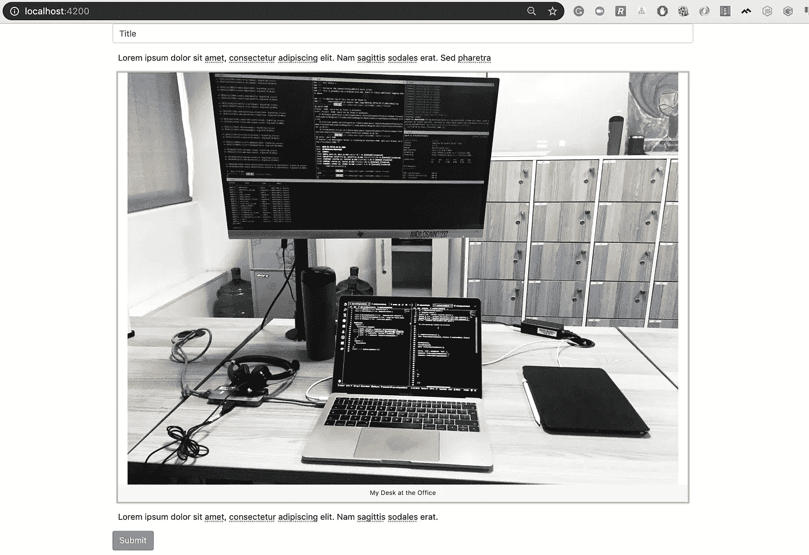
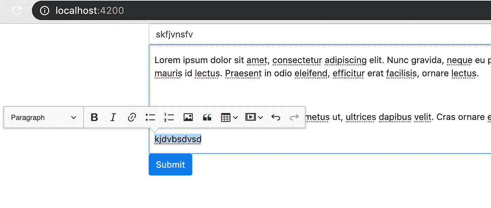

# 用 Angular 设置编辑器的详细方法

> 原文：<https://medium.com/swlh/a-detailed-approach-of-setting-up-ckeditor-with-angular-e546610157ba>


Photo by [Christopher Flynn](https://unsplash.com/photos/TEX3MKBZwLA?utm_source=unsplash&utm_medium=referral&utm_content=creditCopyText) on [Unsplash](https://unsplash.com/search/photos/image-uploads?utm_source=unsplash&utm_medium=referral&utm_content=creditCopyText)

您可能正在为自己的博客工作，并且想知道如何管理富文本内容。在本文中，我试图展示一种逐步建立支持图片上传到云服务的富文本编辑器的方法。

## 这篇文章是写给谁的？

*   我和 Angular 一起工作，或者说我对 Angular 的工作原理有所了解。
*   我试图建立一个编辑器，上传图片到云服务在这种情况下 Cloudinary。
*   我已经知道如何使用 CKEditor，但我似乎不能解决它的图像上传方面的问题。
*   我正在寻找一个工具，帮助挂钩自动从 CKEditor 上传到 Cloudinary 图像。

## 我们将建造什么？

我们将建立一个非常简单的 web 应用程序，允许用户在网上创建丰富的文本内容。在编写和提交内容后，用户将被重定向到显示内容的不同页面进行阅读。该项目的示例代码可以在 [t](https://github.com/IyiKuyoro/ckeditor-image-upload) 中找到。

[](https://github.com/IyiKuyoro/ckeditor-image-upload) [## IyiKuyoro/cke editor-图片-上传

### 从 ckeditor 5-IyiKuyoro/ckeditor-image-upload 下载我的图像上传教程

github.com](https://github.com/IyiKuyoro/ckeditor-image-upload) 

以下是编辑器页面的外观。



A screenshot of the editor page

## 设置角度项目

获得 Angular 应用程序设置的最快方法是使用 CLI。在本教程中，我们将使用 Angular 7，这是制作本教程时的最新版本。因此，如果您还没有这样做，请继续在全球范围内安装它。

```
npm i --save -g @angular/cli
```

接下来你要做的事情是建立角度项目。我要给我的项目 RichEditor 打电话。您可以使用下面的命令创建角度项目。出现提示时，请设置角度路由和 CSS。

```
ng new RichEditor
```

*这个项目是用 Angular 7 建造的。* [*根据反馈*](https://github.com/IyiKuyoro/ckeditor-cloudinary-image-adapter/issues/10) *，如果您使用^8.2.版本，您将遇到图像上传适配器错误~.要解决这个问题，请将您的* `*tsconfig.json*` *文件中的 es 目标更改为* `*es5*` *。*

在开发模式下启动应用程序。

```
cd RichEditor
ng serve
```

到目前为止，你应该已经有了你用 CLI 创建的任何 Angular 应用程序的常规首页。

## 设置文本编辑器

我们的编辑器页面将包含以下内容:

*   标题的输入框。
*   CKEditor 5 气球编辑器元素。
*   一个提交按钮，仅当上述两个字段已被填充时才显示。

为了加快速度，尽量减少造型上的挫折，我们将使用 bootstrap。*我绝不是 bootstrap 专家，事实上，我并不使用它。所以如果我在这里做事有点效率低下，请原谅我。*

## 添加引导

使用下面的命令安装 bootstrap 及其一些依赖项。

```
npm install --save bootstrap jquery popper
```

像这样在`angular.json`中给你的棱角样式添加引导样式。

The Angular styles loaded at startup

*注意，* ***y*** *你必须重启服务器才能看到引导的效果。*

## 创建编辑器页面

我们将创建编辑器页面作为该应用程序的默认路径。首先，我们创建编辑器组件，它将包含上面提到的所有元素。

```
ng g c Editor
```

然后将其作为默认路由添加到路由中。

The app routes

当然，这不会导致页面默认显示，所以我们将利用`<router-outlet>`来显示页面。回到`app.component.html`文件，用`<router-outlet>`替换它的所有内容。

这应该会将默认页面的内容更改为“编辑器工作”。太好了。现在对于一些预期的内容。

为了使我们的内容更加整洁、结构更加合理，需要使用一种文章类型。因此，让我们快速添加一个接口。我喜欢将我所有的类和接口添加到一个名为 models 的文件夹中，这个文件夹位于 src 文件夹中。下面是我们将使用的一个简单的粒子界面。

The Article interface

在添加编辑器之前，为了加快速度，让我们用角度模板驱动的表单设置标题和按钮的输入框。请记住，您将需要在您的应用程序模块中导入`FormsModule`来使其工作。

这里只是一点 CSS。

一些组件代码把它带回家。

要添加编辑器，首先要安装 ckeditor5 angular 包。该软件包包含 CKEditor 模块，它将使设置成为可能。我们还需要安装我们想要使用的编辑器。在这种情况下，因为我们想保持编辑器的整洁和不受干扰，我们将使用 balloon。下面是安装这两个包的命令。

```
npm i --save @ckeditor/ckeditor5-angular @ckeditor/ckeditor5-build-balloon
```

将`CKEditorModule`添加到`app.module.ts`文件的导入列表中。别忘了先从`@ckeditor/ckeditor5-angular`导入。

接下来，我们需要将编辑器本身添加到模板中。为了做到这一点，我们需要首先将气球编辑器导入到`editor.component.ts`文件中。

```
...
import * as BalloonEditor from '@ckeditor/ckeditor5-build-balloon';
...
```

在`EditorComponent`类中创建一个新字段，并将其分配给 BallonEditor。完成后，您还需要声明 config 对象来保存编辑器的所有设置。

```
...
Editor = BalloonEditor;
editorConfig = {
    placeholder: 'Type the content here!',
};
...
```

你可以在这里找到配置对象[的更多属性。](https://ckeditor.com/docs/ckeditor5/latest/api/module_core_editor_editorconfig-EditorConfig.html)

*注意，当前有一个* [*已知问题*](https://github.com/ckeditor/ckeditor5/issues/1758) *在生产中使用* `*placeholder*` *属性。出于完整性的考虑，我把它留在这里，因为它在开发服务器上运行良好。一旦这个问题得到解决，我会回来删除这个说明。*

您的`editor.component.ts`文件现在应该看起来像下面这样。

要在页面上显示编辑器，只需在输入元素和按钮之间添加`ckeditor`标签和其他属性，如下所示。

```
...
<ckeditor
    [config]="editorConfig" [editor]="Editor"
    required [(ngModel)]="article.text"
    data="" name="text"
></ckeditor>
...
```

这将在页面上产生一个简单的编辑器，它是干净的，不受干扰的。您可以通过突出显示文本和使用工具提示来格式化文本和添加图像。



A screenshot of the editor displaying som lorem ipsum text

如果你现在尝试添加一张图片，你会马上发现一个问题。图像似乎没有被添加，并且在控制台中显示一个错误，说“file repository-no-Upload-adapter:Upload adapter is not defined”完全正确。您需要设置图像上传适配器，以便 CKEditor 知道将嵌入的图像上传到哪里。有两种主要的方法，关于这两种方法的说明可以在[这里](https://ckeditor.com/docs/ckeditor5/latest/features/image-upload/image-upload.html)找到。但是你很幸运！我用 Cloudinary 编写了一个定制的适配器来为您实现这一点。让我们看看如何设置它。

## 添加 Cloudinary 图像上传适配器

*如果你在 2020 年 6 月之前读到这篇文章，请注意该部分自那以后已经发生了变化。我反对“ckeditor-cloud inary-uploader-adapter ”,而支持“puff-puff ”,它做了同样的事情，甚至更多。*

首先，去 [Cloudinary](https://cloudinary.com/) 创建一个账户，如果你还没有的话。如果您愿意，可以在注册时更改分配给您的云名称。从仪表盘中获取您的云名称，然后按照说明(可在此处找到)创建未签名的上传预设。你不需要任何插件。你很快就会需要这两个变量。

然后，从 [npm](https://www.npmjs.com/package/puff-puff) 安装帮助我们动态完成这项工作的软件包。不用担心，它是非常轻量级的，没有任何依赖性。

```
npm i --save puff-puff
```

一旦完成，下一件你想做的事情就是在`editor.component` 中添加一个工厂函数，CKEditor 使用你刚刚安装的包动态创建上传适配器。

```
...import { CloudinaryUnsigned } from 'puff-puff/CKEditor';...imagePluginFactory(editor) {
    editor.plugins.get( 'FileRepository' ).createUploadAdapter = (    loader ) => {return new CloudinaryUnsigned( loader,   <your_cloud_name>, <your_unsigned_upload_preset>); };}
...
```

一旦完成，添加工厂函数作为`extraPlugins`数组的唯一元素。`extraPlugins`是我们之前添加的`editorConfig`对象的属性。

```
editorConfig = {
   placeholder: 'Type the content here!',
   **extraPlugins: [ this.imagePluginFactory ],**
};
```

你的`editor.component.ts`文件应该看起来像下面这样。

仅此而已。你现在应该可以上传图片了。当图像成功上传后，会出现一个上传进度条和一个勾号。

但是还有一件事。图像不会有反应。为了管理它，我们需要做的就是向`CloudinaryUnsigned`构造函数添加最后一个属性。这应该是一个数字数组，表示我们希望 CKEditor 在支持图像响应时使用的图像大小。请记住，这必须从最小尺寸到最大尺寸进行，尺寸以像素为单位。以下是方法。

现在我们支持响应式图像。继续向文本区域添加一些图像。等待图片上传到你的云端仪表盘，你应该可以看到已经上传的图片。

Puff-Puff 还可以帮助将图像上传到自定义后端服务。你所需要的只是一个来自后端服务的上传 URL。点击查看更多关于[的信息。](https://gist.github.com/IyiKuyoro/bea2cb8501af02c94e52fa2df2fedaa8)

## 提交表单

这里我们要做的最后一件事是提交表单，并将数据发送到新的路由进行显示。理想情况下，您可能希望将新文章发送到后端服务器进行存储或类似的操作。

## 创建新的路线和组件

生成一个新组件，并将其命名为“视图”。将路径为“view”的新路由添加到应用程序 routes，并使用新创建的 ViewComponent 作为其组件。

```
ng g c view
```

**在查看路径中显示新文章**

在`editor.component.ts`文件的`onSubmit`函数中，导航到查看路线并传递新文章作为 NavigationExtra 的状态。你将需要注入角路由器来工作。

```
onSubmit() {
    this.router.navigate(['/view'], { state: this.article});
}
```

要显示文章内容，下面是`view.component.html`文件应该是什么样子。

您会看到我们仍然在使用`ckeditor`元素来呈现文章的内容。这完全正确。我们可以使用 div 或段落来呈现内容，但是不支持图像响应。但是，将 disabled 属性设置为 true 很重要，这样内容就不可编辑了。

而`view.component.ts`文件应该是这样的。

我们找到了。在本文中，我们已经学会了如何做到以下几点:

*   设置 CKEditor5 气球编辑器
*   为 CKEditor 设置一个简单的 Cloudinary 图像上传适配器
*   添加对响应图像的支持
*   在浏览器页面上显示富文本内容

感谢阅读！

*如果您发现错误，请私信，我会尽快解决。感谢*😄