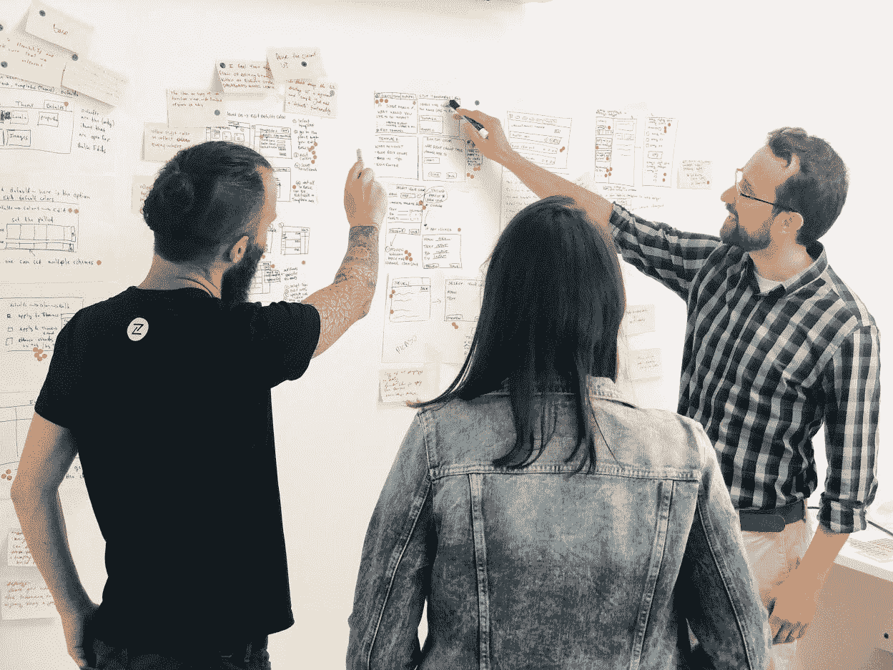

# DIY 设计冲刺——第一次主持人的笔记

> 原文：<https://medium.com/swlh/a-diy-design-sprint-notes-from-a-first-time-facilitator-6e0c310469d3>

“- Look, a dot! -Yes, I see it now!”

*TL；DR —做好充分准备，完全可以自己促成一个* [*的设计冲刺*](https://www.youtube.com/watch?v=K2vSQPh6MCE) *。它甚至可以改善你的日常团队互动。技巧和窍门在下面。*

作为一名产品经理，在过去的十年里，我领导了许多项目，最关键的部分是启动它们。不管公司是什么，或者团队是如何组成的…