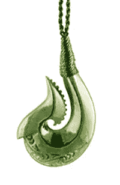
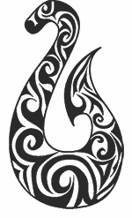
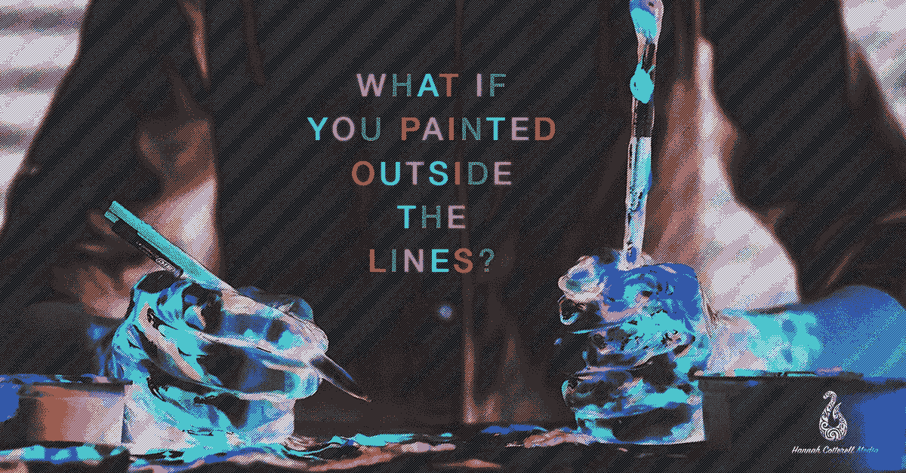

# 变成品牌的涂鸦

> 原文：<https://medium.com/swlh/a-doodle-that-turned-into-a-brand-c37bf688551a>

## 当无聊激发了冒险

你确定吗？但是你从来没有这样做过？你不会寂寞吗？如果你没钱了怎么办？你正处于中年危机早期吗？如果你付不起账单怎么办？再过几个月，你会更喜欢你的工作。

**如果你失败了呢？**

现在是 2016 年。我坐在办公桌前，对大多数人来说，这意味着有一些艰苦的工作在进行。我在涂鸦。办公室里到处都是喋喋不休的声音，人们敲着键盘，看起来很忙，继续他们的一天。这通常是我，作为一个积极的人，努力工作，喜欢把事情做完。一分钟一百万个想法的敬业员工渴望更多的预算(我永远也不会得到)来做更多的事情。但在为别人工作了十年之后，我的思维越来越混乱，动力也越来越弱。我通常可以在创纪录的时间内完成我需要做的一切，这应该为创造性思维和新想法铺平了道路。但是由于无处可去，没有资源来实现这些创造性的想法，涂鸦开始了。

在你平常的周五 17:30 这个可靠的时间，人们开始像时钟一样从办公室蜂拥而出，匆匆忙忙地跳进他们的汽车，同时聊着他们周末的大计划。*“这个周末天气很好，要好好利用！”*

在与简单的概念作斗争时，*“为周末而活”，*我低头一看，意识到我已经花了大半个小时来画一个毛利鱼钩。

# 毛利鱼钩是什么？

作为一名新西兰人(私下里，我希望自己 100%来自那只可爱的小鸟的土地)，我一直喜欢绿宝石和有意义的设计。

那么鱼钩是什么？鱼钩通常刻在绿宝石上，代表繁荣和水上安全通行，考虑到我大半生都在船上或船附近度过，这似乎有点贴切。

然而，我不禁想知道，我是否在繁荣方面有些失败。我的生活大部分时间都是焦躁不安的，报酬很低，需要太多的自我激励，我无法摆脱这样的想法:时间可以更明智地使用。

第二天，我毫不犹豫地决定把我粗略的草图发给一个做图形的朋友，一周后，砰的一声，草图就出来了。我的标志。

The doodle that became a logo…

## 做一个 logo 并不能让你成为企业家。

现在我可以想象很多人走到这一步。但是，让我告诉你，很容易让球走出去，有一个涂鸦变成一个标志，但要干到底，辞掉你的工作，说你好世界？！！那完全是另一回事。

在你成长的过程中，有些事情人们会忘记告诉你。让你周围都是你想成为的人，他们会在你成长的过程中帮助塑造你。谢天谢地，我的男朋友 Kees 恰好是这些人中的一员。六个月后，他言出必行，给了我一个急需的教训。

我去工作了，我辞职了。

想知道那是什么感觉，看看我的另一个博客，[“我辞职的那一天，学校里没有教你的东西。”](/@hannahcotterell/the-day-i-quit-my-job-what-they-dont-teach-you-at-school-31e986ee2c54)

所以我有一个鱼钩标志，一个网站，一个客户和 8k 的银行存款。你如何从现在开始让你的储蓄翻两番，让你的业余时间翻一倍，让你的创造力翻三倍？嗯，这将在我的下一篇博客中介绍。但是现在我要把这个留给你。

有时候最好的想法就这么发生了，如果你给自己不总是需要知道结果会是什么的奢侈，你可能会惊讶于你的结局。当我刚开始[绿石创意](http://www.greenstonecreative.com)的时候，我以为我会成为一名无人机飞行员，为昂贵的房子拍照。

我现在是一个专门讲故事的人，正在建立一个创意者网络，他们比我认识的任何人都远程工作，更快，更努力，更聪明，他们只是因为做他们喜欢的事情而赚更多的钱。这一切中最好的部分是什么？

这才刚刚开始。

> “建立你的梦想，如果你不这样做，别人会雇你来帮他们建立梦想”托尼·加斯金斯

*汉娜·科特雷尔，绿石创意公司创始人*

