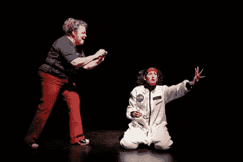
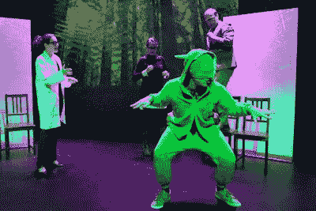
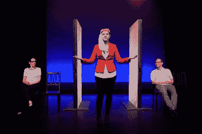
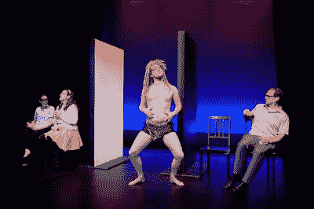
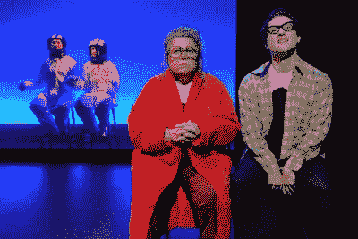
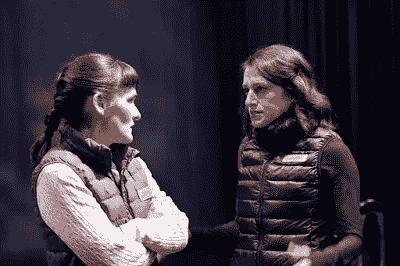
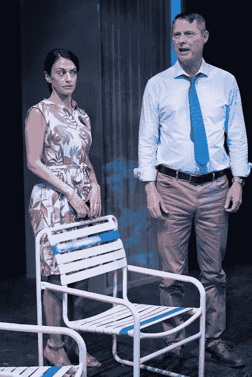
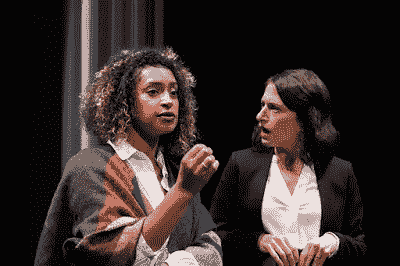
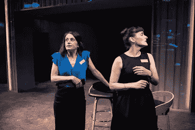

# 梦想是你内心许下的愿望

> 原文：<https://medium.com/swlh/a-dream-is-a-wish-your-heart-makes-97408b41ae0e>

作为一种有抱负的陈述，“敢于梦想”简短而甜蜜。然而，不管是作为命令还是多愁善感的[异想天开](https://www.vocabulary.com/dictionary/whimsy)，它完全没有抓住要点。[做梦是一种自发的活动，做梦者对此几乎无法控制。任何有幸经历过生动的梦并能记住梦内容片段的人都知道，从一个场景到另一个场景的转换发生得很快，颜色往往比现实生活中更强烈，虽然不一定会进入第四维度，但做梦者可以体验他们在现实生活中无法想象的事情。](https://www.wikiwand.com/en/Dream)

在纽约港[上空漂浮过](https://www.wikiwand.com/en/New_York_Harbor)同时指着[在命令下倾覆](https://www.wikiwand.com/en/Capsizing)的船只；我发现自己一丝不挂地躺在一个空的[停车位](https://www.wikiwand.com/en/Parking_space)上，一个黏糊糊的绿色[斑点](https://www.vocabulary.com/dictionary/blob)从后面靠近我，进入我体内，将我吞没；或者在熟睡时享受与死去的和/或远方的朋友的频繁拜访，我的许多梦都带我进行奇异的冒险。虽然水经常在一些梦中扮演角色(强烈暗示是时候起床去洗手间了)，但我已经看到湛蓝色的海水涌入旧金山湾并看到一座办公楼的地板在我脚下融化，露出奇怪的生物做着更奇怪的事情。

我们的一些梦可能包含关于需要注意的健康状况的预兆，或者关于即将变糟的情况的警告。

儒勒·凡尔纳并不是第一个涉足 T4 科幻小说的作家。但是，考虑到他最著名的作品的标题(1864 年的[地心之旅](https://www.wikiwand.com/en/Journey_to_the_Center_of_the_Earth)，1870 年的[海底 20，000 里格](https://www.wikiwand.com/en/Twenty_Thousand_Leagues_Under_the_Sea)，以及 1873 年的[八十天环游世界](https://www.wikiwand.com/en/Around_the_World_in_Eighty_Days))，很明显，自从他的角色在一次探险中第一次下降到[冰岛](https://www.wikiwand.com/en/Iceland)火山，包括遭遇[恐龙](https://www.wikiwand.com/en/Dinosaur)，已经过去了 155 年在他 1902 年著名的无声电影《月球之旅》中(这部电影的部分灵感来自凡尔纳的两本不太出名的小说——1865 年的《从地球到月球》和 1870 年的续集《绕月旅行》)，乔治·梅里爱创造了一个太空探索的愿景，这个愿景很容易被孩子的想象力激发

虽然 ***月球之旅*** 充满了逻辑上的[漏洞](https://www.wikiwand.com/en/Loophole)，但这些细节对孩子来说并不重要，正如[阿里·所罗门的](https://wiggleroomblog.com/about-2/)美味讽刺作品《与蹒跚学步的孩子玩耍时的即兴表演规则所证明的那样。

* * * * ** *

[游乐场的](http://playground-sf.org/) 2019 [新作节](http://playground-sf.org/festival/)包括[鲁本·格里贾尔瓦的](http://www.rubengrijalva.com/)剧[安娜考虑火星](http://playground-sf.org/annaconsidersmars/)的全球首演。这篇文章以 Renata agui rre([Wilma Bonet](http://www.abouttheartists.com/artists/326146-wilma-bonet))用她的智能手机记录她的一个[早熟的](https://www.vocabulary.com/dictionary/precocious)小女儿关于搬到[火星](https://www.wikiwand.com/en/Mars)和带走所有的小狗小猫的珍贵咆哮开始(希望创造一个[病毒视频](https://www.wikiwand.com/en/Viral_video))。安娜([梅丽莎·奥尔蒂斯](https://www.facebook.com/melissa.ortizhaines?eid=ARA6uFtsNku3Yd71yu0ozsAXljGo2ga58FNX_yC-ByWhM_qbIjcQnHyf9ZYnXOxl064_1SZehRSrTvX_&timeline_context_item_type=intro_card_relationship&timeline_context_item_source=676848083))成年的时候，地球人已经在红色星球的表面上行走，雷纳塔被诊断患有[肺癌](https://www.wikiwand.com/en/Lung_cancer)。由于未解决的气候危机，地球上的生活条件持续恶化。上升的海平面导致岛国消失在水下(旧金山的一个更独特的版本现在被海堤包围着),物种的大规模灭绝正在加速。

Wilma Bonet (Renata Aguirre) and her daughter, Anna
(Melissa Ortiz) in a scene from ***Anna Considers Mars***
(Photo by: Mellophoto.com)

成年后的安娜为一家非营利的动物权利组织工作，该组织专门拯救明显没有 T2 魅力的物种(如太平洋沼泽螳螂和西部大沼泽蛞蝓)，这些动物远没有熊猫和树袋熊可爱和上镜。因此，寻找资金赞助者是一个极其困难的(而且常常是羞辱性的)挑战。就像拥有普渡制药公司(生产奥施康定)的萨克勒家族一样，企业也在寻找可以帮助 T21 在媒体上粉饰形象的形象。河蛞蝓和底栖动物似乎对普通大众没什么吸引力。

Melissa Ortiz, Aaron Wilton, and Chrisian Haines
in a scene from ***Anna Considers Mars***
(Photo by: Mellophoto.com)

但是对于一直梦想在火星上生活的安娜来说，也许有一个办法可以用一个签名扼杀两个梦想。在与傲慢的基金会董事([凯蒂·鲁宾](http://www.abouttheartists.com/artists/562190-katie-rubin))和她的助手马尔科姆·菲利普斯([克里斯蒂安·海恩斯](https://www.facebook.com/christian.haines.353?__tn__=%2CdK-R-R&eid=ARCmYeBiCXJH0g1C_QLLQ3DdjOye9gWG-uXHxyw-n03DG9lcwjD4Pnz3DKSosd7gsV8bgtzYScctRQkA&fref=mentions))会面后，一位潜在的捐赠者看起来很有希望。不幸的是，随着她的拨款申请被拒绝，Renata 继续威胁她的家庭癌症治疗保险，安娜的未来似乎就在她眼前崩溃了。

令人惊讶的是，她毕生的梦想可能会实现。被提名为在火星上建立人类殖民地的雄心勃勃的项目的半决赛选手后，安娜和马尔科姆(已经是决赛选手)开始了在[秘鲁](https://www.wikiwand.com/en/Peru)的训练计划，无法保证能够生育孩子或经受住一个会说话的[倭黑猩猩](https://www.wikiwand.com/en/Bonobo)的含情脉脉的关注，倭黑猩猩自称是[火星人](https://www.wikiwand.com/en/Martian)，并与一个来自[明尼苏达州](https://www.wikiwand.com/en/Minnesota)的[谦逊的](https://www.vocabulary.com/dictionary/self-effacing)女[耶稣怪胎](https://www.wikiwand.com/en/Jesus_freak)展开了一场空中浪漫。

在见证 Grijalva 的剧本从 Renata 的 vaping 问题和虚拟 [bingo](https://www.wikiwand.com/en/Bingo_(U.S.)) 游戏到 Anna 对环境的关注和体验[外星](https://www.vocabulary.com/dictionary/extraterrestrial)生活方式的希望的时间里，观众们熟悉了这些新时代的技术，如 Anna 的随叫随到的虚拟贴身男仆 Carson ( [Soren Oliver](http://www.abouttheartists.com/artists/267437-soren-oliver) ，以及谷歌的 [Glass Enterprise Edition](https://x.company/projects/glass/) 。由[人工智能的](https://www.wikiwand.com/en/Artificial_intelligence)最具侵入性、最新形式的[目标营销](https://www.wikiwand.com/en/Target_market)以及[医学伦理](https://www.wikiwand.com/en/Medical_ethics)中新的法律漏洞所引发的问题，仍然与今天的[医疗保健行业](https://www.wikiwand.com/en/Healthcare_industry)的残酷惊人地相似。

Katie Rubin appears as an Emirates hostess as
Melissa Ortiz (Anna) and Christian Haines (Malcolm)
fly first class in a scene from ***Anna Considers Mars***
(Photo by: Mellophoto.com)

不管它的来源是什么，钱仍然让世界运转，当一个人想要大量的钱来支持一项崇高的事业时，他就不得不做出某种妥协。尽管乘坐阿联酋航空的奢侈被凯蒂·鲁宾的空姐和[亚伦·威尔顿](http://www.abouttheartists.com/artists/301550-aaron-wilton)狡猾地嘲笑，看起来像各种各样不太上镜的生物(包括安娜的前男友达里尔)，安娜必须决定哪一个对她来说是更道德纯粹的决定:拯救数百万只黏糊糊的蛞蝓，还是拯救她不服从医疗又令人沮丧地内疚的母亲。她应该拿走基金会的钱，还是放弃一生中实现童年梦想的机会，以安慰她垂死的父母？

Aaron Wilton appears as a talking bonobo aboard an
Emirates flight in a scene from ***Anna Considers Mars***
(Photo by: Mellophoto.com)

服装由[布鲁克·詹宁斯](http://www.abouttheartists.com/artists/542630-brooke-jennings)设计，灯光由[布列塔尼·梅勒森](http://www.abouttheartists.com/artists/525898-brittany-mellerson)设计，音效由[伊恩·沃克](http://www.abouttheartists.com/artists/338314-ian-walker)设计，导演[苏西·达米拉诺](http://www.abouttheartists.com/artists/328489-susi-damilano)在塑造安娜与她母亲达里尔和马尔科姆的个人冲突方面有着强大的影响力。更大的问题在于 Grijalva 的剧本，它可以从大量的剪辑中受益。这位剧作家敏锐的机智、敏锐的想象力和精心设计对话的明显技巧是毋庸置疑的。然而，在目前的形式下，安娜认为火星感觉就像是一系列稍微成功的 SNL 短剧，缺乏足够的戏剧胶水来支撑这两个小时的戏剧。

Wilma Bonet (Renata) and Aaron Wilton (Darryl) wonder
how things are going in outer space for Anna (Melissa Ortiz)
and Malcolm (Christian Phillips) in a scene from
***Anna Considers Mars*** (Photo by: Mellophoto.com)

由于安娜认为火星 演变的方式，女性的角色远比 Grijalva 为演员中的两个男性创造的角色丰富。永远可靠的威尔玛·博内特扮演安娜的母亲做得很好，尽管在一个场景中，我可以发誓她看起来像[罗西妮·巴尔](https://www.wikiwand.com/en/Roseanne_Barr)并且开始听起来像[艾丝特·盖蒂](https://www.wikiwand.com/en/Estelle_Getty)。梅丽莎·奥尔蒂斯饰演的安娜承担了最沉重的戏剧负担，凯蒂·鲁宾在一系列辛辣的客串中抢了她的风头。

安娜认为火星的表演将持续到 6 月 16 日，在波特雷罗舞台。

* * * * * * * *

电影史上最长也是最著名的梦境之一涉及天真无邪的年轻女孩多萝西·盖尔，她发现自己被传送到奇妙的奥兹国 T21，在那里她问一个穿着奇怪的女人“你是好女巫还是坏女巫？”当我们其余的人在可怕的意识中挣扎，意识到在[特朗普政府](https://www.wikiwand.com/en/Presidency_of_Donald_Trump)中生存就像被困在一个永无休止的[噩梦](https://www.wikiwand.com/en/Nightmare)中时，[散弹手](https://www.wikiwand.com/en/Shotgun_Players)目前正在海湾地区首映[国王](https://shotgunplayers.org/Online/default.asp?BOparam::WScontent::loadArticle::permalink=kings&BOparam::WScontent::loadArticle::context_id=)，这是一部由[莎拉·伯吉斯](https://groveatlantic.com/author/sarah-burgess/)编剧的紧凑的政治惊悚片。

虽然很容易想象《T0》*中最重要的人物是资深的得克萨斯州参议员约翰·麦克道威尔([唐·伍德](http://www.abouttheartists.com/artists/413558-don-wood))和新来的[达拉斯](https://www.wikiwand.com/en/Dallas)众议员悉尼·米尔萨普([萨姆·杰克森](https://www.facebook.com/sam.jackson.50309277))，但真正的行动发生在幕后，因为观众目睹了两位女性游说者的残酷行为，这无疑会迫使观众思考:“你是一个好婊子还是一个坏婊子？”*

**

*Elissa Beth Stebbins (Kate) and Sarah Mitchell (Lauren)
in a scene from ***Kings*** (Photo by: Ben Krantz Studio)*

*凯特([伊莉莎·贝丝·斯特宾斯](http://www.abouttheartists.com/artists/370205-elissa-stebbins))是一个厌倦了政治运作的人她的客户包括一个足科医生协会。她深谙国会议员使用的委婉语，让他们看起来像是在立法(而不是混淆视听)，她并没有完全被这一行业的好处所蒙蔽。翻译？凯特可能仍然拥有一丝人性。她的职业同事劳伦([莎拉·米切尔](http://www.abouttheartists.com/artists/328329-sarah-mitchell))就不是这样了，她是一个很难驾驭的女同性恋者，似乎天生就具有[凯莉安妮·康威](https://www.wikiwand.com/en/Kellyanne_Conway)和[莎拉·哈克比·桑德斯](https://www.wikiwand.com/en/Sarah_Sanders)的性格特征。正如剧作家解释的那样:*

> **“我来自***特区的郊区，我的父母都是军人，也分别在* [*公关*](https://www.wikiwand.com/en/Public_relations) *部门工作过。有一段时间，我父亲曾短暂地为一名国会议员工作过，所以我总是觉得自己和华盛顿以及那里的人们有联系。我试着写了一会儿关于* [*五角大楼*](https://www.wikiwand.com/en/The_Pentagon) *的东西，但事实证明有点困难。大约两年前，我读到一些关于议员们做的这些* [*筹款*](https://www.wikiwand.com/en/Fundraising) *静修的事情(有很多公司把议员们从华盛顿带到* [*纳帕*](https://www.wikiwand.com/en/Napa_County,_California) *或* [*南卡罗来纳州*](https://www.wikiwand.com/en/South_Carolina) *的高尔夫球场)。这些杰出的成功人士不得不在筹款的幌子下聚集在一起做这些活动，这在我看来非常有趣。我想这就是促使我写华盛顿的原因。”***

****

**Sarah Mitchell (Lauren) and Don Wood (John McDowell)
in a scene from ***Kings*** (Photo by: Ben Krantz Studio)**

**随着戏的开始，凯特和劳伦在科罗拉多州韦尔的一个年度静修会上相遇，凯特的新客户，国会女议员米尔萨普似乎藏在她的酒店房间里。米尔萨普是一个[金星](https://www.wikiwand.com/en/Service_flag)寡妇，作为一个华盛顿[局外人](https://www.vocabulary.com/dictionary/outsider)对[政治腐败](https://www.wikiwand.com/en/Political_corruption)持批评态度，作为一个[实用主义者](https://www.vocabulary.com/dictionary/pragmatist)来到国会，他愿意从人们那里拿钱，但不一定听从他们的吩咐。尽管米尔萨普每天都会尽职尽责地打电话筹款，但她并不害怕停止那些她不感兴趣的推销活动，也不害怕避开游说者提出的利润丰厚但道德上有问题的联盟。**

****

**Sam Jackson (Sydney Millsap) and Sarah Mitchell (Lauren)
in a scene from ***Kings*** (Photo by: Ben Krantz Studio)**

**另一方面，她的德州同胞已经在位多年，对政治领域了如指掌。他为自己的儿子(哈佛毕业生)感到骄傲，偶尔被迫为自己成为诗人的选择辩护。当米尔萨普的理想主义被证明不利于再次当选时，她选择与麦克道尔竞争参议员席位。这位国会女议员出人意料的政治转向加剧了劳伦和凯特友谊中的竞争。**

**伯吉斯的作品充满了智慧、内部知识和对细节的关注，这使得阿伦·索尔金对《T2》和《白宫风云》的贡献如此强大。除了展示那些在华盛顿的[泡沫](https://www.wikiwand.com/en/Filter_bubble)中经营的人的居高临下的[精英主义](https://www.wikiwand.com/en/Elitism)，伯吉斯毫不犹豫地取笑达拉斯[法士达](https://www.wikiwand.com/en/Fajita)的连锁餐厅( [Chili 的](https://www.wikiwand.com/en/Chili%27s)和[休斯顿](https://www.wikiwand.com/en/Houston) ( [Ninfa 的](https://www.wikiwand.com/en/Ninfa%27s))之间的竞争，或者许多政治策略的纯粹琐碎。**

**工作在[安格瑞特·麦克洛斯基](http://www.abouttheartists.com/artists/330432-angrette-mccloskey)的帅气单元布景中(灯光由[克里斯·伦达尔](http://www.abouttheartists.com/artists/574524-christopher-lundahl)提供，视频由[艾琳·吉利](http://www.eringilley.com/)提供，声音设计由[詹姆斯·阿德](http://www.abouttheartists.com/artists/570467-james-ard)提供，服装由[若松美雪·比尔莱因](https://miyukibierlein.carbonmade.com/)提供)，散弹枪的开发总监&常驻演员、[乔安妮·麦克布莱恩](http://www.abouttheartists.com/artists/328456-joanie-mcbrien)用那种剧场式的【指导这部作品正如她在程序说明中解释的那样:**

> ***“在 2018 年中期选举中，100 多名女性被选入国会。有些女性击败了长期执政的***(像* [*亚历山大·奥卡西奥-科尔特斯*](https://www.wikiwand.com/en/Alexandria_Ocasio-Cortez) *这样的女性，即使她所在政党的成员反对，她也愿意站出来反对政治制度中的不平等)。作为新当选的国会议员，悉尼·米尔萨普对金钱和政治之间的有毒关系感到震惊。她没有接受无情的筹款是她工作的必要部分，而是揭露了有利于富人的幕后交易和妥协。国王 *提出了我们社会的一个中心问题:我们应该接受现有的制度还是废除它？有什么后果？”*****

**几年前，有人形容女演员西尔维娅·迈尔斯非常渴望得到公众的关注，以至于她会出现在一个信封的打开仪式上。虽然许多国会议员都渴望成为焦点，但伯吉斯的戏剧显示了华盛顿真正的力量所在。正如你所料，这不是一个美丽的景象。山姆·杰克森和唐·伍德在假装谦逊和真诚关心选民方面做得很好，但是这部剧的最高表演荣誉由莎拉·米切尔和艾丽莎·贝丝·斯特宾斯(两位杰出的女演员)分享。**

****

**Sarah Mitchell (Lauren) and Elissa Beth Stebbins (Kate)
in a scene from ***Kings*** (Photo by: Ben Krantz Studio)**

*****王者*** 的演出将在[阿什比舞台](https://www.eastbayexpress.com/oakland/ashby-stage/Location?oid=1109495)持续到 6 月 16 日(点击[此处](https://shotgunplayers.org/Online/default.asp?BOparam::WScontent::loadArticle::permalink=kings&BOparam::WScontent::loadArticle::context_id=#tickets)获取门票)。这是预告片:**

***原载于*[*https://myculturallandscape.blogspot.com*](https://myculturallandscape.blogspot.com/2019/05/a-dream-is-wish-your-heart-makes.html)*。***