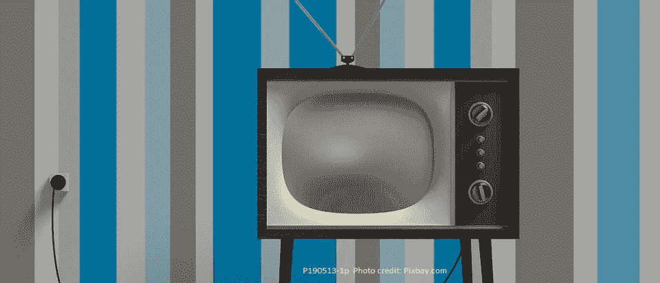

# 对过去的幻想购物之旅表明，通货膨胀可能比我们想象的还要低

> 原文：<https://medium.com/swlh/a-fantasy-shopping-trip-to-the-past-shows-that-inflation-might-be-even-lower-than-we-think-33e7c0adc88a>

最近通胀得到了很好的控制，平均水平远低于美联储 2%的目标利率。但是真实的通货膨胀率会比这还要低吗？在最近为华尔街日报撰写的一篇文章中，安迪·凯斯勒解释了原因。