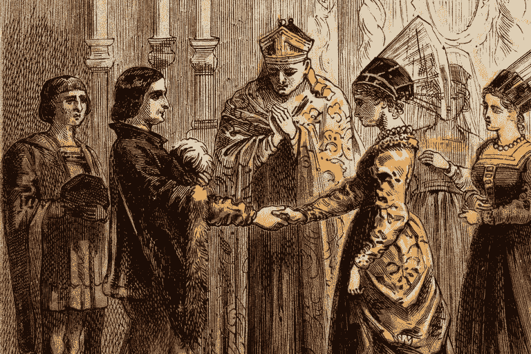

# 莎士比亚《亨利五世:凯瑟琳的异国情调》的女性主义解读

> 原文：<https://medium.com/swlh/a-feminist-reading-of-shakespeares-henry-v-katherine-s-exoticism-1cfabf08e86b>

著名的哲学家、活动家和学者西蒙娜·德·波伏娃在她极具影响力的作品《第二性》中写道:

> “一个人不是天生的，而是变成的。”

德·波伏娃的引用强调了女性在上流社会和她们儿女书架上的小说作品中的困境。正如德·波伏娃所说，女性气质是一种社会建构的框架，经常被当权者(通常是男性)所利用。在通过电影将莎士比亚呈现给现代观众的过程中，比如肯尼思·布拉纳(1989)或英国广播公司(2012)制作的版本*亨利五世*，膨胀的乐谱、激动人心的表演和精致的制作设计只会突出塑造这些叙事选择的父权态度。在凯瑟琳，异国情调的爱情在所有三个版本的故事中，这些对女性有害的想法决定性地融合成一个平凡的怪事。

与她的男性同行不同，这位法国公主主要用她的母语交流。有人可能会认为，为了清晰起见，莎士比亚会简单地让所有的法国角色都说英语，但凯瑟琳并没有遵循这种模式。相反，有一个完整的场景致力于凯瑟琳的经历是如何充满异国情调的，因为她在一堂关于人体解剖学各个部分的英语课上摸索。虽然滑稽，但这一场景强调了女性仅仅因为与大多数人的经历格格不入而被盲目崇拜是多么普遍。作为亨利的爱情意中人，凯瑟琳更令人向往是因为她的异国情调，而不是因为任何特定的性格特征。不幸的是，肯尼思·布拉纳和 BBC 改编的《T4:亨利五世》都没有以任何实质性的方式处理凯瑟琳的异国情调。尽管 BBC 纠正了 Branagh 改编中的许多文体错误，但在对凯瑟琳的总体处理上仍有失误。在 BBC 的版本中，一名法国女演员扮演了公主，这无疑是试图增加演员名单的多样性，悄悄地给一个已经有很大问题的角色增加了一层外国色情。两个版本的角色都在用法语闲聊，而其他演员则说着完美的英语。尽管意图如此，那些改编《亨利五世》的人未能解决她性格中不合时宜的异国情调。

凯瑟琳与其说是亨利未来的伴侣，不如说是他未来的爱情对象。这种区别在她与爱丽丝的辅导课中得到了暗示，因为爱丽丝发现有必要教她各种附加语，而不是教她正确的英语礼仪或随意的问候。凯瑟琳在解剖学上的学习很可能是一个狡猾的双关语，旨在使她成为年轻国王更合适的伴侣，特别是当结合后一个场景时，该场景澄清了法语和英语之间存在的关于浪漫的不同文化界限(Branagh 和 BBC 的改编都包括这个场景)。她最终与亨利订婚是她在整部剧中客观化的延续。凯瑟琳无法真正同意这一行为，因为她只是一个条约中概述的棋子。在她充满异国情调的描绘之后，凯瑟琳的自主性被忽视了:她对亨利的看法与站在她面前默默敦促她效仿爱丽丝教导的男人无关。因此，《亨利五世》讲述了一个年轻、凶猛、聪明的女人如何沦为观众物化的素材的故事；这个故事的每一次重复都间接地赞美了重男轻女、厌恶女性的女性观的优点。