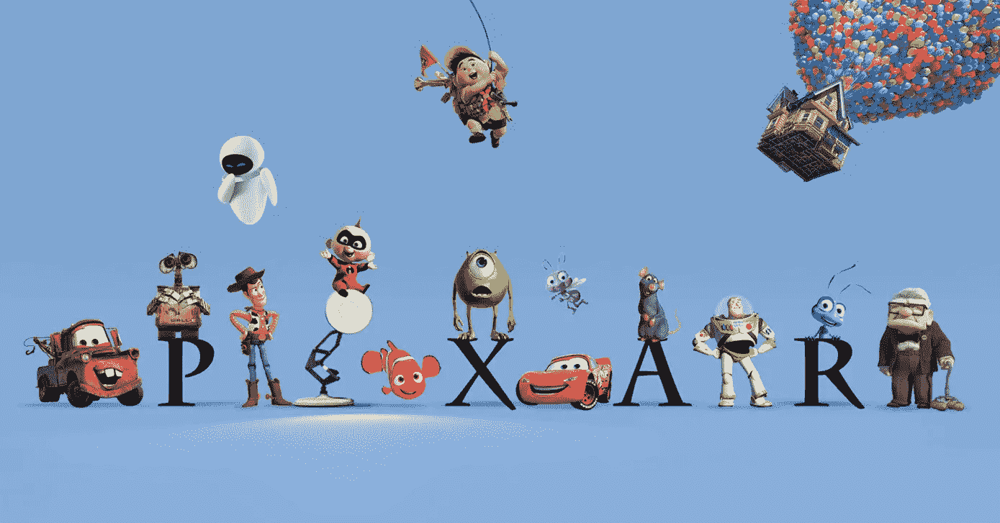

# 创造力的框架

> 原文：<https://medium.com/swlh/a-framework-for-creativity-ac4e6de4d94b>

ixar 是世界上最具创造力的公司之一。也是一门生意；而且是个成功的例子。2006 年，皮克斯以 74 亿美元的价格卖给了迪士尼，其电影的全球票房已经超过 130 亿美元。

企业需要可预测性，尤其是在生产方面。然而，根据定义，皮克斯生产的产品很难预测。这是基于导演团队的创造力…