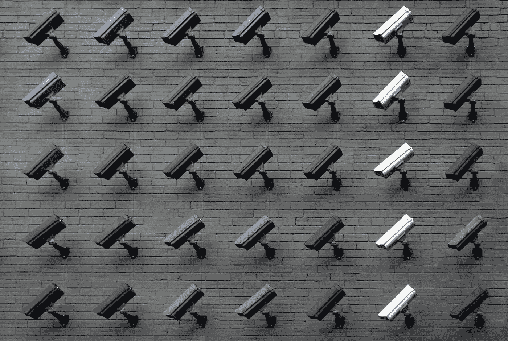

# 隐私的框架

> 原文：<https://medium.com/swlh/a-framework-for-privacy-3327f2601135>

Photo by [Lianhao Qu](https://unsplash.com/@lianhao?utm_source=unsplash&utm_medium=referral&utm_content=creditCopyText) on [Unsplash](https://unsplash.com/s/photos/privacy?utm_source=unsplash&utm_medium=referral&utm_content=creditCopyText)

最近有很多关于隐私问题的讨论。从我的角度来看，这些对话是随着亚马逊 Echo Dot 和谷歌 Home 等个人助理的使用而兴起的，然后在剑桥分析公司和脸书对话中达到顶峰，现在已经逐渐成为一种新的规范。

这篇文章涵盖了一种更具体的思考隐私问题的方式。现在，当我和…