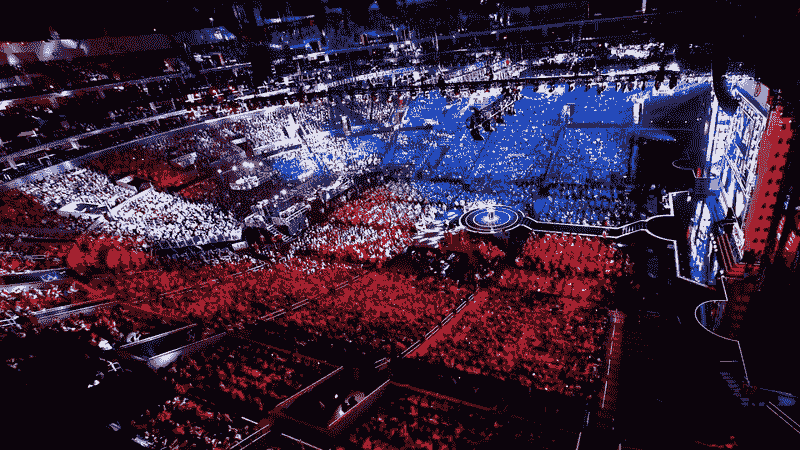
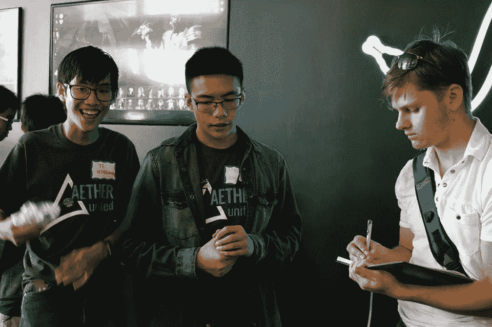
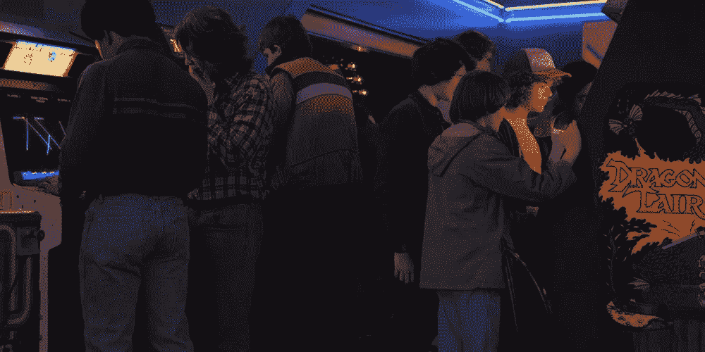
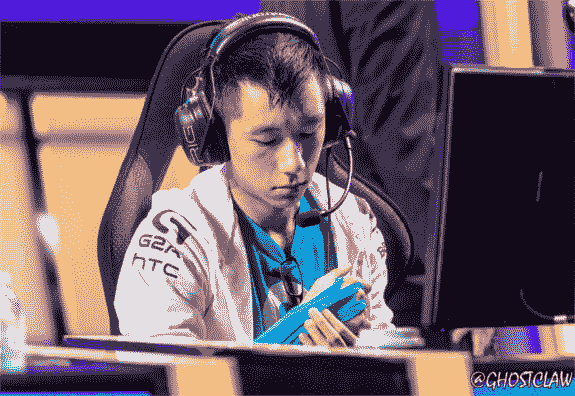
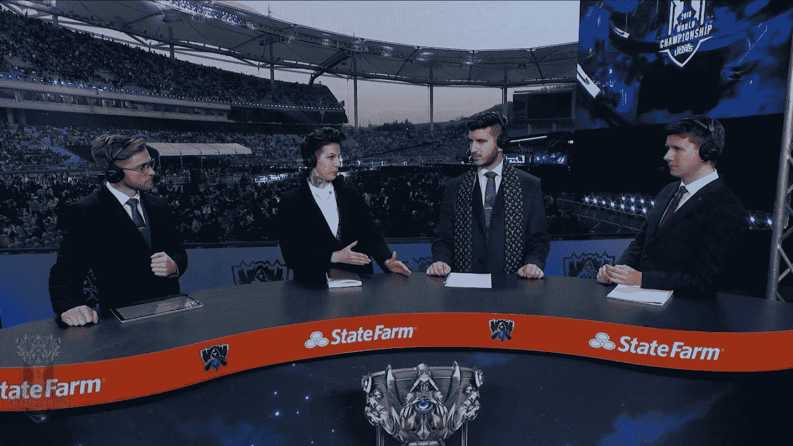
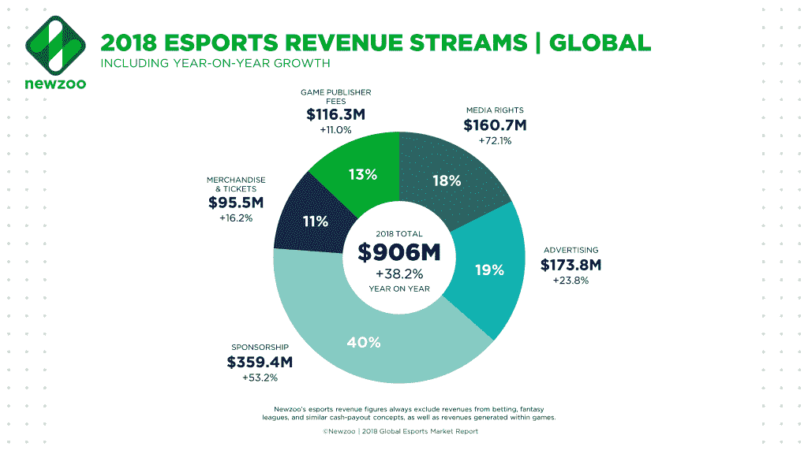
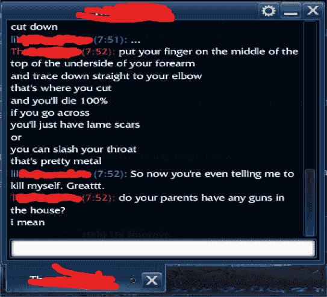

# 电子竞技的未来

> 原文：<https://medium.com/swlh/a-future-in-esports-3582ed703c1a>

2016 League of Legends World Championships hosted in the Staple Center

成千上万的球迷穿着男装，拿着斯台普斯中心的门票，准备观看他们最喜欢的运动。听起来熟悉吗？洛杉矶当地人可能会说，成千上万的球迷坐在体育场观看他们当地的篮球队比赛。然而，就在三年前，斯台普斯中心挤满了来自全球各地的 18188 名球迷，观看 2016 年英雄联盟冠军总决赛。但即使是这个数字，也比不上全球近 4 亿收看比赛的独立观众。热烈欢迎业内最新的观赏性运动，电子竞技。

尽管电子竞技是一个相对较新的行业，但自不到一个世纪前创立以来，它(或称职业电子运动)一直在获得越来越多的关注。我将我的专家项目致力于电子竞技的主要动机是因为我个人与该行业的联系，我从小就是一个狂热的游戏玩家，并在大二的夏天创建了一家电子竞技公司 Aether United。特别是在我收到投资者和家庭成员对该公司潜在成功的怀疑后，我发现有更多的怀疑者认为电子竞技只是一个利基市场。

因此，我对这个项目的最初动机是结束长期以来的耻辱，即竞争性视频游戏是一个浪费时间和精力的坑。我很快发现，随着电子竞技行业继续呈指数级增长，延伸到与传统体育竞争的领域，这些怀疑的观点已经过时。因此，我意识到电子竞技已经开始挑战我在 Aether United 的日子里长大并面临的那些耻辱。因此，在第二学期，我选择扩展我的话题，讨论电子竞技中的潜在问题，这些问题必须在阻碍电子竞技的未实现可能性之前得到解决。本文中使用的大多数例子将使用电子竞技最受欢迎的游戏，由 Riot Games 创建的英雄联盟。

# 抱歉，书呆子们:电子游戏不是一项运动

“游戏不仅仅是一种强迫行为…[它]是成为专家的一种模拟”(沃尔特 7)。Matthew Walther 是《一周》的作者，他是电子竞技行业的主要反对者。然而，瓦尔特的主张几乎不是一个热门话题；自从 20 世纪 70 年代随着雅达利游戏机和街机游戏的推出，视频游戏出现以来，主流媒体指责年轻的游戏玩家懒惰，“他们自己未来的废奴主义者”。早期的批评者可能有很好的理由创造这些刻板印象，但回顾游戏历史，可以肯定地说视频游戏已经提升了这些刻板印象。

即使在 70 年代，视频游戏也经常与传统的离线运动产生强烈的相似性。玩家们迫不及待地离开学校或工作去游乐场，就像其他人迫不及待地出去打篮球一样。就像离线运动一样，视频游戏为玩家提供了与朋友“按需竞争和互动”的机会(天堂 7)。随着技术的进步和互联网的普及，电子游戏作为一种爱好迅速发展。用 Andrew Paradise 的话来说，“三个核心要素[有助于]电子竞技行业崛起为下一个主要的观众体育运动:有组织的联赛的流媒体比赛，可以在任何地方观看的职业选手，以及主要线下体育场馆的直播活动”(8)。

什么定义了一项运动？广受尊敬的在线词典 Webster 将体育定义为一种竞赛或游戏，人们根据一套特定的规则进行特定的活动，并相互竞争。电子竞技是一个价值十亿美元的产业，它就是这样做的。罗兰·李(Roland Li)将每一款归入“电子竞技”类别的游戏定义为共享一个共同主题，“它们是多人游戏，所有参与的团队都通过竞争获胜，运用策略、技巧和团队合作来实现他们的目标”(13)。

你可以在这里得到罗兰·李的书《祝你好运，玩得开心:电子竞技的崛起》

尽管如此，这并没有满足电子竞技的反对。Walther 认为“一项运动最宽松的定义不仅包括技术和竞争，还包括体力消耗和至少受伤的可能性”(4)。不幸的是，他的指控与事实相去甚远。任何极端的行为都有受伤的可能，电子游戏也不例外。《华尔街日报》的作者蒂莫西·马丁(Timothy Martin)警告说，“随着玩家每天训练 10 个小时，过度使用的风险会随着时间的推移而积累”(2)，早期的电子竞技运动员因受伤而提前退役就是例证。像 Jonathan Jablonowski 这样的现任运动员分享了他们的观点，“‘我看到这些神一样的球员赢得比赛，然后他们不得不退休，因为受伤而休假……我有这个理想，在那里我有一个漫长的职业生涯’”(马丁 3)。随着对手继续挑战电子竞技，它已经证明了自己作为观众体育产业中一个突出竞争者的合法性。

# 通往合法性的旅程

作为一项观赏性运动，电子竞技继续凭借其职业机会与传统体育相提并论。Business Insider 的作家 Mai-Hanh Nguyen 将它们分为 4 个不同的类别:体育、营销、活动策划和流媒体/广播。在为世界各地的粉丝创造一个令人兴奋的环境中，每一个都扮演着独特的角色。当定义一项观赏性运动时，拥有一个想看你产品的观众是最重要的。电子竞技拥有这样的观众。

尽管如此，电子竞技已经取得了长足的进步。甚至在 10 年前，该行业的支持者还很难证明电子竞技不仅仅是一个利基市场，因为近 50 年的视频游戏历史没有提供坚实的成功故事。然而，自从电子竞技诞生以来，这个行业已经朝着个人成长迈出了大步。特别是在英雄联盟中，北美冠军联盟的 Riot Games 特许经营权已经成功地融入主流媒体，并收购了万事达卡(Mastercard)和 State Farm 等老牌公司，作为其国际锦标赛的强大赞助商。

由于这些专项投资，电子竞技收入预计到 2020 年将达到 15 亿美元(见下页图表)，根据领先的电子竞技统计数据收集机构 Newzoo 的数据，同比增长近 40%。有趣的是，天堂发现传统体育联盟“提供了一个有趣的类比。NFL 和 NBA]成立于 20 世纪上半叶，但…直到 20 世纪 90 年代末才成为收入来源……”(天堂)。本质上，我们国家最大的线下运动花了 50 年才成为今天的巨头；随着电子竞技的第五个十年即将到来，这个新行业似乎也将出现类似的趋势。

# 游戏结束了？

在我进入第二学期的研究期间，《英雄联盟》的创作者 Riot Games 因歧视丑闻被起诉。尽管电子竞技在过去十年中取得了成功，但很明显，随着认可的增加，责任也越来越大。随着电子竞技的发展，越来越多的人意识到它的存在，过去可能被忽视的行业短板必须被认识到。我进入第二学期，决心发现电子竞技在消费这个行业之前必须识别和解决的潜在陷阱。

我最初的探索发现了意想不到的结果。我就困扰电子竞技行业的问题咨询了北美英雄联盟冠军联赛 LCS 的主持人奥维莉·梅。我从她那里得到答案是出乎意料的；她提出了一个不常谈论的内部问题。她告诉我，虽然“电子竞技很受欢迎，但它的亏损仍然大于盈利……”(五月)。进一步研究发现，在 2018 年电子竞技获得的 9 亿美元总收入中，近 80%的电子竞技收入来自外部赞助商(见图表)。尽管通过交换媒体权和广告空间，实际交易赚取了该收入的~40%;超过一半的电子竞技收入来自赞助商，他们向该行业投资，但不期望立即获得回报。

虽然这种投机为电子竞技提供了指数级的同比增长，但随着该行业越来越依赖赞助，它也制造了金融泡沫。奥维里·梅警告说，“人们[必须]开始认真寻找赚钱的方法。”与其他行业不同，电子竞技不出售有形产品，因此更难确定赞助商的猜测是否符合实际的行业价值。尽管如此，观众体育产业在如何赚取收入方面有独特的优势；他们不是从销售产品中获利，而是向全球数亿人销售独特的体验。因此，电子竞技比赛应该转变为外部赞助商的营销媒介。随着电子竞技继续扩张，电子竞技应该通过向越来越多的合作伙伴出售广告空间来积累收入。

游戏文化一直是游戏玩家和观察者们鄙视的来源。从个人经验来看，电脑屏幕使得玩家互动失去人性，创造了一种网络欺凌他人的文化。因此，许多表现不符合团队期望的球员将面临来自团队的恐吓和有害攻击。然而，它并不止于此。随着这种文化的挪用，职业选手收到了多重死亡威胁。因此，这些行动导致许多电子竞技组织取消了粉丝见面会等预定活动。如果这些行为的数量和严重性增加，后果将是毁灭性的，从不高兴的球迷和失去赞助商，到人命损失。作为回应，电子竞技公司必须积极惩罚毒性，并公开表明这种行为和文化不会被容忍，而不是采取被动的立场。

# 运动员的头脑

在幕后，竞争团队组织的首席执行官们正在努力将他们的团队塑造成下一个国际超级大国。由于缺乏规章制度，许多组织让他们的运动员每天工作 10 个小时，被绑在电脑屏幕和游戏椅上。在 Ovilee 的采访中，她很乐观，“每个人都是被他们对游戏的热爱所驱动的……”(3)。尽管激情在任何运动员的心理中都起着至关重要的作用，但很难相信运动员应该每天工作 10 个小时。Andrejkovics，*The Invisible Mind:Mind of a Winning Team，*的作者分享了他的想法，“许多组织被野心蒙蔽了双眼，强迫他们的运动员在‘职业道德’的面纱下工作……相反，他们正在助长伤害和倦怠”(51)。球迷对运动员的期望往往只有一个:通过训练和练习取得好成绩。他们往往没有意识到运动员也是人，也需要康复。Team Liquid 是电子竞技领域备受尊敬的组织，该组织的运动治疗师 Jared Tendler 也有类似的想法，“保持运动员的思维、看电影或去健身房很重要，尽管不会直接影响比赛……这些都是支持高水平表现的必要活动”(72)。参加任何职业运动都需要一种平衡，让运动员恢复精神状态与推动他们进行严格的练习一样重要。

[你可以在这里找到 Zoltan·安德烈科维奇写的关于电子竞技中心理弹性的书](https://amzn.to/38ytb6i)

# 好游戏，玩得好

电子竞技自 20 世纪 70 年代卑微的开端以来已经走过了漫长的道路。虽然争论电子竞技的合法性仍然被认为是一个热门话题，但电子竞技已经证明了自己。五十年内，电子竞技游戏开始迅速崛起，成为票房收入最高的娱乐产业之一。尽管它的旅程充满了反对者，但电子竞技已经证明了它作为一项观众运动的合法性，在结构、职业选择和商业模式方面与线下竞争对手有许多相似之处。

展望未来，我们必须承认电子竞技还不完美。随着这个年轻的行业继续快速扩张，每个电子竞技实体都有责任保持其成功。首先，游戏公司必须投入额外的时间和资源来改善他们的商业模式，以创造可持续的收入流。同样重要的是，电子竞技组织必须投资于他们的运动员，以培养一个健康和注重运动员的环境，为他们的运动员提供高水平的表现，以进行练习、表演和坚持。最后，要靠社区来培养一种无毒的新文化。

回头看看我的专家项目，看到电竞已经走了这么远，真是太神奇了。正如电子竞技多年来克服了与其名称相关的负面刻板印象一样，我相信该行业有能力解决这三个问题。当我们做到的时候，这将是一场真正的“精彩的比赛”

**作品被引用**

红胡子。" 2014 年世界锦标赛将在韩国举行。"*英雄联盟，* 2018。

程，莱恩。监视旧金山湾区开放。*脸书【2017 年 8 月 22 日。*

沃尔特马修。"抱歉，书呆子们:电子游戏不是一项运动."【2018 年 5 月 4 日第周。

伯特普雷斯顿。"《奇异事物 2》中街机的 5 个问题。" *GeekDad* ，2017 年 12 月 31 日。

天堂，安德鲁。"电子竞技的兴起是一种观众现象."VentureBeat，VentureBeat，2018 年 11 月 30 日。

[李，罗兰。*好运有乐:电子竞技的崛起*。天马出版社，2017。](https://amzn.to/3eat6Xq)

“我的胳膊真的很瘦。”职业电子游戏玩家正在锻炼。"*华尔街日报*，道琼斯&公司，2018 年 10 月 11 日。

阮梅汉。"电子竞技和视频游戏行业的工作和职业继续增长."商业内幕，商业内幕，2017 年 12 月 8 日。

梅奥维莉。个人面试。2018 年 12 月 30 日

各种作者。"游戏、电子竞技和移动市场研究和数据."*新动物园*。2019.

肥肥。"昨天有人发出了死亡威胁。"推特，推特，2018 年 9 月 9 日。

Andrewjkovics，佐拉顿。*看不见的头脑:获胜团队的心态。*创造空间 Ind，2016