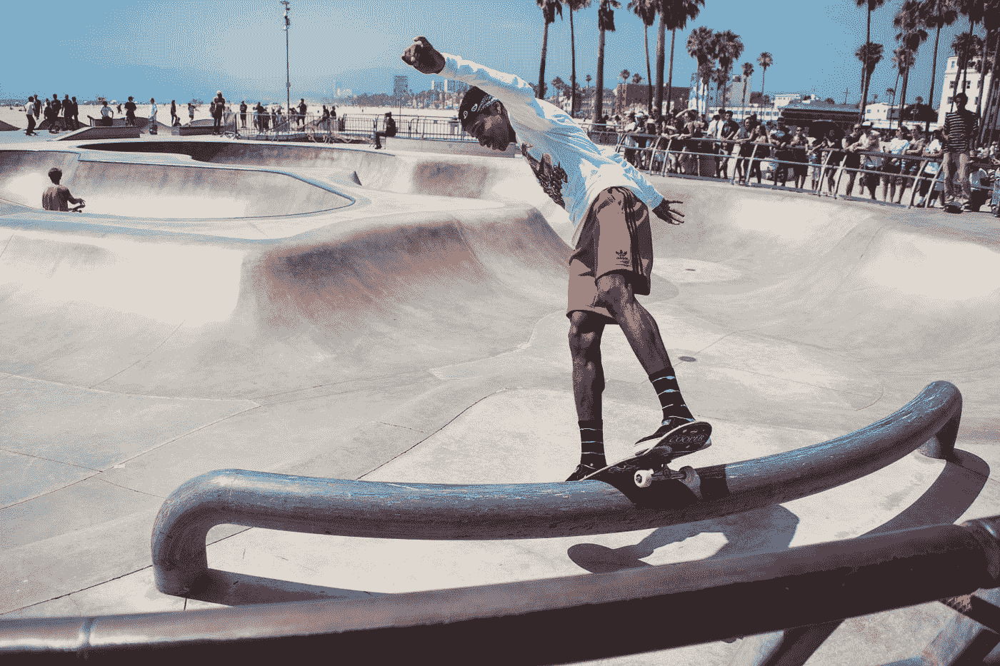

# 一杯工作与生活的平衡？给我的？

> 原文：<https://medium.com/swlh/a-glass-of-work-life-balance-for-me-89048e33eebe>

## 不用了，谢谢。

Photo by [Travis Yewell](https://unsplash.com/@shutters_guild?utm_source=medium&utm_medium=referral) on [Unsplash](https://unsplash.com?utm_source=medium&utm_medium=referral)

你相信工作生活平衡吗？我不知道。

我认为我们人类非常复杂。我们可以对某些事情很清楚，但对另一些事情却完全糊涂。

我努力学习如何做饭:我熬过了大学；我是一个很好的厨师。但是如果你要付钱给我做饭，我宁愿擦洗你餐馆的整个地板…