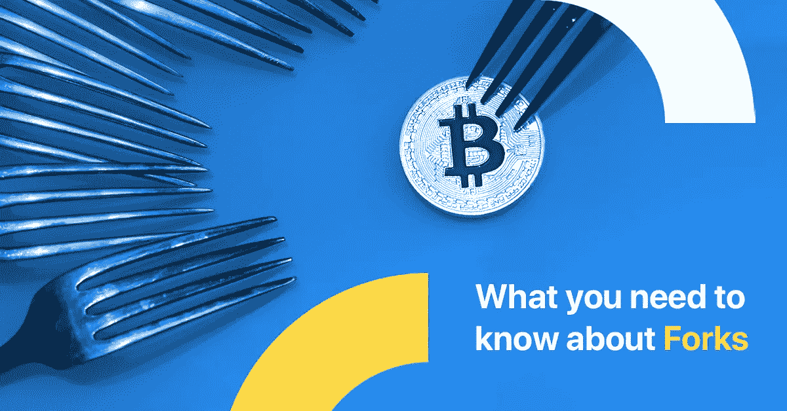

# 叉子指南——更多的是关于区块链，而不是意大利面条

> 原文：<https://medium.com/swlh/a-guide-on-forks-its-more-about-blockchain-than-spaghetti-2e3846ce1a69>

## 叉子不仅仅是餐具，尤其是在谈论区块链的时候。这本简短的指南会满足你的学习欲望。

基本上，Fork 只是一个软件或协议更新的酷名字。Forks 创建了一个新版本的区块链，根据这是哪种类型的 fork，两个区块链将同时在网络的不同部分运行。分叉可以是向后兼容的或不兼容的，根据这一点，它们将被标记为硬的或软的。

## 什么导致了加密中的分叉？

主要原因通常是社区的分裂、新的未来实现或两者的结合。Split 占据了令人骄傲的第一位，并在示例数量上领先。当团体决定它们将不再遵循相同区块链上的旧协议的规则时，导致分叉的分裂或分歧发生。所以社区决定改变规则，创造一个新的区块链，一个从特定街区演变而来的原始区块链的新版本。奇怪的是，美国是一个艰难抉择的例子:殖民者决定脱离大英帝国，成立一个新的国家，听起来有点耳熟。

编程分支主要有两种类型:硬编程和软编程。

## 硬叉子

这是对使旧版本无效的协议的彻底改变。但是，它们可能会继续运行，并最终出现在另一个协议中，该协议的数据与新版本不同。在这个过程中可能会出现混乱和错误。硬分叉意味着与以前版本的区块链永久分离，新版本不接受以前版本的节点。

简单地说，这种分叉将导致两条不同的路径:一条沿着新的、升级的区块链，另一条沿着旧的路径。通常，旧道路的追随者会很快切换到新的道路，因为他们会意识到旧的是不相关的和过时的。例如，一些用户不喜欢新的 IOS 更新，但 99%的用户最终会接受它。

实现硬分叉的原因包括纠正在以前的软件版本中发现的重要安全风险，添加新功能，甚至是撤销事务。

例如，对于比特币，硬分叉对于定义主要参数(如区块大小)的变化是必要的。这里有一些加密世界中硬分叉的实际例子。

有时会计划硬分叉，关于它们的信息会列在项目的路线图中。没有新的硬币被创造出来，当计划硬分叉时，社区是一致的。以太网的拜占庭就是一个很好的例子。以太坊两阶段升级计划的第一阶段 Byzantium 于 2017 年 10 月开始，代表着以太坊区块链基地的升级，以实现更好的可扩展性和私人交易的集成。第二阶段已计划好，并将在不久的将来实施。拜占庭不是与东罗马帝国混淆，没有历史可比性。

与有计划的硬分叉相反的是有争议的硬分叉。一个有争议的硬分叉是由于社区内的分歧，这导致他们中的一部分人通过对代码进行大的更改，例如创建比特币现金，来创建一个新的链(在他们看来是一个更好的链)。

比特币现金是由社区中的一部分人创建的硬分叉，他们希望比特币通过将块大小从当前的 1MB 增加到 8MB 来更好地扩展。目的是允许更多的交易被处理，从而减少用户支付的费用。这种硬分叉导致了一种叫做比特币现金的新加密货币的诞生。

## 柔软的叉子

当软分叉发生时，旧节点会将新闻块识别为有效的，从而使这种分叉向后兼容。

大多数矿工之间的共识足以执行新规则，不像在硬分叉期间，需要将所有节点升级到新版本。软件工程的主要目标是实现新的更好的功能，但只是向后兼容的功能。抱歉，这是另一个历史例子，但软叉类似于法国大革命，当时这个国家从君主制“更新”成了共和制，但这是同一个旧法国。

旨在改变比特币地址格式的 P2SH 和旨在改善签名验证的 [BIP 66](https://github.com/bitcoin/bips/blob/master/bip-0066.mediawiki) ，都是过去发生的成功软分叉的例子。

## 硬分叉与软分叉

一般来说，它们是一回事——当一种加密货币的代码发生变化时，旧版本保持不变，同时还会创建一个新版本。主要区别在于，对于软分叉，只有一个区块链将保持有效，因为所有用户都采用了更新。虽然两种分叉都会产生背离，但硬分叉最终会产生两个区块链，而软分叉则意味着产生一个。

无论加密货币的创建原因是什么，Crypterium 都支持比特币、以太币和莱特币等主要货币。请继续关注，因为逐渐地，平台将增加新的硬币。

## 关于[地穴](https://medium.com/u/3c3059b00067?source=post_page-----2e3846ce1a69--------------------------------)

根据毕马威和 H2Ventures 的说法，Crypterium 是最有前途的金融科技公司之一。我们正在打造一款移动应用，以满足数字资产时代的银行需求。

我们的目标很明确:有了 Crypterium，无论你用传统货币做什么，你都可以用数字资产来做。这个想法得到了 TechCrunch 联合创始人 Keith Teare 和超过 40 万注册用户的支持，这个数字每天都在增长。

该团队由 Visa 中欧和东欧前总经理 Steven Parker 以及来自全球金融机构(如复兴保险、伦敦衍生品交易所、美国运通等)的高管领导。

加入我们的 [**电报新闻频道**](https://t.me/crypterium_en) 或其他社交媒体，保持更新！

[**网站**](http://crypterium.com)**๏**[**电报**](https://t.me/crypterium)**๏**[**脸书**](https://www.facebook.com/pg/crypterium.org)**๏**[**推特**](https://twitter.com/crypterium)**๏**[**bitcointalk**](https://bitcointalk.org/index.php?topic=2214098.0)****************

********

## ****这篇文章发表在 [The Startup](https://medium.com/swlh) 上，这是 Medium 最大的创业刊物，拥有+431，678 名读者。****

## ****在这里订阅接收[我们的头条新闻](https://growthsupply.com/the-startup-newsletter/)。****

********