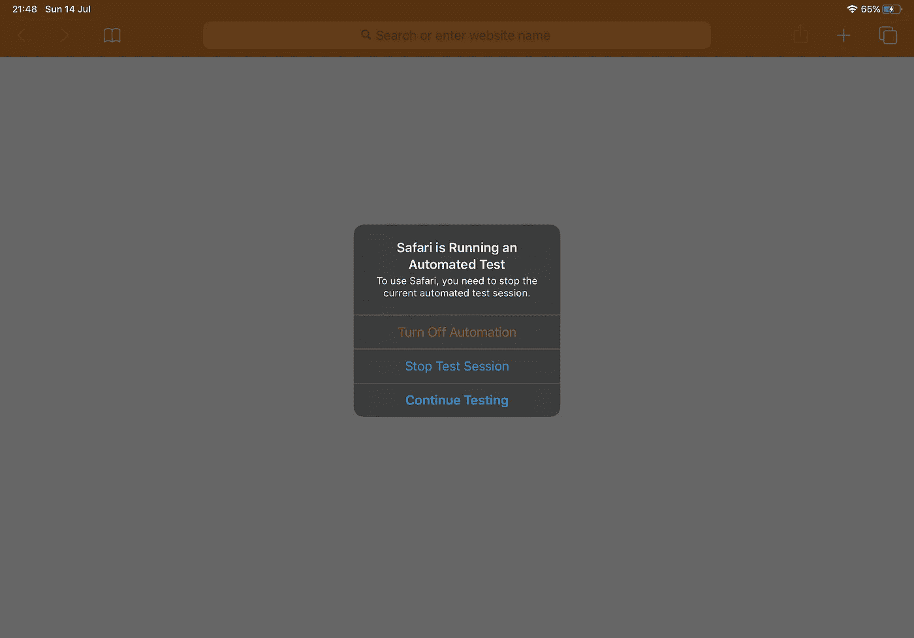
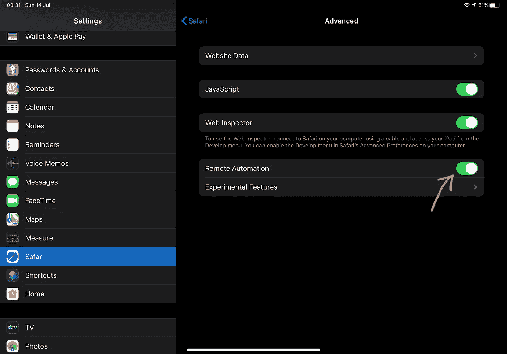
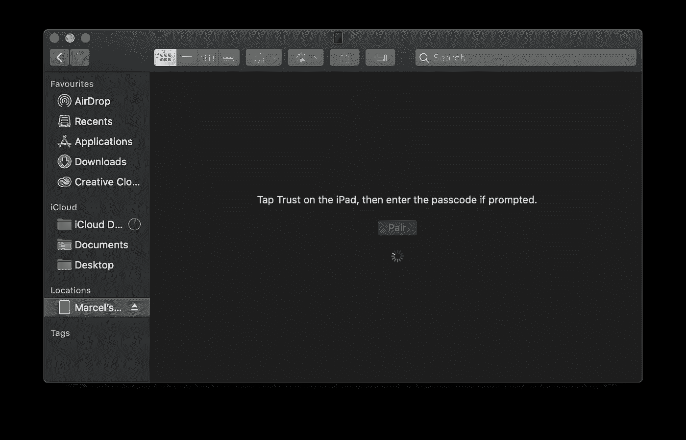
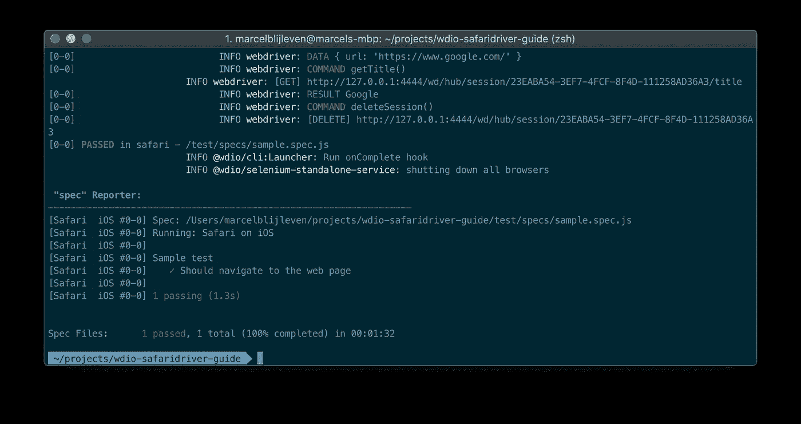

# 在 iOS 13 上使用 WebdriverIO 的指南

> 原文：<https://medium.com/swlh/a-guide-to-using-webdriverio-with-ios-13-ba0a24420ff8>

## 探索最新 safaridriver 中的新功能



Safari 10 早在 2016 年就引入了原生 WebDriver 支持，从 iOS 13 开始，他们将这种支持扩展到了苹果浏览器的移动版本。本指南将带你了解我使用 WebdriverIO(实际上没那么多)所必须采取的所有步骤。我们将完成一些基本的设置，创建一个页面对象和一个示例测试，最后我们将进行连接到 iOS Safari 所需的更改。

# 重要的事情先来

目前这个功能只在 macOS Catalina 和 iOS 13 上可用，遗憾的是这两个版本都还在测试中。如果你觉得自己很勇敢，你可以通过 https://beta.apple.com 的[安装公测版，如果不是，你仍然可以继续学习如何使用 Safari 自带的 safaridriver 在 macOS 版本的 Safari 上设置 WebdriverIO。](https://beta.apple.com/)

因为我们使用的是 WebdriverIO，所以你需要同时拥有 NodeJS 和 npm(节点包管理器)。您可以通过在您的终端中运行`node -v`和`npm -v`来检查您是否已经安装了这些。最新版本的 WebdriverIO 至少需要节点版本 8。

最后但同样重要的是，您至少需要安装 Java 8 JDK。我更喜欢用[家酿](https://brew.sh/)软件包管理器安装这些，但是你可以用你喜欢的任何方式。

## 安装软件包

为您的项目创建一个目录，并在终端中导航到该目录。运行`npm init -y`用默认值创建一个 package.json 文件。现在我们可以用下面的命令安装 wdio 命令行接口包。

```
npm i --save-dev @wdio/cli
```

如果要使用特定版本的 WebdriverIO，可以单独安装。

```
npm i --save-dev webdriverio@<version>
```

下一步是为 wdio 创建一个配置文件。这可以很容易地通过在你的终端中输入`./node_modules/.bin/wdio config`来完成。这将带你通过一个交互式助手，你可以选择你需要的所有设置和服务。你可以按 *<键输入>* 直到关于服务的问题添加到你的测试设置中。取消选择 *chromedriver* 与 *<空格>* 并选择 *selenium-standalone* ，然后再次按 *<回车>* 直到交互助手结束。您现在应该会看到以下消息。

```
Configuration file was created successfully!
To run your tests, execute:
$ wdio wdio.conf.js
```

在设置过程中，我们选择了 selenium-standalone 和 mocha 服务，这将自动为我们安装@wdio/mocha-framework 和@ wdio/selenium-standalone-service 包。

最后，我们安装可选的 Babel 编译器，它允许我们使用新的 JavaScript 特性。

```
npm install --save-dev @babel/core @babel/cli @babel/preset-env @babel/register
```

# 安装

如果你以前从未使用过 safaridriver，你需要在终端中输入`safaridriver --enable`来启用它。

打开您最喜欢的代码编辑器，替换`package.json`文件中的测试命令。这将确保我们在运行测试时调用我们的 wdio 配置。

在您的项目根目录下，创建一个名为`babel.config.js`的文件，内容如下。这只是一个基本的巴别塔配置，以帮助我们开始。

接下来，我们必须告诉我们的测试框架 Mocha 使用 Babel 编译器。打开`wdio.conf.js`并搜索 mochaOpts 属性，将其更改为。

配置文件中默认的浏览器功能设置为 Firefox，因为这篇文章是关于 Safari 的，我们必须改变它。

## **创建页面对象**

我喜欢使用页面对象，所以我们将创建一个简单的页面对象。在项目根目录下创建一个名为`test`的目录。然后，在`test`中创建一个`pages`目录。用下面的代码创建一个名为`Page.js`的新文件。

## 编写测试

为了简单起见，我们将创建一个小样本测试。在`test`目录中创建一个`specs`目录，并用下面的代码将一个名为`sample.spec.js`的文件放入其中。

在这个测试中，我们创建了 Page 对象的一个新实例，导航到页面，最后检查 title 属性是否包含文本“Google”。很直接，对吧？现在让我们通过在您的终端中键入`npm run test`来运行您的测试，如果一切顺利，您将在您的终端中看到一个成功的测试结果。

# 但是 iOS 呢？

你可能已经注意到，测试启动了桌面 Safari，而不是 iOS。这是因为我们仍然需要设置一些东西。打开您的`wdio.conf.js`，将平台名称 iOS 添加到您的浏览器功能中。

现在拿起你运行 iOS 13 的 iPhone 或 iPad，通过 USB 连接到你的电脑。进入*设置> Safari >高级>远程自动化，启用远程自动化。*



iOS 13 Safari remote automation settings

下一步是“信任”你的电脑。当你第一次将 iPhone 或 iPad 连接到电脑上时，点击弹出菜单上的“信任”即可。如果您没有看到此弹出窗口，您可以打开一个 Finder 窗口，并在“位置”下的右侧栏中单击您的设备。您应该会看到一个配对按钮，点击它，然后在您的设备上点击“信任”。输入您的密码，您就可以开始了！



现在保持你的 iPhone 或 iPad 解锁，在你的终端中输入`npm run test`。您应该会看到 Safari 在您的设备上弹出。等待几秒钟后，顶栏将变成橙色，这意味着浏览器正由远程自动化控制。

对我来说，如果我在 Safari 中没有打开任何额外的标签页，自动化会启动得更快。自动化完成后，浏览器将关闭，您将在终端中看到一个通过的测试。您刚刚在运行 iOS 13 的设备上运行了您的第一个测试！

稍后，当 iOS 13 正式发布时，您也可以在 iOS 模拟器中运行您的测试，只需将`'safari:useSimulator': true`添加到您的浏览器功能中。一旦 iOS 模拟器对公众开放，我将创建一个关于使用它的单独的故事。

