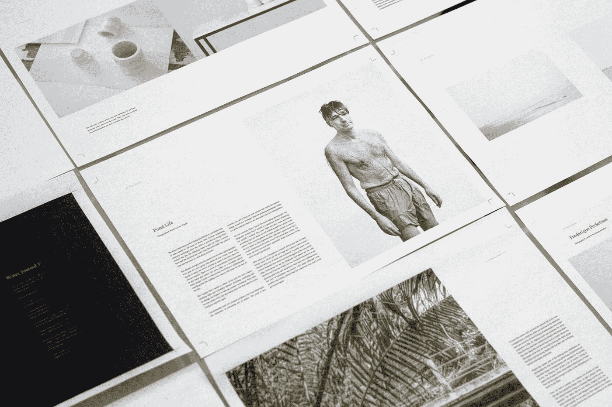

# 数字出版的七分钟历史

> 原文：<https://medium.com/swlh/a-history-of-digital-publishing-25025606df39>

## 从古腾堡到 Adobe 的 PDF 发明(以及更多)——出版界如何从零到一百万英里每小时…

Photo by [Water Journal](https://unsplash.com/@waterjournal?utm_source=medium&utm_medium=referral) on [Unsplash](https://unsplash.com?utm_source=medium&utm_medium=referral)

1993 年 6 月 15 日，Adobe Systems 的绝密项目 Camelot 完成并向全世界发布。这个特别工作组三年工作的成果被命名为…