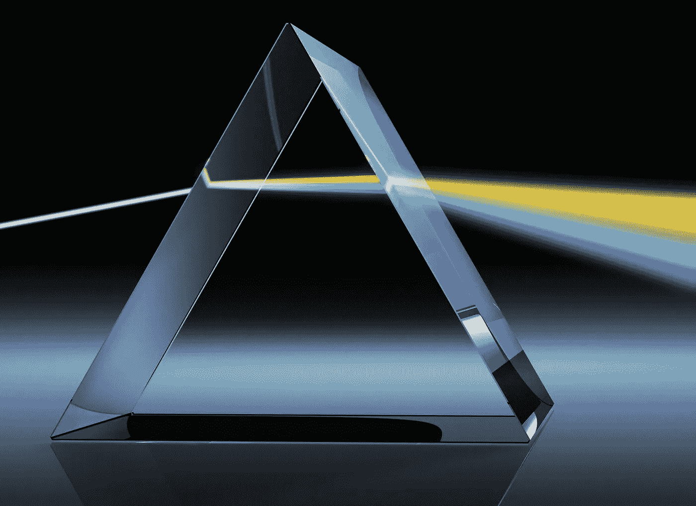

# 洞察力和创新的一课:塑造创造性的工作场所

> 原文：<https://medium.com/swlh/a-lesson-for-insight-and-innovation-shaping-the-creative-workplace-a74517ee5cc4>

你还记得你第一次看到光波穿过棱镜时的情形吗？当光波穿过玻璃介质时，它们是如何减速的，从而显示出分散成光谱的光？

我们常常只希望我们的个人和专业项目有速度，让它们在光的清晰和指引下前进。但是因为他们是…