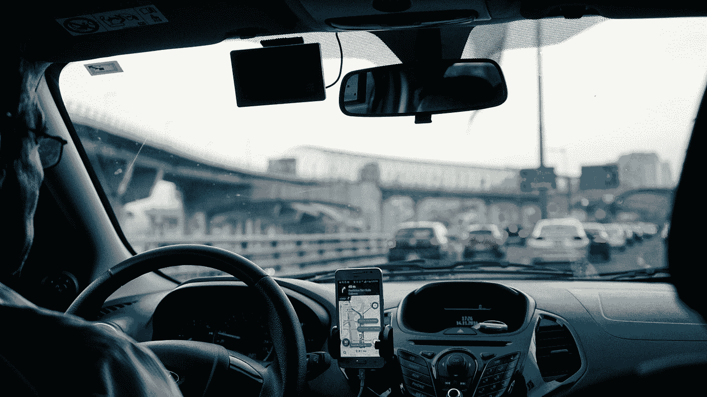

# 一个作弊的优步司机的教训

> 原文：<https://medium.com/swlh/a-lesson-from-a-cheating-uber-driver-4e2538fc9178>

我讨厌在洛杉矶国际机场飞行。这对那些必须经常在洛杉矶飞来飞去的人来说并不是革命性的。不管怎样，几年前我不得不飞到洛杉矶国际机场。我到了机场，从行李传送带上拿起我的包，这时我想起，除了交通、航站楼之间长得离谱的走廊和没完没了的施工，我对洛杉矶国际机场的头号抱怨是他们的拼车政策。要求司机在停车场场外等待与票价连接以试图减少交通流量的权力[(这项政策最终于 2017 年改变)](https://www.latimes.com/travel/deals/la-tr-uber-lyft-20170829-story.html)。对于一个疲惫的旅行者来说，不利的一面是，如果你在到达行李认领处之前忘记订车，那么在他们到达之前，你要等大约 20 分钟。

Photo by [Dan Gold](https://unsplash.com/@danielcgold?utm_source=medium&utm_medium=referral) on [Unsplash](https://unsplash.com?utm_source=medium&utm_medium=referral)

当我默默咒骂自己的健忘时，一个陌生人走过来问我是否需要搭车。现在我知道你在想什么，是的，我见过*被带走*，不，我没有那些特殊的连姆·尼森技能。然而，我意识到应用程序在我的手机上，他显然只是放下了某人，显然，偶然走进了我。我不情愿地和我的新朋友一起上了车，他告诉我，我们需要开车离开机场，到一个我们可以用应用程序连接的社区。黑幕？绝对的。在这一点上，虽然我已经在车里，虽然我冒着被绑架的风险，没有可能支付赎金，但至少我不必等待遵守规则带来的二十分钟(讽刺和第一世界的问题比比皆是)。

当我们走出“禁区”时，我可以连接他的车，但应用程序不接受我更新的公司信用卡。现在我们有一个问题。我有没有下车搭竞争对手的车？我的司机叹了口气，说他可以按折扣价收我一平方。我们已经从有点可疑变成了“我的公司会批准这笔交易给一个人，一个不可靠的唱片公司账户吗？”我勉强同意了。我不知道附近的情况，说实话，我只想在不失去一个肾的情况下回到我的酒店。

我的司机在给我看了应用程序费用后，开始在车流中蜿蜒前行，然后按照我们在秘密谈判中达成的协议，减去了 10 美元。我们开车的时候，我忍不住问他几个问题。

他是否担心自己会因为规避规则和在行李认领处识别票价而被禁止进入拼车平台或被监管不严？

他认为其他司机会因为他的行为举报他吗？

他是否担心在应用程序中被标记为在洛杉矶国际机场外完全相同的位置重复转机？

他经常使用他的应用外支付方式吗？他认为这是不道德的还是交易的一部分？

Photo by [Ben White](https://unsplash.com/@benwhitephotography?utm_source=medium&utm_medium=referral) on [Unsplash](https://unsplash.com?utm_source=medium&utm_medium=referral)

是的，我问过他所有这些问题。不是突然像一个孩子为学校报纸写文章，而是在一个好奇的背景下，“你去哪里？”有点像机场酒吧里的对话。

幸运的是，我的司机非常乐意分享他的想法。当他开始自己的小生意时，他已经为不同的拼车服务开车好几年了。在那段时间里，应用程序在没有通知的情况下多次改变策略，影响了他的赚钱能力。他认为宽松的接车规则是被误导的，他在遵守政策的同时搭载的每个乘客都对此表示不满。有一天，他决定走进候机楼，寻找下一位乘客，而不是绕回等候区。这很有效，自从第一次钓鱼实验以来，每次他有所下降时，他都这样做。乘客们总是很欣赏这一点(我也是)，尽管他承认他不得不“瞄准”像我这样的人(高个子，男性，不怕因为我的身材/愚蠢而被绑架)。他认为如果他被抓住了，他会停止把人们赶出洛杉矶国际机场，这是值得冒险的。他也是 Reddit 上一群司机中的一员，他们都分享类似的技巧和窍门，所以他不认为这在这个行业中不会引起不满。

至于被应用程序标记，他承认他没有想到平台后端的人会看到他的驾驶模式，并将其标记为可疑。他笑着感谢我的“建议”，并说他以后会去不同的地方混。他确实承认，他偶尔会用自己的 Square 账户私下向人们收费，但大多是在人们的手机或应用出现问题时。

当我们快到酒店时，他对我说的最后一句话是最有趣的。他问我，我的公司是否重视我的技能，以至于不会有一天用人工智能取代我。我承认他们可能没有，而且在不久的将来，这可能会成为我们许多人的现实。他点点头说，“这些应用程序现在需要司机来满足乘车需求，但自动驾驶汽车准备好的那一天，我们就完了。他们会封锁所有人的通道，就这样。我敢肯定，他们会发出一些警告和最后一条信息，感谢我们的服务，但在一天结束时，他们需要我们，直到他们不再需要我们。”说完，他让我下车，按照约定用我的卡付了钱，并祝我晚安。

我承认我对他的坦率和洞察力感到惊讶。这家伙在和大公司玩游戏，他知道大公司一有机会就会把他踢出门外，把他当成可牺牲的成本。这让他的所作所为合乎道德吗？大概不会。我敢肯定，有人从他们的公司偷了一大笔钱或知识产权，因为他们觉得这是“T0”应得的。然而，这种互动提醒了我，员工与公司的关系是多么不稳定。

Photo by [Hebert Kostan](https://unsplash.com/@hebertkostan?utm_source=medium&utm_medium=referral) on [Unsplash](https://unsplash.com?utm_source=medium&utm_medium=referral)

**外卖#1:** 公司总是更好地服务于召唤未来和提前计划。在一个零售、自动化和不断变化的需求导致职位、公司或整个行业消亡的时代，领导者最好召唤出房间里的大象，与员工合作解决它。例如，[亚马逊本周出台了一项计划，计划在 2025 年](https://techcrunch.com/2019/07/11/amazon-invests-700-million-to-retrain-a-third-of-its-u-s-workforce-by-2025/)前投资 7 亿美元对 10 万名员工进行再培训和技能提升，让他们从事更多的技术工作。杰夫·贝索斯需要为亚马逊员工做这些吗？也许不是，但他可能意识到每个角色都不能自动化，公司有大量的人力资本，他们已经接受了亚马逊的核心价值观。不过，最重要的是，员工欣赏直接沟通和诚实，即使是关于不确定的未来(想想裁员、公司收购或领导层变动)。

**外卖#2:** 在洛杉矶国际机场不被不明不白的家伙绑架真好。是时候在我所有的旅行应用程序上更新信用卡了，看看《拍摄 2》获得一套新的独特技能。