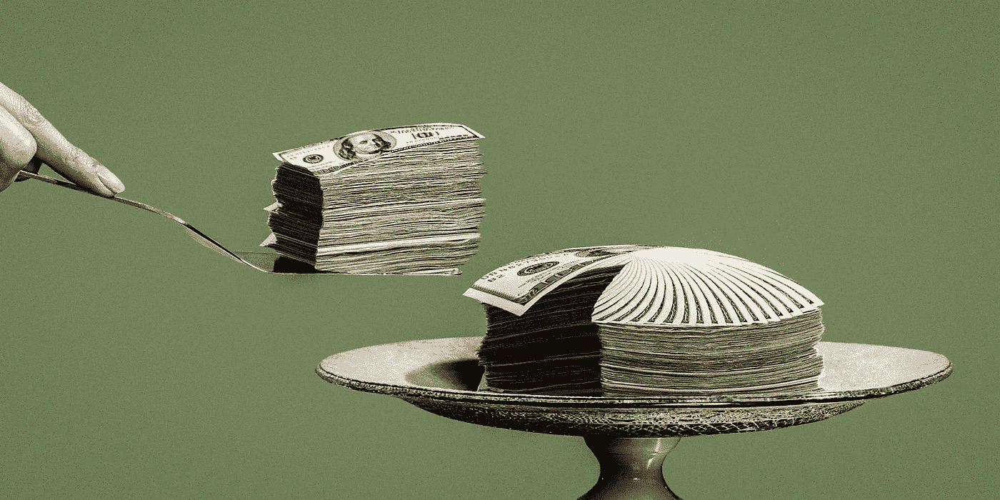

# 一个鲜为人知的致富方法…

> 原文：<https://medium.com/swlh/a-little-known-way-to-become-wealthy-14ac397ccc89>

## 金钱永远不会凭空产生

**人。**

财务成功的一个重要因素是其他人:

1.  与你合作的人
2.  联系你的人
3.  你雇佣的人
4.  卖给你东西的人
5.  向你买东西的人

我将在下面更详细地讨论这些问题:

**1。与你合作的人**

我相信大家都熟悉这句谚语:

> ***“你是你周围 5 个人的平均值”***

如果你周围的人知道你不知道的事情，并挑战你成为更好的自己，你自然会提升。

不仅如此，你还可以建立一个强大的部落，一个合作伙伴、合作伙伴和潜在供应商或买家的网络。

许多像史蒂夫·乔布斯、理查德·布兰森和比尔·盖茨这样的成功人士并不是靠自己努力，他们总是有团队、合作伙伴和关系帮助他们达到他们所取得的成功水平。

这甚至不一定是朋友，如果你知道如何接触经销商、销售经理或有影响力的人，并说服他们与你合作，那么你会走得很远。

然而，如果你决定走这条路，你的产品或想法需要脱颖而出，并有一些概念证明，原型或 MVP(最可行的产品)。MVP 是你的产品、想法或服务的最基本的版本，是你进入市场的有效产品。

学习如何与人接触，如何激励人，如何说服人，如何与人合作，如何提高你的技能和网络，这样你就有东西可以回报。

你必须付出价值才能获得价值，所以要提升自己，让自己脱颖而出。

**2。联系你的人**

我记得年轻时听过这句话:

> “你的成功取决于你结交的朋友，你的关系网就是你的净资产”。

没有人是一座孤岛，要创造财富你需要销售，而销售你需要消费者，现在关于消费者有趣的事情是他们不喜欢被销售。

这就是为什么认识与客户关系密切的人很重要，他们可以介绍你或代表你做推荐。

这可能是:

*   客户的朋友
*   姐妹公司
*   供应商
*   经销商
*   首席执行官的侄子
*   或者经理的女儿不停地向妈妈和爸爸要你们公司正在努力批量生产的可爱的新玩具。

你需要的人不仅能帮你联系到客户，还能帮你找到机会。

你可能正试图进入一个竞争激烈的低利润行业，但你的朋友告诉你一个几乎没有竞争对手的高利润新行业。

如果财富是乘客，人就是交通工具。

**3。你雇佣的人**

有句话说得好:

> ***“万事通，无所不能”。***

如果您在某一特定任务中招募了比您更优秀的人，并且对他们进行了很好的补偿，您的投资将获得巨大的回报。

不知道如何编写您想要构建的应用程序？雇佣某人

不是自然销售人员？招募一名？

车库不够大，你没时间打包送货？外包？

有太多的小任务占用你的时间吗？找个私人助理。

有很多人在某些任务上比你做得更好、更有效率，你需要找到他们。

这并不一定非得是受薪员工，例如，如果您为您的业务创建了一个附属计划，您希望招聘拥有大量追随者和相当大影响力的附属公司。

你雇佣的人就像是你的企业、产品、想法或服务的军队。你想雇佣最好的。

**4。卖给你的人**

这是我第一次创业时遇到的另一句话:

> ***“卖东西的时候不赚钱，买东西的时候赚钱”。***

在购买任何东西时，无论是您打算出售的产品还是个人使用的产品，您都应该始终注意两件事:

1.  公平价格
2.  好品质

公平价格，我不是指低价格，事实上更便宜的选择通常是最糟糕的，它们便宜是有原因的。

您支付的价格需要反映您希望从该商品中获得的价值，而不再是:

*   如果有中间人抬高价格，那就把他们赶走。
*   如果有任何不必要的额外费用，不要购买。
*   尽可能从直接渠道购买
*   避免使用信用卡或每月分期付款，从长远来看，预付费用会更便宜。
*   不要用债务购买任何东西，如果你负担不起，你也负担不起。当然也有例外，但这应该是一个普遍的原则。

其次，质量必须很好，例如，我过去常常买一大堆便宜的 4 美元 t 恤，每隔一个月就需要更换一次，所以我开始买 40 美元的设计师 t 恤，这已经持续了我 4 年多了。我现在每年只需要多买 1-2 件 t 恤，而不是 10-30 件。

你想卖的产品也是如此，如果你能为更好的质量支付更多，选择更好的质量，你的客户和你的商业银行账户会在以后感谢你。

**5。向您购买的人**

中枢国际公司的首席销售官萨姆·沃尔顿曾说过这样一句话:

> ***“老板只有一个。顾客。他可以解雇公司里的所有人，从董事长到下任主席，只需把钱花在别的地方。”***

“建造它，他们就会来”是一个过时的策略，知道人们最大的痛苦是建造财富的新方法。

知道人们想要解决什么问题，解决这个问题并让他们开心，这是致富的必由之路。人们会很快为任何让生活更轻松或让他们更快乐的东西买单。

*   你认为人们为什么吸毒？这有助于他们逃跑。
*   人为什么要抽烟？它能减轻压力
*   人为什么要喝酒？它能让感官变得迟钝，改善当时的情绪。

现在前三个例子是非常糟糕的，醉人不是一个变得富有的好方法。相反，想办法为人们的问题提供解决方案，他们会为此付钱给你。

想帮人逃跑？创建一个基于一个人的情绪播放歌曲的应用程序，已经证明音乐以类似于毒品和性的方式产生快感。

人们花了几千年的时间试图让自己的生活更轻松，如果你能做到这一点，你将是一个非常富有的人。

这就是为什么社交网络、服务企业和技术公司收入最高，并在短短几年内拥有数十亿美元估值的原因。

所以你有它，**人:**

你如何和他们一起工作

他们如何联系你

他们如何为你工作

你需要从他们那里得到什么

他们需要你做什么。

这是一种鲜为人知且被忽视的致富方式。

财富通过多重网络流动，如果你没有网络，财富从何而来？

## 这篇文章发表在[《创业](https://medium.com/swlh)》上，这是 Medium 最大的创业刊物，有+430，678 人关注。

## 订阅接收[我们的头条新闻](https://growthsupply.com/the-startup-newsletter/)。

