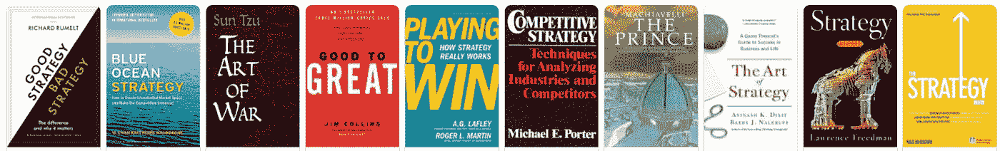

# 少一点策略，多一点行动；为什么大多数成功的公司在战略上失败

> 原文：<https://medium.com/swlh/a-little-less-strategy-a-little-more-action-why-most-successful-companies-fail-at-strategy-6d4d3d0931ab>

我过去认为战略是商业成功的必要组成部分。我们在 50，000 本关于战略的书中学到了这一点。我们已经把目光投向了军事，受到了《孙子兵法》的启发，凝视着史蒂夫·乔布斯和埃隆·马斯克的远见卓识。我们被灌输了颠覆性创新的可取性和……