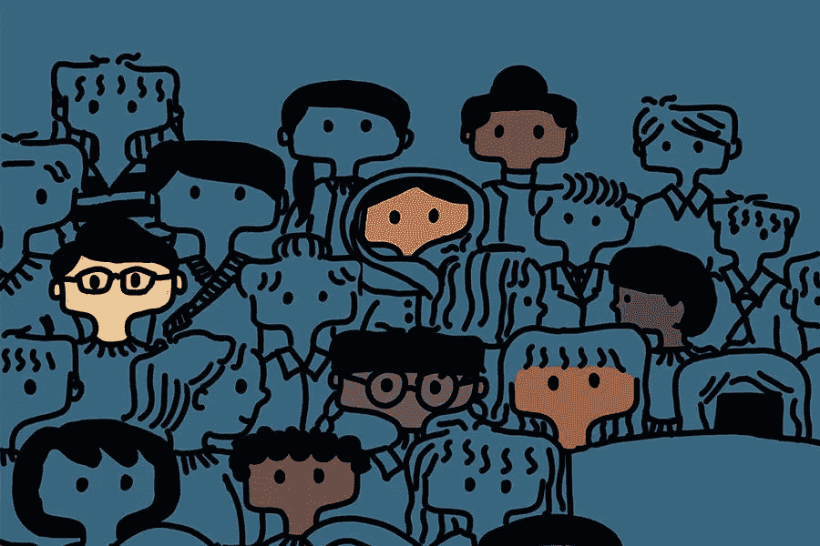

# 一个身处科技大世界的少数民族小女孩。

> 原文：<https://medium.com/swlh/a-little-minority-girl-in-a-big-tech-world-18f62a76a34e>

Image by: Selina Hua

当我年轻的时候，我从来没有想过我会在科技行业发展。事实上，我的计划是成为一名兽医…唯一的原因:因为我喜欢动物。我在大学一年级走上生物医学科学道路时很快意识到:我不仅数学和化学(这两门课是获得任何医学学位都必须学的)非常糟糕，而且当它…