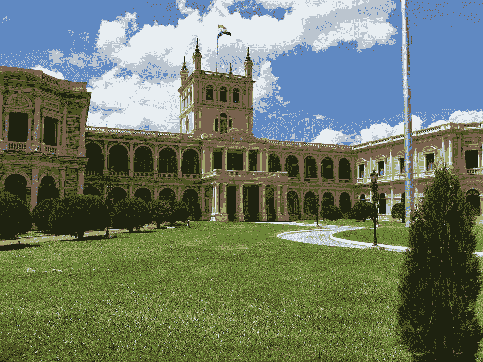

# 巴拉圭新兴但不断发展的技术领域一览

> 原文：<https://medium.com/swlh/a-look-at-paraguays-nascent-but-growing-technology-scene-14dd763916d5>

[Source](https://pixabay.com/photos/paraguay-presidential-palace-palace-2211577/)

内陆国家巴拉圭大约有 700 万人口。它还是世界第二大水电站的所在地，巴拉圭是世界第六大大豆生产国。企业家和技术领域在这个国家仍处于起步阶段，但人们正在采取措施让新想法起步。以下是关于商业、技术和企业家的十个事实…