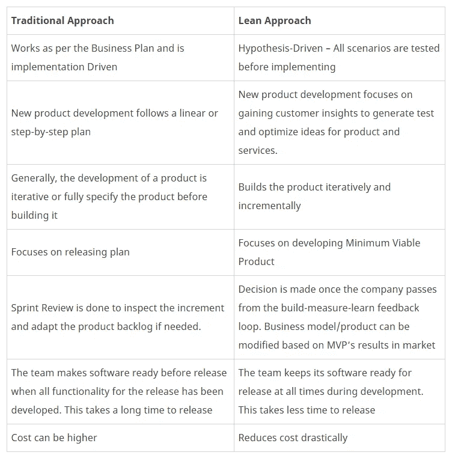

# 深入了解精益创业:10 分钟概述

> 原文：<https://medium.com/swlh/a-look-inside-lean-startup-an-overview-in-10-minutes-1579188bd526>

## “精益启动方法不是关于成本，而是关于速度”——Eric Ries

> 超过 50%的小企业在头四年失败。

Photo by [Clark Tibbs](https://unsplash.com/@clarktibbs?utm_source=medium&utm_medium=referral) on [Unsplash](https://unsplash.com?utm_source=medium&utm_medium=referral)

这个事实并不是要阻碍你实现你的梦想，而是提醒你，并不是每一个形成商业模式的想法都会成功。很明显，他们中的大多数都不知道！

所以，一个企业家不能盲目相信某个商业理念，在创业之前，他们必须有一个万一失败的应急计划。当企业失败时，企业家可能不会失去所有的资金和资源，但他们会失去产生新想法的意志力。

为了避免这一问题，it 的解决方案是制定和执行战略的方法，以加速上市时间和业务的可行性。这种方法被称为精益创业。

# 精益创业:意味着什么？

精益创业是一种通过减少开发周期中投入的时间和资金来获得开发产品的最短可能途径的方法，它还用于进行可行性测试，以确定开展某项业务是否可行。

但是，大多数企业家和公司领导人对这种方法有误解和错误的理解。

## 关于精益创业的神话

*   精益意味着你没有宏大的计划
*   第一件事是验证解决方案
*   精益创业关注失败
*   精益方法不适合大型企业；这只是为了启动
*   精益创业用数据和客户反馈取代愿景

然而，事实上，任何公司，无论大小，都可以从精益创业技术中受益。GE FastWorks 通过使用精益启动方法在全球启动了 100 个项目。另一个支持者包括高通、Intuit 等等。

> 精益与一家公司赚多少钱或投资多少钱无关，而是用最少的资源满足客户的需求。

让我们看看为什么客户开发很重要，可以使用什么方法？

# 精益创业方法论:客户发展宣言

精益启动方法基于客户开发方法。由史蒂夫·布兰克开发，它强调“在开发过程中尽可能早地了解客户和他们的问题。”

## 精益客户开发在行动

客户开发有助于避免错误并发现新的市场机会。与其假设你对企业的信念是正确的，企业家必须专注于科学方法来验证这个想法。

## 在进行产品开发之前，问问自己

*   谁是你的客户？
*   他们的需求是什么，面临着什么问题？
*   现有的场景是什么？
*   你能为你的客户提供什么解决方案？
*   你将如何提供有效的解决方案？

## 为了拿出最好的产品，Eric Ries 在 2011 年提出了精益创业方法，描述如下

*   假设驱动的实验:企业家必须思考新的想法，以达到预期的结果，而不是只关注计划和研究。通过进行假设驱动的实验来验证想法，可以消除不确定性。这确保了团队通过放弃坏主意来完成他们的任务。精益不仅仅是快速失败、廉价失败。它是关于围绕产品开发的过程和方法。
*   **迭代产品发布**:如果公司投入时间迭代构建产品以满足早期客户的需求，他们可以降低市场风险，甚至可以避免大量资金和昂贵的产品发布和失败。
*   **经验证的学习**:这个过程涉及到每一步的测试迭代。通过经验证的学习，可以根据数据而不是推测做出决定。

通过使用这些方法，企业将有一定的方法得出结论，而不是使用试错法。

## 成功运用精益创业方法的过程是什么？

为了了解如何缩短产品开发周期以及如何检查业务的可行性，以下是采用精益创业方法的流程:

# 精益启动的过程:构建-测量-学习反馈循环

企业家需要明白的第一件事是，精益创业不是一次性的过程，它是一个循环，需要在业务的每个阶段都遵循，精益创业的过程实际上是一个循环。

**计算出的构思**

如前所述，想法和业务是基于统计数据和数字，而不是情绪和假设！虽然不可能研究整个市场，但在确定市场中的痛点或缺口，然后将其转化为特定的商业模式之前，必须进行特定的样本研究。

**加速开发最小可行产品(MVP)**

一个商业想法可能包括许多不同的产品和服务，但是，企业家必须明白，只有在完成整个产品或服务之后，才能向最终客户开展业务，这是一个更大的财务和战略风险。一个企业家不能冒这样的风险，他必须把他们的产品分成几个阶段，一旦他们有了一个最低限度的可行产品，就把它投放给顾客。

MVP 正在开发一个具有所有基本需求的产品，并将其投放给一个较小的客户群。这将使他们能够测试和衡量他们的产品在市场上的性能，在整个产品准备好投放市场供大众消费之前，它已经有了一个强大的固定客户基础。

甚至开发一个 MVP 都可以加速！以下是加速 MVP 开发所采用的因素:

*   单元测试
*   可用性测试
*   连续累计
*   集群免疫系统
*   及时可伸缩性
*   云计算

**连续测量**

产品一投放市场，就要进行持续的测量。通过采用以下任务和方法可以实现连续测量:

*   分割测试
*   持续部署
*   清除产品所有者
*   实时监控
*   漏斗分析
*   净发起人分数
*   实时警报
*   预测监控

因此，如果 MVP 的性能如预期的那样，那么开发就可以进行到下一个阶段，如果有某些挫折，它们需要被纠正，并确保它们不会在进一步的开发中重复。

但是，如果产品未能占领市场，这对企业家来说是一个线索，可以通过发现问题或永久关闭大门以避免进一步的损害来启动商业模式的重大变革。

**持续学习**

精益创业最重要的一个方面是学习，一旦企业家在市场上推出产品，他们就开始产生数据。所有这些数据都必须经过分析，并从中得出某些结果或知识。然后，成果或结果将用于改进产品的其余部分，并使更广泛的产品更有利可图。

**支点**

Pivot 是指在收到直接或间接反馈后，改变业务策略，以测试产品的新方法。对于企业家来说，做出一个关键的决定是最艰难的决定之一，因为他们已经投入了大量的时间和金钱，对产品抱有很高的期望。Pivot 有不同的类型，每一种都是为了测试产品的生存能力而设计的。它包括:-

*   放大支点:当创业者看到产品中的一个功能比其他功能更受关注时，他们可以使用这个支点。然后，他们可以通过提供具有单一功能的全新产品来改变策略。
*   **缩小枢轴**:与上述枢轴相反。有时产品的功能不足以支持庞大的客户群。你需要扩展你的产品来支持更多的功能。在这种情况下，整个产品成为更大产品的一个单一特征。
*   **客户细分支点**:你的产品可能在市场上获得了很好的评价，但没有从你的目标用户那里获得。在这种情况下，您需要重新定义您的产品定位、价值主张、定价和渠道。
*   **客户需求中枢**:从客户反馈中，您可能会意识到您的产品的问题对客户来说并不是很重要。在这种情况下，你必须更深入地理解问题。您可能需要重新定位或开发新产品来解决他们的问题。
*   **平台中枢**:这种情况下，您需要更换应用平台，反之亦然。您可能会惊讶地知道，像优步、Airbnb、易贝等品牌。需要选择形成平台中枢来支持确定性。
*   **商业架构中枢**:有两种类型的商业:高利润、低交易量的商业和低利润、高交易量的商业。你不能两者兼而有之，但有时你可以从一个转向另一个。
*   **价值获取中枢**:指收入或货币化模式的变更。当您改变赚钱的策略时，它会影响商业模式的产品、业务、销售、营销和运营方面。
*   **引擎增长中枢**:一般来说，初创公司使用三种主要的增长引擎:病毒式、粘性和付费增长模式。他们可以从一个增长引擎转向另一个。
*   **渠道中枢**:这里您需要改变销售产品和服务的方式和地点。(店内、在线、应用内等。)
*   **技术中枢**:运用现代技术达到同样的效果。如果技术提供了经济高效或性能更好的解决方案，这将很有帮助。

除此之外，企业家还必须遵循一些原则，以成功实施精益创业方法。这些原则如下:

# 塑造企业的精益创业原则

## 企业家无处不在

埃里克·里斯(Eric Ries)认为，任何拥有初创企业的人都是企业家。他将初创企业定义为“一个旨在极端不确定条件下创造新产品或服务的人类机构”。面对不确定性，任何人都可以成为企业家。没有比今天更适合创新的时候了。 ***三思而后行，从小规模做起。***

## 创新会计

会计不仅仅局限于以财务为基础记录收入、损失、利润和销售，还包括如何衡量进展、如何设定里程碑、如何确定工作的优先顺序等。这种会计被称为创新会计。想想创造性的方法来解决这个问题，这样它就有足够的差异化点来获得市场优势。

## 创业就是管理

一个企业家一定不要忘记，一个企业不仅仅是一个产品、客户和所有者；这是一个由许多不同实体和下属组成的组织。如今，初创企业需要一种新型的管理方式，这种管理方式必须与环境相适应。因为有很多企业曾经有着惊人的产品和巨大的市场，但是却因为管理上的失败而失败了。

## 有效学习

虽然大多数企业家都希望在市场上做大，并致力于开发一个成功的品牌，但他们往往把目光局限在赚钱上。当你经营一家企业时，最重要的是了解市场，用科学的工具和方法来验证所有的学习，审视企业的所有要素，并最终为长期成功的企业未来发展一个可持续的品牌。

## 构建-测量-学习

精益创业就是通过构建最简单的产品 MVP，将想法转化为产品。这是通过测试和用户反馈进行评估，以收集目标用户如何接受产品的数据。如前所述，要建立一个成功的企业，就应该在反馈循环中进行处理。

# 部署精益创业的显著优势

*   理解业务可行性的科学方法
*   降低经济损失的风险
*   加速处于初始阶段的产品开发
*   快速帮助学习什么是不工作的，立即做出改变
*   如果最初的计划不起作用，建议转向或停止
*   可以通过用户活动、参与度和保持度来跟踪进度

# 使用精益启动的局限性:何时不使用

*   设计和产品在开发过程中显得杂乱无章
*   向竞争对手展示风险投资理念
*   很难为大多数产品创造 MVP
*   想出一个创新的方法是一项困难的工作
*   不确定的项目需要更多的时间来达到他们的回报时间

# 快速学习:为什么精益比传统方法更有效？

精益不是从商业计划开始的；它始于对商业模式的探索。只有快速的实验和反馈才能揭示这个想法是否会被执行。让我们看看它有什么不同？

在一个创业投资组合中使用精益方法会比使用传统方法导致更少的失败。

# 什么时候使用精益？

*   当有更短、更简单的问题时
*   当开发 MVP 和运行实验成为可能时
*   没有高风险情况，如严重的法律/合规、品牌、政治或财务风险
*   当您需要快速改进时
*   当问题和解决方案未知时

## 实时示例

Dropbox
德鲁·休斯顿——Dropbox 的首席执行官在 2007 年提出了提供仓储设施的想法。他发布了一个简单的视频，解释产品是什么，它如何让用户受益，从而验证了他的想法。他使用了 Digg 平台，并瞄准了该技术的早期采用者。

不经意间，这个视频看起来像是产品演示，但幸运的是，他一夜之间收到了 5000 到 75000 份注册表格。在收到大量客户反馈后，Drew 对发布最终产品充满信心，因为它专注于解决实际的存储问题和安全的文件共享。在推出最终版本后，Dropbox 在不到 10 个月的时间里满足了 100 万用户的需求。

**总结**
我们必须明白，在当今的市场上，一场大爆炸式的产品发布会是失败的完美秘诀。对于这个大爆炸，你所要做的就是遵循原则，不断尝试，专注于用更少的资源为客户增加价值。学会倾斜以获得有利的结果。

这就是一个企业家需要了解的关于精益创业的全部内容。理解这一点是很重要的，精益方法是一个持续的过程，它将在企业中反复实施。

本帖最初发表于我们的博客: [***此处***](https://www.spec-india.com/blog/a-look-inside-lean-startup-an-overview-in-10-minutes/)

## 这篇文章发表在 [The Startup](https://medium.com/swlh) 上，这是 Medium 最大的创业刊物，拥有+421，678 名读者。

## 在此订阅接收[我们的头条新闻](https://growthsupply.com/the-startup-newsletter/)。

