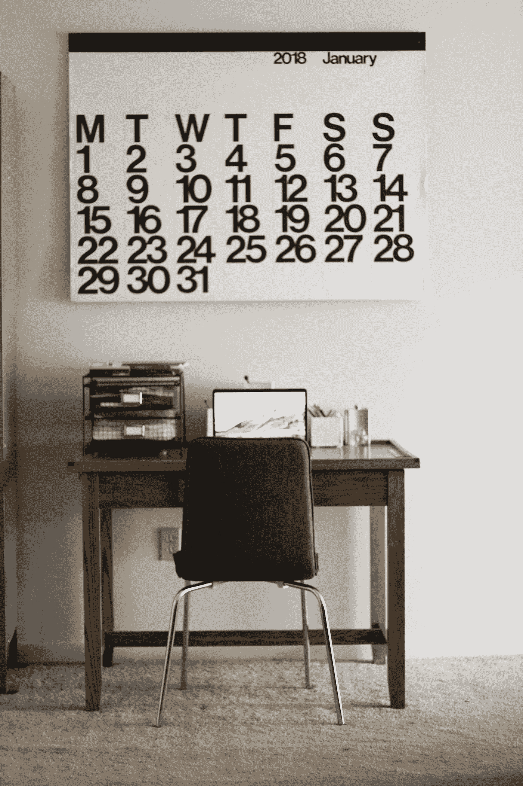

# 一种总是有话题可写的方法

> 原文：<https://medium.com/swlh/a-method-for-always-having-a-topic-to-write-about-24922f655cac>

Photo by [Alex Jones](https://unsplash.com/@alexjones?utm_source=medium&utm_medium=referral) on [Unsplash](https://unsplash.com?utm_source=medium&utm_medium=referral)

当你阅读致力于作家帮助的在线页面时，你总是会遇到来自声称有写作障碍的新手作家的大量问题。在我看来，有一大群想要成为作家的人认定可怕的写作障碍实际上是真实存在的，就像医生可以治愈的疾病一样。它不是，你也不应该让自己被…