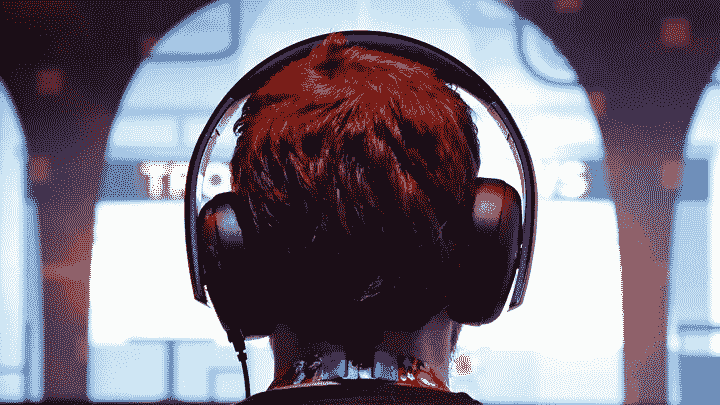

# 音乐事件

> 原文：<https://medium.com/swlh/a-musical-affair-45fb89b530b5>

*不喜欢音乐的人的耳朵之间*

Photo by Jonathan Alcorn on Reuters

我喜欢音乐。

滚石乐队、背信弃义乐队、史努比·道格，凡是你能说出来的，我都听。音乐帮助我早上醒来，它在我去健身房的时候激励我，它在我孤独的时候安慰我，它在聚会上让我兴奋。

我是说，每个人都喜欢音乐，对吧？