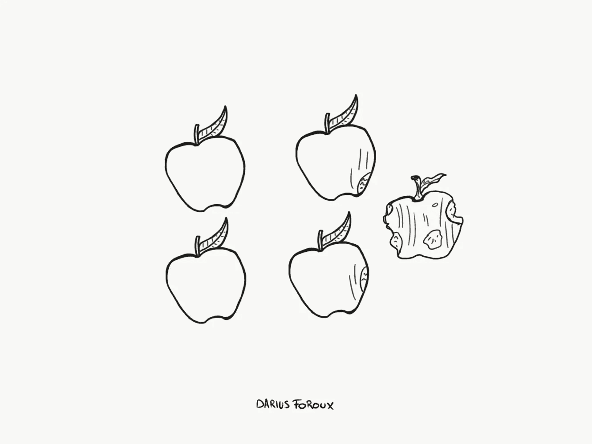

# 消极的态度比你想象的更容易传染

> 原文：<https://medium.com/swlh/a-negative-attitude-is-more-contagious-than-you-think-71795dc87e3b>

当一个懒惰的人加入一个高效的团队时，你认为更有可能发生什么？

*   选项 A: 懒惰的人从高效的人和他们积极的心态中获得灵感。懒惰的人会自动提升到他们的水平。
*   **选项 B:** 团队中高效的人随着时间的推移变得懒惰。