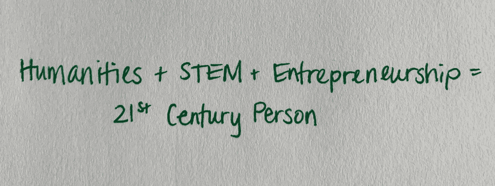
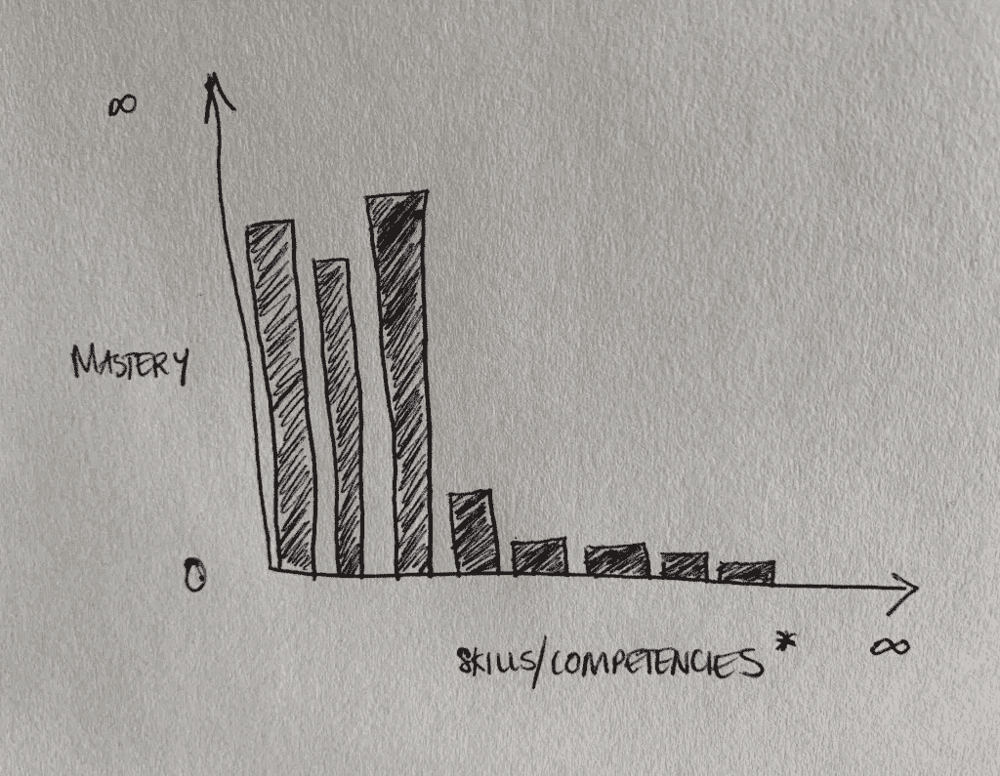
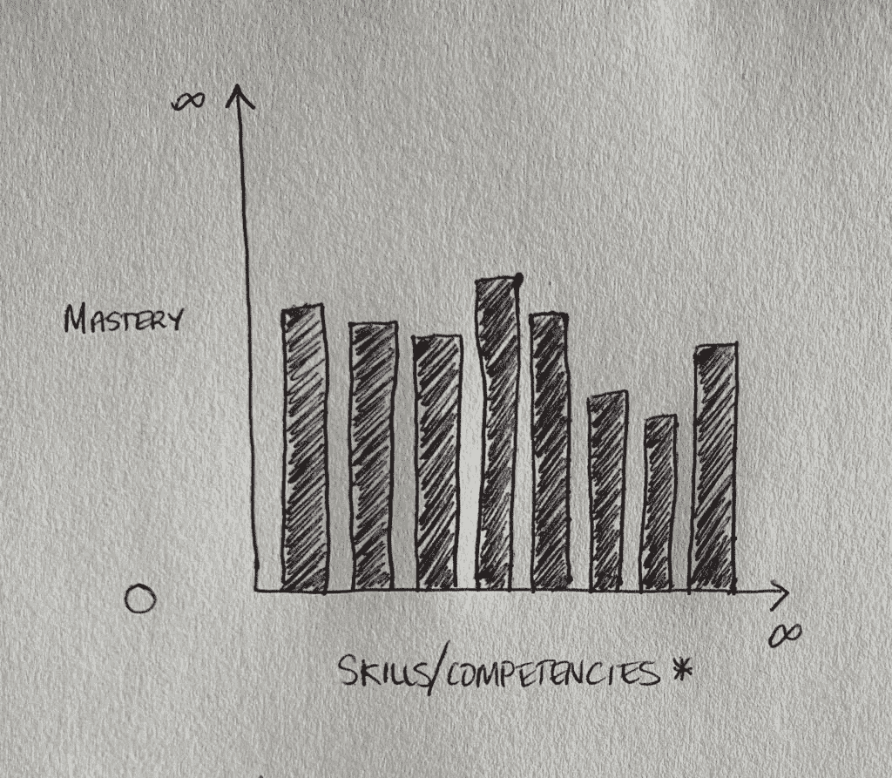

# 解决问题的新方法

> 原文：<https://medium.com/swlh/a-new-approach-to-problem-solving-d2c18dd7ef4f>

如果我们与来自不同教育背景的人建立团队和公司，从人文到科学，我们可以解决我们作为一个社会面临的最棘手的问题，如气候变化和性别平等。但是在我们能够应对这些挑战之前，作为一个社会，我们需要改变我们重视和支持非技术能力的方式。我们需要将所有教育学科视为具有同等价值。我们需要将软技能视为与硬技能具有同等价值，换句话说，软技能只是技能，正如 Esther Perel 在她的 [SXSW 2019 主题演讲](https://www.youtube.com/watch?v=0PqWQl2AJpQ)中所说。我们需要看到多样化技能和学术背景的结合比当前构建产品和体验的模式更强大。是时候我们引入新的规则来集合团队、产品和公司了。这样做不仅会改变我们制造的产品和公司，还会改变我们生活的全球社会。

**问题:我们看重什么**

让我们来看看最近最主要的软件公司之一，脸书。从该公司最近的道德丑闻来看，从数据隐私(或缺乏数据隐私)到猖獗的未经检查的假新闻，允许外国政府影响美国选举，马克·扎克伯格显然将软件工程和利润置于客户生命之上。扎克伯格重视人们的数据，因为他和他的公司可以从中获利。道格拉斯·拉什科夫的一篇[媒体文章](/s/douglas-rushkoff/what-if-mark-zuckerberg-had-stayed-in-school-321aa3129af5)探讨了如果马克·扎克伯格留在学校会发生什么。拉什科夫认为，“通过放弃大学教育，扎克伯格可能剥夺了自己和世界从他的工作中获得的一些历史、文化、经济和政治背景的好处。我们现在都在为他的急躁付出代价。”通过没有完成大学学业，扎克伯格证明了他重视自己在数学、科学和工程方面的能力，以及那些与人文学科研究有类似技术思维的人。

事实是扎克伯格不是唯一一个有这种感觉的人。我们的社会助长了不健康的不平衡。这方面的证据来自于高技术职位比低技术、文科类职位的工资高。因为我们贬低了人文学科或任何其他学科，我们也减少了学术多样化和社会活力公民的供给。但是，为什么我们认为数学、工程和科学是高级技能呢？重视所有对人类发展和最终创造我们的集体社会很重要的技能发生了什么？有没有一种方法可以包容多学科背景和能力？答案是肯定的。事实证明，这是生活在 21 世纪及以后的人类的要求之一。

**解决方案:新的价值规则，新的团队**

在他的书《T2:人工智能时代的高等教育》中，[约瑟夫·e·奥恩(Joseph e . Aoun)](http://robot-proof.com/#title)为我们作为人类繁荣发展所需的新的“素养”做了一个令人信服的论证:数据素养、技术素养和人类素养。对我们来说，至少精通其中的每一种文字是绝对必要的。正如[凯文·凯利](https://kk.org/)在《技术想要什么》中所讨论的，人工智能、纳米技术、物联网的进步，以及新旧技术不可避免的融合，进一步支持了 Aoun 关于人类实现知识基础多样化的观点。我意识到，作为一名工程师，我也需要更多样化的技能，并通过承担更多的领导角色、阅读广泛的文本以及撰写关于企业家精神和多样性的交集，努力提高我的人文素养。我认识到仅仅有技术头脑对我和我们的社会都没有好处。是时候让我们认识到技术和非技术能力对于构建构成我们世界的体验和产品的重要性了。是时候让我们不再只看重某些核心能力了，尤其是在组建团队和公司的时候。

深入思考这个概念，我修改了几张最初由 Matt Sparks 创作的草图来描述社会现状和我们的发展方向。第一张草图展示了当今社会通常看重的东西，例如，一个高度技术化但没有很多其他核心素养或能力的人。第二张草图展示了社会需要重视什么，一个拥有数学、工程、企业家和人文能力的人。随着社会接受第二个草图，单一学科的个人将不再相关。

What society values…

What society needs to value… * Skills/competencies include: science, math, english, philosophy, art, etc. They also include Joseph E. Aoun’s three literacies: data literacy, technological literacy, and human literacy.

重视多学科能力将允许我们建立多学科团队、公司和社团。我们可能还会发现比数学和工程能力更有价值的积极影响:有意识地创建多样化和包容性的团队。建立多学科团队使我们能够在产品构思阶段识别偏见、数据隐私和其他道德困境等问题，并在仓促发布产品之前解决这些问题，以免给与之互动的人带来负面影响。这些看似对立和不同的教育学科也将以人为中心的特征融入到产品设计的每个方面，这是今天大多数公司忘记包括的东西。具有更广泛能力的人接触到了更多的想法、互动和经验。更加多样化和包容的团队为头脑风暴和设计会议带来了往往被忽视的观点，并确定了潜在的新的和真正创新的解决方案。多样化和包容性的团队所构建的产品和体验看起来与同质的和以技术为中心的团队大不相同。

组建一个具有多学科背景的团队后，开始构建小项目。为什么从小处着手？因为小项目允许你测试，做必要的改变，快速迭代。从小处着手也意味着任何错误都不太可能对社会产生重大负面影响。随着团队提高产品的价值，迭代和改进的产品草稿可以更快地发生。在测试和实验阶段，您可以检查您的团队界面是如何工作的。团队界面是团队成员之间分享想法和产品反馈。它考虑的项目有:团队成员之间的沟通有多好；平等对待团队成员；以及将创新理念转化为同样具有变革性和有用的产品或体验的最佳实践。团队界面用于为产品产生新的和创新的想法，并改进现有的产品。当我们创建一个流线型的团队界面时，我们可以开始开发解决更大问题的产品。一次又一次的经历和一个又一个的产品，我们将开始看到我们对世界的积极贡献，并看到它们最终达到全球规模。

**一个美好的未来**

一旦我们有了多学科团队，有了无缝的团队界面和沟通，我们就可以在我们创造的产品和体验中拥抱我们的个体差异。多学科团队创建更多样化的体验和产品，而不是构建另一个只支持更多软件或生产力工具的软件插件或工具。多学科团队是解决挑战性全球问题的关键，这些问题以前可能没有考虑过。多学科团队是产生今天的 Gesamtkunstwerk，或总艺术作品的关键，这个术语是理查德·瓦格纳在 1849 年创造的。Gesamtkunstwerk 源于这样一个概念，即把来自不同背景的各种各样的人——作家、演员、歌手、服装设计师、道具创作者、音乐家和作曲家——聚集在一起，创作一些我们今天仍然知道并喜爱的最伟大的歌剧作品。今天，通过建立多学科团队，我们可以创造新的艺术作品，并开始解决我们人类面临的最紧迫的问题。这种新的团队组建方式将让我们成为艺术家，而不是破坏者，奥斯汀·克莱恩在他的新书《继续前进》中写道。快速移动和打破东西的硅谷文化没有增加价值或连接人性。

建立多学科思想家、艺术家和问题解决者团队的决定很简单，但执行起来并不容易。然而，这种 Gesamtkunstwerk 方法将为我们提供工具，帮助我们设计一个更加以人为本的社会。因为，事实证明，我们需要的不仅仅是软件工程师来解决今天和明天的巨大挑战。随着我们开始[构建镜像世界](https://www.wired.com/story/mirrorworld-ar-next-big-tech-platform/)，或者如凯文·凯利所描述的数字和物理空间的融合世界，这种信念和团队结构的转变变得越来越重要。一旦我们更充分地拥抱多学科团队，我们将开始推进人类的旅程。我们将开始创造一个所有人都重要的世界，一个我们一起解决最棘手问题的世界。

*原载于 2019 年 5 月 26 日*[*https://jennifergallegos . tech*](https://jennifergallegos.tech/2019/05/26/a-new-approach-to-problem-solving/)*。*