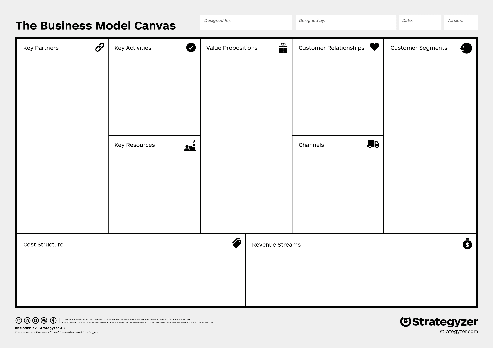

# 用 5 个步骤规划商业模式

> 原文：<https://medium.com/swlh/a-new-methodology-for-business-model-mapping-6a122f140579>

## 系统思考，转动你的飞轮，用视觉语言讲述引人入胜的故事

戴夫·格雷在他的书[**Gamestorming**](https://amzn.to/2C8e17P)**中概述了他所谓的“商业游戏”。基本上，商业是围绕目标建立的。在某个初始点 A 和某个目标未来状态 B——目标之间设置张力的目标。**

**商业是一套旨在将我们从起点 A 移动到目标点 b 的过程。在这两点之间是所谓的“挑战空间”。**

****

**在这个挑战空间中，资金、人员、基础设施和战略都在忙得不可开交，它们都试图找到联合，共同朝着目标 b 点前进。管理通常被视为将资源集中起来执行这些流程。**

**从下图中我们可以看到，协调在业务模式中创造了显著的效率。**

****

**Diagram from Bill Aulet, Entrepreneurship Professor at MIT**

**结盟是顶尖公司超越竞争对手的法宝。像商业银行这样的公司——无情地砍掉一切与他们的愿景(消费者银行业务中最好的客户服务)不直接相关的东西。招聘、营销、管理、基础设施——一切都是为了实现这一愿景。**

**协调需要清晰，为了清晰我们需要剔除所有的赘肉，这样我们才能准确理解我们的业务在做什么，为谁做，以及为什么做。这种简单的商业模式被称为商业模式。**

**我所知道的最好的业务建模技术被称为业务模型画布。它首先源于亚历克斯·奥斯特瓦尔德 2004 年的一篇论文，然后以图表形式源于他 2010 年的“远见者手册” [**商业模式生成**](https://amzn.to/2CYNcF3) 。Alex 将业务分为 9 个部分，如下所示。**

****

**像这样的工具令人难以置信的好处是它在从业者之间创造了一种共享的语言——使他们能够在设计过程中具体地谈论业务——从构思到实施。**

**然而，缺点是它是静态的。它未能传达真实世界商业模式的变化和复杂性。在我的实践中，我发现它作为教学辅助工具非常有用。但是当你把一个商业模式分解成一个个整齐的盒子时，你就失去了它的一些灵魂。**

**在本文的其余部分，我将提出一种方法，以一种清晰和一致的方式直观地概述业务模型，并捕捉真实世界业务的动态运动或“灵魂”。**

# **可视化复杂性**

**我喜欢用视觉语言来帮助把复杂的事情变得简单。这种做法也非常有助于与他人分享复杂的事情，并帮助他们理解重要的部分。**

**视觉语言可能看起来令人生畏——但正如戴夫·格雷在 [**游戏风暴**](https://amzn.to/2C8e17P) 中指出的那样——实际上只有 12 种形状或“字形”组成了你能想象到的每一个 2D 物体。下面显示的是我们的**视觉字母表**。**

****

**Point, Line, Angle, Arc, Spiral, and Loop.**

****

**Oval, Eye, Triangle, Rectangle, House, and Cloud.**

****

**Try drawing these shapes using the 12 glyphs. Easy, right?**

**在 Donella Meadow 的精彩著作[**Thinking in Systems**](https://amzn.to/2LYZzUi)**，**中，她概述了一种可视化映射系统的方法，我将在本文中借用这种方法，如下所示。**

****

**A very entertaining systems map of a coffee drinker’s energy levels**

**盒子是存量，水龙头流量，箭头是影响我们正在绘制的资源流量的外部因素，在这种情况下是喝咖啡者的能量水平。**

**系统是相互联系的事物的集合，它们相互影响形成一个整体。系统是由油藏或“存量”之间的资源移动或“流动”来定义的。听起来熟悉吗？**

**企业是系统。它们是复杂的系统。它们有许多移动的部分，大量的噪音阻挡了重要的信号。系统映射是将嘈杂的现实转换成简单图表的行为，该图表概述了重要的流程和库存，并传达了一致性。**

**吉姆·科林在他的开创性著作 [**中概述了“飞轮”的概念。为了清楚起见，我稍微编辑了下面的引文，它解释了什么是飞轮。原文可以在**](https://amzn.to/2CcTE9Q)**[这个链接](https://www.jimcollins.com/concepts/the-flywheel.html)找到。****

**想象一个巨大而沉重的飞轮——一个水平安装在轮轴上的巨大金属盘，直径约 30 英尺，厚 2 英尺，重约 5000 磅。现在想象一下，你的任务是让飞轮在车轴上尽可能快、尽可能长地旋转。用很大的力气推动，你让飞轮慢慢向前移动，起初几乎察觉不到。你继续推，用持续的巨大努力，你移动它一整圈。你继续朝着一个一致的方向努力。**

**然后，在某个时候——突破！这东西的冲力对你有利，向前猛推飞轮，一圈又一圈……嗖！…它自身的重量为你工作。你没有比第一次旋转时更用力，但是飞轮越转越快。"**

**正如柯林斯生动地解释的那样，飞轮通过朝着一个一致方向的极端努力获得动量。这是对齐。任何与你的商业模式不一致的事情都会起到反方向的推动作用，减缓你的飞轮，限制它之后的每一次推动的影响。**

**可视化你的商业模式是关于识别你在推动什么，或者像科林所说的——你的飞轮是什么？然后绘制出你需要推动的是什么，以及你需要避免哪些推动。**

**让我们一起努力。我们现在处于 A 点，我们希望通过挑战空间在 B 点达到我们的目标。为了达到 B 点——我们需要调整我们的资源，避免任何错误分配资源的行为，然后开始推动我们的飞轮。这样做的模式就是我们的商业模式。这是股票间资源流动的模型。资金、人员和基础设施等资源。**

**[Oliver Emberton](https://oliveremberton.com/2013/how-to-become-an-entrepreneur/) 尝试与麦当劳和谷歌(特别是他们的 AdSense 平台)合作，如下所示。**

********

**这两种商业模式都非常简洁，失去了构成极其复杂的公司的许多细微差别。然而，想象一下你以前从未听说过麦当劳或谷歌，有人试图向你解释他们是做什么的。这些将抓住这些模型的灵魂，同时掩盖大部分噪音。**

**这是一家创新咨询公司——董事会实验室的草图。我试图在粒度和清晰度之间找到平衡。我想让你看到这个行业的细微差别，同时又不失活力。**

****

**This is the third iteration of this business model map.**

**这是另一个经过提炼和图形化渲染的例子。这是一个名为 51%的女性领导的共同工作空间。**

****

**Does this seem extremely complex? They’re actually quite simple to construct.**

# **如何用 5 个简单的步骤来形象化你的商业模式**

**你的商业模式的基石是你的客户、产品和目标。我称之为商业建模的 COG 模型。顾客是购买你的产品的人。你的提议是他们问题的解决方案。你的目标就是你的 B 点——你建造这台机器要到达的地方。用系统词汇的思维来说，这些就是你的股票。**

**你的商业模式的循环是你的渠道、关系和成长。渠道是你的客户从没听说过你到购买你的产品的途径。关系是你的客户购买你的产品后所走的路。成长是在你提供服务后发生的事情，使你的服务与你的目标相一致。这些是你的心流。**

**列表是你的商业模型中需要细化的节点。例如，在我的创新咨询模型中。我正在解决几个可能的问题，这需要一个列表来解释。列表的关键是适度。只有当增加的粒度值得牺牲模型的视觉清晰度时，才使用它们。**

# **台阶**

1.  **用你的积木打好基础。左边是客户，中间是产品，右边是目标。**
2.  **在两者之间画出你的循环。渠道连接您的客户和您的产品。关系在你的产品和你的顾客之间循环。成长将您的产品和目标联系在一起。**
3.  **使用列表详细说明关键节点。一般来说——在这些点上，有人可能会停下来问——这是怎么回事？在某些情况下，列表实际上可能是另一个伪装的循环。为了识别这些，寻找列表中各点之间的相互依赖关系。**
4.  **看看你的地图。以上 3 个步骤是构建业务模型图框架的简单框架。通过仔细研究它，寻找弱点、困惑点或机会，你可以完善你的模型，直到它有效地传达了你的业务的灵魂，而不是别的。**
5.  **你可能会发现 51%的人有更多的反馈循环来强化你的产品。如果是这样的话，除了这三个核心循环之外，可以随意添加额外的循环。目的是将你的业务过滤到其核心部分，然后显示这些部分如何随着时间的推移而联系起来。**

****

# **包扎**

**我称之为本体商业模型映射或 BMM。这是一个简化复杂系统的过程，存在于系统思维、业务建模、常规策略和视觉语言之间。**

**当你试图理解新技术的含义，在一个现有的组织中创新，或者计划一个新的冒险时，使用它。**

**我引用了一些影响我思考的不同作品。他们只是我欠下一大笔债的一小部分。其他作者包括史蒂夫·布兰克、杰弗里·摩尔、弗雷德里克·拉鲁、埃里克·冯·希佩尔、克莱顿·克里斯滕森和弗雷德·考夫曼。**

**我还欠安东尼·厄普沃德和他蒸蒸日上的生意。几年前，他参观了我的一个班级，这让我开始思考商业建模中的外部性，以及如何将它们重新定义为战略优势。**

**我计划最终发布一份关于这个主题的白皮书。如果你想在这种情况下被联系——[访问我的博客，订阅我的时事通讯](https://www.andrewjwalls.com/)。**

**我也在努力发布两个新的创新工具。一个用于在扩展阶段帮助导航风险增长，另一个用于理解你的主要利益相关者运作的环境——超越移情图的范围。**

## **这篇文章发表在 [The Startup](https://medium.com/swlh) 上，这是 Medium 最大的创业刊物，拥有+409，714 名读者。**

## **订阅接收[我们的头条](http://growthsupply.com/the-startup-newsletter/)。**

****