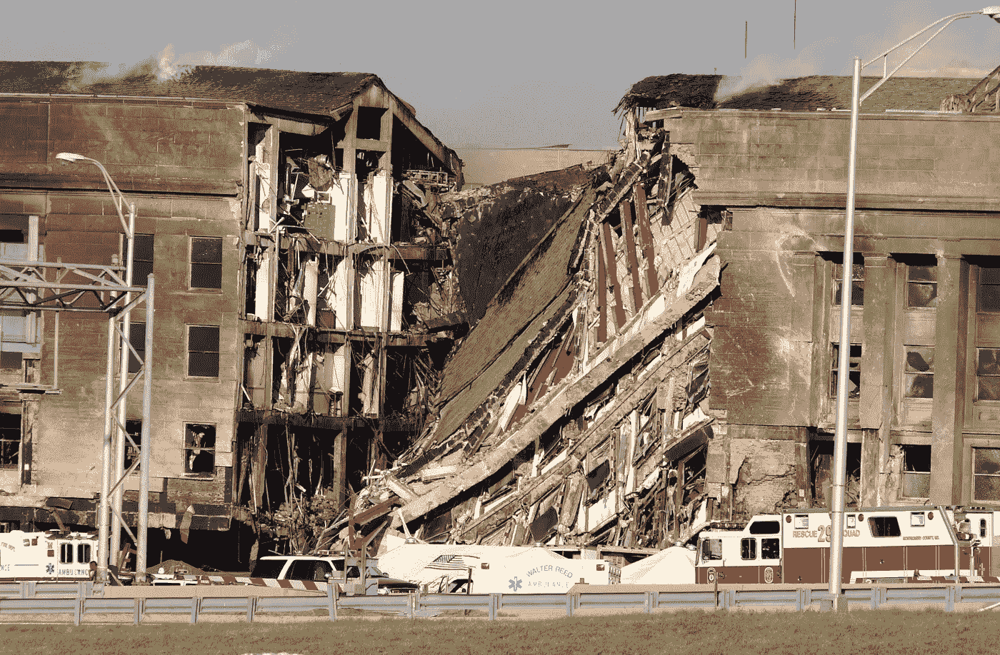

# 对我们自由的新威胁

> 原文：<https://medium.com/swlh/a-new-threat-to-our-freedoms-af99119e21a7>

The Pentagon, a symbol of our might, in the wake of the 9/11 attacks (U.S. Navy)

新西兰针对穆斯林的枪击事件和斯里兰卡针对基督徒的爆炸事件不断提醒我们，我们生活在一个危险而动荡的世界，恐怖行为就像达摩克利斯之剑一样悬在各国的头上。虽然这两起袭击是相互关联的，并且是由宗教冷漠所引发的(一个是对另一个的报复)，但由其他类型的冷漠或…所引发的袭击威胁