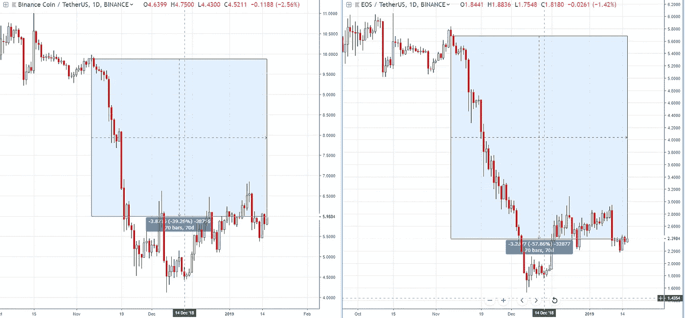
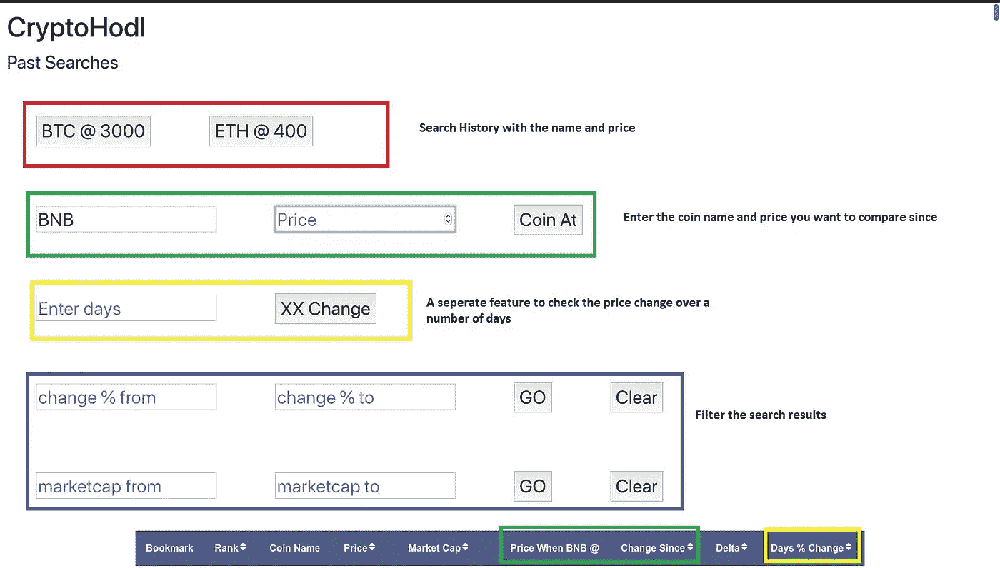
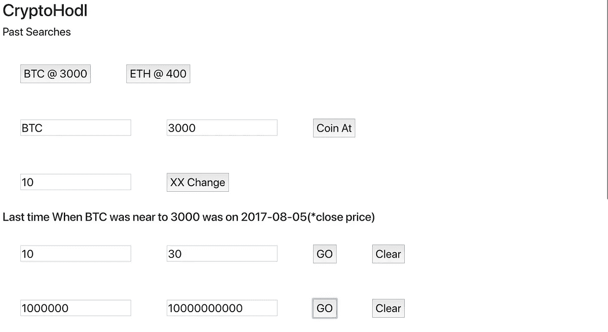
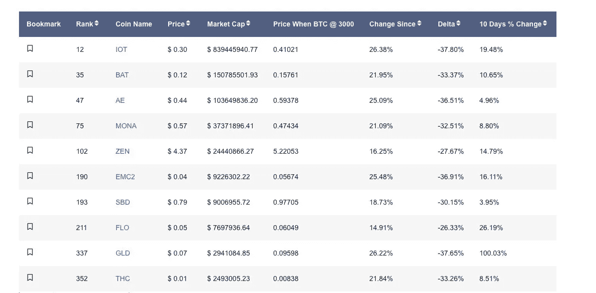

# 进行加密价格比较的新方法

> 原文：<https://medium.com/swlh/a-new-way-to-do-a-crypto-price-comparison-c2fcebbc2627>

我们比较事物的方式总是围绕两个事物中的一个，即一段时间内的不变资产或稳定资产。

在加密中，它是美元或 USDT 或各种形式的美元，时间是由用户定义的持续时间。可能是几天、几周或几个月。

此外，当比较你持有的硬币的价格变化时，你通常不会在意市场的变化。

这是我希望做出改变的地方吗？你知道，几个星期前，我以 9 美元左右的价格购买了一些 BNB 代币，几天后它跌到了 4 美元左右。这不是问题，因为我知道这是一个熊市，这是市场周期的一部分。

奇怪的是，我的问题是，

*   如果我当时没有买 BNB，而是买了 ETH 或 EOS 会怎么样。
*   与我同期购买的相比，另一枚硬币下跌了多少？

BNB fell 39.26% VS EOS which fell 57.86% during the same 70 Days

正如你在下面的图表中看到的，BNB 下跌了 39.26%，而 EOS 在同样的 70 天内下跌了 57.86%。这一信息在许多方面都很有用。

比如，

*   我知道，在同一时期，BNB 远比 EOS 更有弹性&如果我投资了 EOS，我反而会损失更少。
*   我现在知道 EOS 相对于 BNB 是便宜的，因为我可以用我现在的 BNB 比 70 天前得到更多的 EOS。
*   通常情况下，由于高波动性和超卖情况，硬币会快速下跌，快速上涨，但情况并不总是如此，这也取决于硬币的基本面。

所以我想到了做 [Cryptohodl](http://www.cryptohodl.in) ，这是可以想象的第一个密码相关比价工具。

用户输入硬币的**名称**和**购买价格**或他们想要比较的东西，如绿色框所示。

The header section were user enter the input

黄框是一个独立的功能，用户可以输入他们可以检查价格变化的天数，它将显示在最后一列。

下面是一个例子，我输入搜索 BTC @ $3000，同时我想比较前 10 天的变化%。

我进一步筛选，找出变化在 10%和 30%之间，市值在 100，000 美元到 100，000，000 美元之间的硬币..

正如你所看到的，BTC 上一次在开市和收盘之间达到 3000 美元是在 2017 年 5 月 8 日。

So let's check BTC@$3000 , with 10 to 30% change filter and check last 10 days change at the same time

这是最终结果，

“BTC@3000 时的价格”是 2017 年 5 月 8 日的收盘价，“自那时起的变化”是百分比变化。

Delta 就是被搜索的硬币和那个硬币之间的价格差%。

the final result table

在最后一列中，您可以注意到 10 天的价格变化。

web 应用程序仍在开发中。这篇文章只是为了分享旅程和想法以及获得反馈。

如果你喜欢这场音乐会和这个应用程序，请分享并鼓掌。在接下来的几天里，外观将会有所改变。

目前我正在开发一个简单的基于技术指标的密码筛选程序。在推特上关注我们[@ trade planio](https://twitter.com/TradeplanIO)[@ shakks](https://twitter.com/shakks)

## 这篇文章发表在 [The Startup](https://medium.com/swlh) 上，这是 Medium 最大的创业刊物，有+412，714 人关注。

## 订阅接收[我们的头条新闻](http://growthsupply.com/the-startup-newsletter/)。

