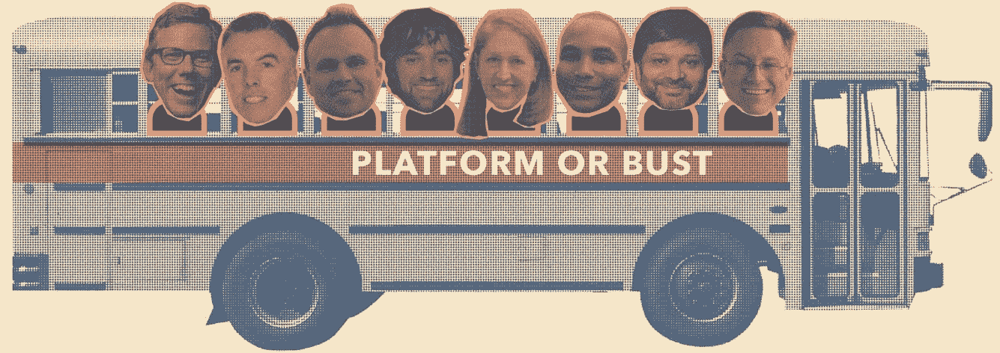
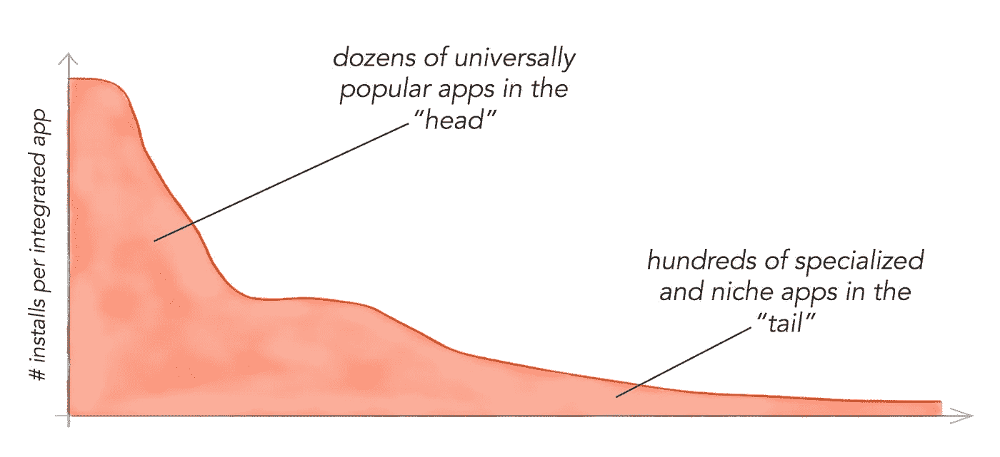
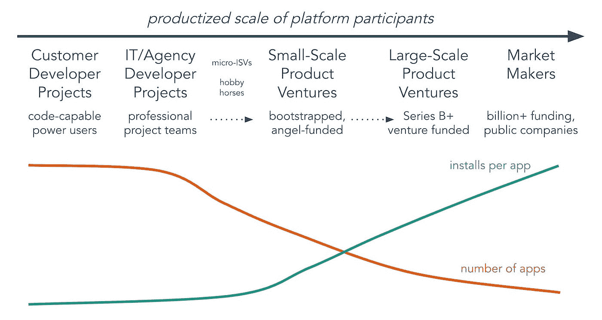

# 平台实地考察:来自湾区最佳云公司的 9 条原则

> 原文：<https://medium.com/swlh/a-platform-field-trip-9-principles-from-the-best-cloud-companies-in-the-bay-area-344ea93c1b27>

HubSpot 平台生态系统副总裁 Scott Brinker

HubSpot 首席执行官布莱恩·哈利根宣布:“我们将进行实地考察。

作为 HubSpot 成为一家可爱的平台公司的旅程的一部分，Halligan 坚持让他的整个管理团队离开我们在波士顿的办公室，去会见旧金山湾区十几家最好的基于云的平台公司的领导人。

什么对他们有效？什么没有？如果他们可以回到过去重新来过，他们会做些什么不同的事情？我们的任务是尽可能多地利用他们的智慧来帮助指导我们自己的平台战略。

不幸的是，我不能透露我们遇到的公司或高管的名字。我们的约定是，我们的谈话不会被记录在案，以鼓励尽可能多的坦诚。但是，如果你在脑海中列出湾区最著名的平台，你会对我们访问的人有一个很好的感觉。

令我们非常感激的是，他们都非常开放和慷慨地与我们分享他们的经验和见解。在一周的旋风课程中，我们从该领域的一些顶尖人物那里获得了平台动力学的硕士教育。

特别是对于像我这样的平台迷来说，了解这些不同的公司如何思考他们的平台和生态系统是非常有趣的。令我惊讶的是——尽管现在回想起来，这可能不应该——他们有多少共同的信仰。

让我印象深刻的是，这些共同的信念形成了一套实用的平台原则。

因为它们构成了集体智慧，我觉得我们可以分享它们，同时仍然尊重我们遇到的个人的匿名性。这些原则都是由多家公司倡导的，所以你不能把它们归于任何一家。

**1。想成为对 ISV 有吸引力的平台吗？建立庞大的客户群。**

平台是飞轮。更多的开发者创造更多的应用程序，吸引更多的客户，吸引更多的开发者，创造更多的应用程序，吸引更多的客户，无止境，一切都朝着正确的方向发展。(至少概念上的理想是这样的。)

当然，挑战在于启动良性循环。鸡还是蛋？对于许多平台来说，解决这种“冷启动”问题的唯一可靠的方法是首先向市场推出一些对客户有吸引力的独立优点。(例如，“为工具而来，为网络而留”的概念已经被用于推出不少社交平台。)

对于一家公司来说，开始时是一家产品公司，获得大量客户，然后寻求转型为平台公司是一种常见的模式。毛毛虫变成蝴蝶。

好消息是，这种方法可靠地解决了冷启动问题。如果你的产品获得了大量的客户群，你自然会引起开发者的兴趣，他们将你视为他们自己发明的潜在分销渠道。

然而，挑战在于，从产品公司到平台公司的转变不是一个渐进的步骤。它要求你采取一种质的不同的思维方式，从以产品为导向的价值主张转变为以生态系统为导向的价值主张。

**2。平台公司应该以其生态系统的成功来衡量。**

如果我能从我们的实地考察中学到一条最重要的智慧，那就是这个信条:一家平台公司应该以其生态系统的成功来衡量。

一家产品公司只关注增加收入。然而，平台公司致力于增加其收入和其合作伙伴的收入。因为如果一个平台不能为它的合作伙伴提供价值，更多应用对更多客户的飞轮就会停止转动。

当然，所有公司最终都是由客户的成功来评判的。但是，一个伟大的平台公司珍惜平台合作伙伴，并致力于他们的成功。由于它们提供了令人难以置信的专业和补充能力，It 部门将它们视为客户成功的关键驱动因素。

生态系统的成功可以直接通过合作伙伴通过平台创造的业务量来衡量。平台公司自己的产品和合作伙伴在平台上销售的解决方案的总收入就是整体生态系统的“经济”。健康的经济增长了平台及其合作伙伴的收入。

成为生态系统经济的管理者是从产品思维模式转向平台思维模式所需的重大转变之一。

**3。说到平台合作伙伴，重质轻量。**

不要把你的平台生态系统中的合作伙伴数量作为虚荣的衡量标准。

的确，在其他条件相同的情况下，您的平台生态系统中的合作伙伴越多越好。但是其他的东西不平等。一个充满垃圾的生态系统可能是灾难性的，因为垃圾应用会损害客户对你平台的信心。

平台生态系统的生死取决于客户对合作伙伴应用质量的信任。

因此，在您的平台程序中实现强大的质量控制机制非常重要。这些可以是内部流程，如认证或应用审查以及应用性能监控。它们可以是外部输入，如顾客的评价和反馈。理想情况下，你两者都想要。

在云世界中，应用程序会随着时间的推移而变化，或者在某些情况下，无法随着时间的推移而变化，因此您应该关注现有的应用程序，以检测熵的任何退化。

不要被某个特定应用或集成“有总比没有好”的诱惑所诱惑。对合作伙伴有一点严厉的爱—让他们在认证和其他客户体验 SLA 方面达到高标准—对整个生态系统都有好处。因为:生态系统的生死取决于信任。

**4。平台是长尾市场，这是它们魔力的一部分。**

也就是说，不要将质量与合作伙伴的规模或已有的品牌资产混为一谈。毕竟，大多数成功的平台生态系统本质上都是长尾市场——这是一个平台不同于简单的几个合作伙伴的动力。

头部包含少量受大量客户欢迎的应用程序。这些通常是知名品牌的应用程序，是推动大量安装的做市商。他们就像商场里的房客。

但在光谱的另一端——尾部——是各种酷实验发生和新创新出现的地方。对于垂直市场和高度专业化的功能，这里通常有大量创造性的利基用例。初露头角的企业家、微型独立软件开发商和服务提供商(如寻求将其想法“产品化”的机构)都可以在你的生态系统的尾部茁壮成长。

长尾的本质就是拥有大量这样的合作伙伴。在您的平台上，每一个都可能只有少量的安装。但总的来说，所有这些长尾应用结合起来为你的大部分客户群服务。

因此，你的质量控制机制不应该(仅仅)依赖于合作伙伴的规模。你想要数量和质量。(但是当你不得不选择的时候，选择品质。)

**5。警惕过早的直接货币化。**

平台上的一个常见模式是，客户在其系统中集成的应用越多，他们的保留率就越高，无论是平台还是集成到平台中的应用。这是有道理的。一旦您将一组工具连接在一起，并根据您的确切需求配置它们之间的工作流和数据流，您就更有可能感到满意，而不太可能想要将它们分开。

一旦你把这个平台变成了“你的”，那么这个整体就大于它的各个部分的总和。

这是平台建立伟大生态系统的基本动机。这有助于他们赢得新业务。(“你有 X 能力吗？”“为什么，是的，有一个很好的合作伙伴应用程序！”)这有助于他们保留这项业务。同样的动态也有利于平台上的独立软件开发商。(“你和 Y 平台合作吗？”“为什么，是的，我们与他们有很好的整合！”)

这对于平台公司来说就是间接货币化。他们没有直接从安装的 ISV 应用中获得资金。但是，尽管如此，这些整合还是产生了非常真实、积极的财务影响。

也就是说，平台生态系统也可以成为收入的直接来源。最常见的方法是允许客户通过市场购买 ISV 应用程序。然后，平台可以在收入共享模式中抽取交易百分比。例如，苹果通过其应用程序商店获得总销售额的 30%。

然而，许多平台团队警告我们不要成为“过早货币化”的牺牲品，即在你证明自己可以为这些合作伙伴提供足够大的价值之前，过快地转向直接货币化模式，如收入分成。

如果对他们的业务有显著好处，合作伙伴愿意通过市场为分发付费-接触他们以前可能无法接触到的新客户，通过让客户更容易、更快地安装和试用这些应用来提高客户获取速度，无缝集成计费，等等。

但要确保对合作伙伴的价值超过平台公司获得的价值，这样对平台、合作伙伴和客户都是三赢。

**6。对您的平台计划和政策保持透明。**

合作伙伴想知道平台的发展方向。路线图上有哪些功能？将为 ISV 开辟哪些新的机会？合作伙伴构建解决方案而不必与平台本身竞争的“空白”在哪里？

即使你不能公开分享路线图，与 NDA 领导下的合作伙伴分享一个高层次的方向也是非常有价值的。我们采访的多家公司强烈主张至少分享产品主题，如果不是具体的功能。(这种透明度的一个很好的例子是 Slack 如何公开分享他们平台路线图的 [Trello 董事会](https://trello.com/b/ZnTQyumQ/slack-platform-roadmap-for-developers)。)

合作伙伴对您平台的信任与客户对您生态系统的信任一样重要。如果合作伙伴信任平台公司，他们更有可能投资围绕平台公司建立业务——这有利于平台及其客户。用一家平台公司 CEO 的话来说，“开发者是这个星球上最关键的人——你会因为违背承诺而失去他们。”

要赢得合作伙伴的信任，你需要做到透明。分享路线图是一个好的开始。但是，透明度也意味着对生态系统内发展的其他政策或机会的变化要开诚布公。例如，您如何决定哪些合作伙伴出现在目录中，或者有权参与联合营销活动？

如果你能让好处尽可能算法化——合作伙伴获得机会的规则和优点是由客观标准决定的，而不是“你认识谁”——这将大大有助于让合作伙伴感到他们受到尊重和重视。

当计划或政策将要改变时，尽早让合作伙伴知道。

7 .**。为生态系统参与者提供公平的竞争环境。**

平台公司不应该扮演拥王者的角色，人为地挑选哪些合作伙伴应该“赢得”某个特定的类别。平台生态系统的最大好处之一是它可以成为真正的市场经济——一个类别中的多个合作伙伴可以相互竞争，为平台公司的客户提供最佳解决方案。

让顾客挑选获胜者。

通过保持中立，平台公司的胜利与合作伙伴无关。事实是，对于许多类别来说，不一定会有一个赢家。一个类别中的不同产品可能是不同客户群的“最佳”解决方案。

这也为类别内的中断敞开了大门，让新合作伙伴带着比现有合作伙伴更好的解决方案进入。这种进化应该是你的生态系统的一个特征。

当然，这说起来容易，做起来可能很难。个人合作伙伴通常会通过与平台公司达成特殊交易来寻求在竞争中占上风的方法。或者平台公司寻求从特定的合作伙伴关系中获得更多利益——也许是与该合作伙伴的客户群进行某种*交换*联合营销的机会。

构建您的生态系统，以实现这些“特殊”利益和机会，但基于客观价值授予它们。理论上，任何合作伙伴都应该有机会实现这些优势，如果他们满足某些标准的话，例如，可能售出的应用数量，他们可以与其应用一起增长的平台安装数量，他们在某个类别中实现的品牌资产，等等。

不是每个伴侣都是平等的。但是每个伴侣都应该有平等的机会。

**8。在合理的范围内，支持你的生态系统中有竞争力的应用。**

随着平台公司扩展到拥有更大的功能足迹，不可避免地会出现与某些类别的合作伙伴应用程序的重叠。

我们交谈过的大多数平台公司都认为，对这些合作伙伴应用保持开放非常重要——即使它们与平台本身提供的某些方面存在竞争。在许多情况下，只专注于一个特定功能的合作伙伴会比平台本身更深入地了解它。通用用例可能会嵌入到平台中，但更专业或垂直市场的用例通常由合作伙伴提供更好的服务。

这通过尊重客户的选择将他们放在第一位。他们决定更喜欢平台或合作伙伴应用中的哪些功能，并可以根据自己的需要进行混搭。毕竟，这是开放平台给他们带来的主要好处之一:灵活性和可扩展性。

因此，在你的生态系统中拥抱“竞合”，公司在某些方面竞争，在其他方面合作。关注产品协同工作给客户带来的好处。

**9。授权给你的开发者社区的底层大众。**

平台生态系统就像冰山。水线以上是公司开发的应用程序，作为产品出售给该平台上的其他客户。这些通常是市场或合作伙伴目录中列出的应用程序。

但大多数平台也允许个人客户和服务提供商为特定的业务需求构建定制应用。这种发展发生在你的生态系统中的“水线以下”，因为这些应用对世界其他地方是不可见的。

像冰山一样，这些自定义应用的总数往往比公众视野中的应用多得多。例如，我们采访的一家公司有一个由数万名开发人员组成的生态系统，其中只有大约 20%的人处于贫困线以上。

这个比例因公司而异，但重点是相同的:一个只关注独立软件开发商的平台公司正在错过一个与他们更广泛的开发者社区合作的巨大机会。

许多新长尾独立软件开发商经常从水线以下冒出来。例如，一个机构可能为一个客户开发一个应用程序，然后找到另一个想要同样东西的客户，然后是另一个。然后他们意识到，他们也许可以将这个解决方案打包成一个产品化的应用程序，让*的许多*客户都可以使用。突然间，你有了一个新的合作伙伴，为你的生态系统增加了更多的价值。

我希望这些原则对你和对我们一样有帮助——无论你是自己建立一个平台，还是评估你可能参与的其他生态系统。我非常感谢所有在这个话题上与我们分享智慧的人。(你知道你是谁。)

## 这篇文章发表在[《创业](https://medium.com/swlh)》上，这是 Medium 最大的创业刊物，有+409714 人关注。

## 在这里订阅接收[我们的头条新闻](http://growthsupply.com/the-startup-newsletter/)。

