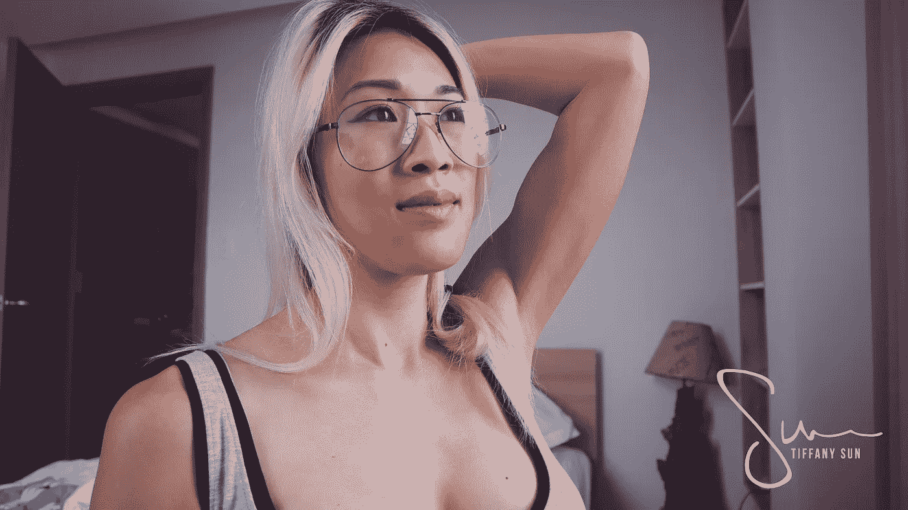

# 当你生活在别人的期望中时，问自己一个问题

> 原文：<https://medium.com/swlh/a-question-to-ask-yourself-when-youre-living-on-other-people-s-expectations-2b0a91361c80>

我很生气，也很沮丧，这比我受到的伤害更甚。

就像一张破唱片，他的话在我脑海中一遍又一遍地回放。

> “你要戴上它。我不在乎你怎么想——我不想再听这些了。”