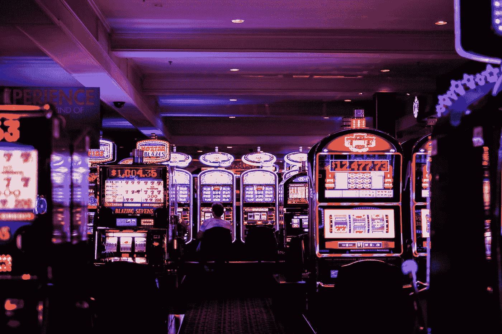
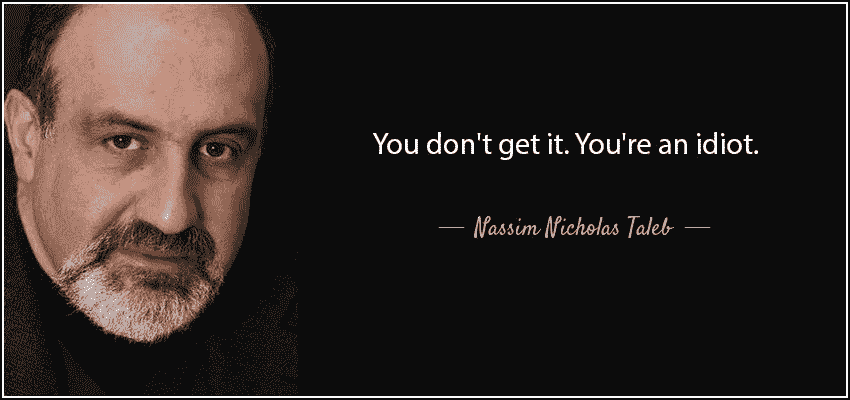
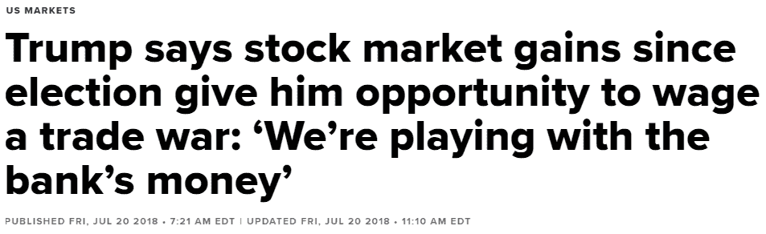

# 玩房款的理性案例

> 原文：<https://medium.com/swlh/a-rational-case-for-playing-with-house-money-6abc630d21c5>

Photo by [Benoit Dare](https://unsplash.com/@_themoi?utm_source=medium&utm_medium=referral) on [Unsplash](https://unsplash.com?utm_source=medium&utm_medium=referral)

玩*房子钱*或*房子钱效应*是一个很好的证明，并谈到在先前收益后风险偏好的增加。传统上，这被视为非理性行为。但也许这比你想象的更理性。让我们来看看！

行为经济学家理查德·塞勒研究人类决策和我们所有的*认知偏差*。

> *认知偏差是思维中的系统性* ***错误*** *，在这个意义上，判断偏离了从公认规范的角度来看被认为是可取的或者从形式逻辑的角度来看是正确的。*

至少丹·艾瑞里在他的书《可预测的非理性》中是这么定义的。所以偏见被视为非理性的行为，一种我们不希望有的缺陷。

其中之一叫做*心理账户。*在这种现象中，人们根据收入的来源对金钱的看法是不同的。比如，一个人会用另一种方式对待自己辛苦赚来的 1 万美元，而不是突然继承 1 万美元。

一种特殊类型的心理会计被称为“房子金钱效应”。想象有人在赌场，预算是 100 美元。他们运气好，很快翻倍至$200。这个人可能会对新赢得的 100 美元更有侵略性，这是他们从“房子”中赢得的钱。因此，房子钱效应。

[泰勒是这样描述的:](https://www0.gsb.columbia.edu/mygsb/faculty/research/pubfiles/1154/thaler_and_johnson.pdf)

> *一次收益后，* ***后续损失小于原收益的*** *可以与之前的收益整合，减轻损失厌恶情绪的影响，有利于风险寻求。*

(为了研究冒险行为，泰勒将赌注与相同的*期望值或 EV* 进行了比较。两种选择的区别在于“风险更高”的选择有更广泛的结果。例如，无风险将肯定赢得 5 美元，有风险将有 50%的机会赢得 10 美元，有 50%的机会赢得 0 美元。两个选项的 EV 都是 5 美元。)

> 这个想法的本质是，直到赢得的钱完全耗尽，损失被编码为收益的减少， ***好像失去一些“他们的”钱没有失去自己的现金那么痛苦。***

房款效应被认为是一种愚蠢的偏见。

统计学家、作家、神经学家、举重运动员纳西姆·塔勒布不喜欢泰勒。这是一个保守的说法。他们甚至在推特上一决雌雄。对他来说，泰勒是他们中的一员[知识分子，但又是白痴](/incerto/the-intellectual-yet-idiot-13211e2d0577)(或 IYIs)。如果你了解塔勒布，你也会知道他认为自己有义务积极地召唤那些人出来。

将房款效应贴上非理性的标签，让纳西姆很生气，因为在他看来，这是完全理性的。

(甚至维基百科似乎也知道这件事:

> *“对于这些偏见中的一些，也存在争议，比如它们是无用的还是* [*非理性的*](https://en.wikipedia.org/wiki/Irrationality) *，或者它们是否会导致有用的态度或行为。”)*

为了理解他的观点，我们需要谈谈凯利。

# 首先，你必须活下来

想象一下，一枚作弊的硬币有 60%的机会正面朝上，你可以以 1 比 1 的赔率下注。因此，你每赌 1 美元，就有 60%的机会赢 1 美元，40%的机会输 1 美元。这款甜蜜游戏的期望值*(或 EV)为每下注 1 美元 0.6 * $ 1–0.4 * $ 1 = 0.2 美元。就赌博而言，这种大的优势很少出现，所以你很想玩这个游戏。*

*假设您有 1000 美元的资金可以用来赌博。你可以继续玩这个抛硬币的游戏，只要你想。你会怎么做？你的赌注是多少？*

*如果你一次赌完所有的 1000 美元，而你输掉了，游戏就结束了。不再有未来赌注。很明显，这个赌注太大了。我们希望确保我们不会破产，这样我们就可以继续玩这个高利润的游戏。当你没钱的时候，你基本上失去了所有你不能再做的未来赌注。*

*所以你变得非常保守，开始下注 1 美元。你很可能不会破产，你基本上可以永远玩下去。但这感觉太保守了。我们希望通过这一系列下注来最大化我们的奖金，使用 1 美元的增量太慢了。也许有一个更大的尺码可以平衡赚钱和不破产？*

*[*凯利准则*](https://en.wikipedia.org/wiki/Kelly_criterion) 已经有了答案。这是一个计算下注规模的公式，可以最大化一系列下注的预期资金几何增长率。这对个体赌徒来说至关重要。基本上，它可以确保你可以继续下注，并从中获得最大收益，而不必达到 0 美元。*

*对于这个游戏，在这些赔率下，Kelly 的赌注将是你资金的 20%。如果你对如何计算感兴趣，可以查看维基百科。*

*所以在我们的例子中，我们的第一个赌注是 200 美元。如果我们输了，下一次赌注会更小:我们剩余资金 800 美元的 20% = 160 美元。但是如果我们赢了，我们增加我们的赌注:它变成 1200 美元的 20% = 240 美元。*

*无论你有 800 美元还是 1200 美元，240 美元赌注的 EV 是一样的。但是当你开始赢的时候，增加你的赌注是有意义的。*

# *语义学？*

*塔勒布喜欢提到约翰·l·凯利(以及使用凯利标准的实践者)，他是少数几个*明白这一点的人之一*，不像决策理论中的几乎所有其他人。凯利表明，在之前的收益之后，你应该下更大的注。因此，塔勒布总结道，房款效应是合理的。*

*但是凯利标准比你赢的时候增加风险更具体。它不在乎钱是来自赌场还是来自你的初始资金。另外，泰勒实验中的风险和凯利例子中增加赌注的风险并不是苹果与苹果的比较。*

*所以我不确定这是一个合乎逻辑的结论。*

*在 14:55 左右，你可以听到塔勒布谈论了几分钟。*

*请记住，泰勒和塔勒布都接受心理会计和玩房子钱的存在。塔勒布并没有否认这一点。当人们称之为偏见，说这是不理智的时候，他就会生气。*

*塔勒布:*

> **行为经济学家有一种叫做心理账户的东西，它指出……根据来源对待金钱是不理性的，因为这些是一个时期的模型。这就是他们看待世界的方式，作为一次性实验。他们不认为世界是重复的。重复下注。所以，* ***如果你把世界看成是一个重复的赌注，在生存的条件下，那么心理核算不仅不是非理性的而且是必要的。*** *任何其他策略实际上都是非理性的。**

*对塔勒布来说，**理性是帮助你生存的东西**。理性就是风险管理。因此，这些“愚蠢的”偏见可以帮助我们应对这些尾部风险，否则这些风险会毁了我们。*

> *"如果一种认知“偏见”是有帮助的，那它就不是偏见."*

*我开始 100%在 Taleb 团队上研究和写这篇文章。但是随着我对细节了解的越来越多，只站在他这一边就越来越难了。有时候，我只是在想:*“我们就不能好好相处吗？”**

*在一个框架中被认为是不合理的，在另一个框架中可能是合理的。在一个孤立的一次性实验中不合理的东西，当你缩小时可以是合理的。这就是为什么我甚至不认为理性与非理性的讨论有多大关系。在我看来，多是基于上下文的语义。*

*所以我不会告诉你这是理性的还是非理性的，而是让你自己得出结论。*

# *实践中的房款*

*所以我们刚刚看到了房子资金效应是风险管理的一种自然形式，从这个角度来看，它是合理的。*

*在实践中的问题是，个人不会突然做出完美的凯利赌注大小。也许更糟的是，它会导致放弃预期价值的冒险行为。*

## *扑克*

*我们都见过那个家伙在牌桌上把他的筹码分成两部分:买入费和他在这一局的利润。他准备用他的利润赌一把，但不想把他的赢盘变成输盘。*

*在作弊抛硬币的例子中，玩家可以通过增加赌注来增加风险。但在扑克游戏中，冒险行为通常是通过次优玩法来实现的。玩多手，追听牌……不仅仅是“风险”的变化，更是期望值的变化。*

*简单来说:玩家开始玩的更差。*

*作为一名职业扑克玩家，你应该练习正确的*资金管理。*你坐在牌桌上的钱数、你下注的金额和你玩的底池应该只占你资金的很小一部分，这样你就不必根据游戏的进展来改变你的行为。这确保了你可以专注于期望值。*

*例如，一个娱乐玩家可能带着$400 的“资金”来到赌场，然后带着$200 坐在桌边。作为一名职业玩家，你会想要一笔 10，000 美元的资金，然后拿着 200 美元坐在同一张牌桌上。赢或输$200 并不会真正影响你的资金。*

*虽然从生存的角度来看，赌场金钱效应可能是合理的，但当它发生在赌场时，你希望成为利用他人“成为它的受害者”的那个人。如果你准备好了，扑克游戏*就是*一个孤立的实验，你可以只玩 max EV。你在会议前后管理你的破产风险，并且有这么大的缓冲，你不需要在会议期间担心它。*

## *法宝*

*赌场并不是唯一可以观察到赌场金钱效应的地方。*

**

*[https://www.cnbc.com/2018/07/20/trump-were-playing-with-the-banks-money-on-markets-gain-since-el.html](https://www.cnbc.com/2018/07/20/trump-were-playing-with-the-banks-money-on-markets-gain-since-el.html)*

*所以，是的，偏见可能是一种幼稚的风险管理形式，但不，我不认为总统应该把它作为孤注一掷的借口。*

*无论你称之为偏见与否，非理性的还是理性的，这些趋势都是真实的。虽然可能有助于生存，但在某些情况下，它们确实会导致“不必要的”行为。*

*但是幸运的是，你可以选择在生活中特定的小的子游戏中玩耍，在那里这些偏见可以被利用。抵制自己的偏见会给你带来回报。你可以在哪里收集他人因偏见而转给你的 EV。*

*扑克就是其中之一。如果你寻找其他人，你会找到他们。*

**原载于 2019 年 6 月 17 日*[*【https://mydomainiskarl.com】*](https://mydomainiskarl.com/2019/06/house-money/)*。**