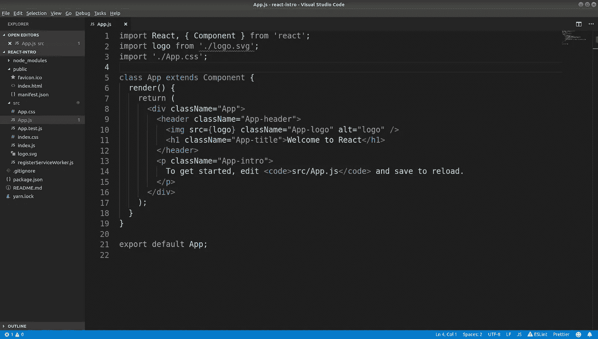

# 对编码训练营利弊的现实看法

> 原文：<https://medium.com/swlh/a-realistic-perspective-of-the-pros-and-cons-of-coding-bootcamps-527a1e4b8fb2>

## 来自一名在职训练营毕业生的想法和思考

Photo by [Lee Campbell](https://unsplash.com/@leecampbell?utm_source=medium&utm_medium=referral) on [Unsplash](https://unsplash.com?utm_source=medium&utm_medium=referral)

新兵训练营是一个很好的方式，让你在缺乏经验的情况下进入一个新的职业。这就是我去训练营的原因，也是我向其他人推荐它们的原因(附带一些警告和保留意见)。能够在六个月内从零技术或编程经验到在一家世界 500 强公司做软件工程师，足以让我相信他们的价值。

我知道我必须改变职业。结束军旅生涯后，我在一家私人保安公司工作，收支相抵，刚好能养活我的妻子和我们的三只狗。当我们得知我妻子怀上了我们的第一个孩子时，那份薪水似乎并没有那么多。我原本计划在即将到来的秋天回到学校，但突然我无法证明这一时间承诺的合理性。经过大量的研究和预算，我意识到如果我在下一个队列开始日开始在 [DevMountain](https://devmountain.com/?campaignid=755770265&adgroupid=44789362453&adid=235566532299&gclid=CjwKCAjwx_boBRA9EiwA4kIELuFgvuD48gqRMrs9BiikkHoz2x4OWyFN5Hf-OTfXvoc4PtZzB0W_nxoCh20QAvD_BwE) 上学，我可以在我儿子预产期前 7 天完成。时间充裕！回顾这一过程，有许多事情证明是有益的，也有一些不那么有益。

坦率地说，我并不抨击训练营是正规教育的替代方式。我喜欢我在训练营的经历，但我不会对这样一个快节奏系统的内在缺陷视而不见。训练营可以关注更多的事情。或者至少，训练营的学生或有抱负的学生可以尝试自学一些东西。技术在不断发展，没有哪一个学位/课程/什么能让你为工作做好充分准备。你最终还是要学会如何自学。

## TLDR:

优点:与大学相比，参加的长期成本，沉浸式环境，关注现代语言和框架，强调实践技能而不是理论。

缺点:大量的前期成本，对现代语言和框架的关注，对计算机科学概念的不重视，无菌的学习环境，以及过度宣传的求职帮助和校友网络

你会注意到有些东西在两列中都有。很震惊，对吧？

> 2017-2018 学年，得克萨斯州四年制大学的年均学费为**15，399 美元/年**。
> 
> -美国教育部

Photo by [Alexander Mils](https://unsplash.com/@alexandermils?utm_source=medium&utm_medium=referral) on [Unsplash](https://unsplash.com?utm_source=medium&utm_medium=referral)

## 成本

参加训练营的最大障碍之一是费用。不仅开始时通常要交一大笔学费，而且全日制课程也不允许学生在上课期间有时间兼职。当然，如果你能应付几个月的低收入，长期成本比大学学位要便宜得多。不是每个人都有能力为训练营支付现金或获得私人贷款(我的训练营没有资格获得佩尔助学金或联邦贷款)，所以这可能是一些训练营采取不同方式收取学费的原因。一旦学生在该领域找到工作，选择固定上限的收入分享协议。

代价值得吗？你能负担得起吗？当然有贷款，但宽限期将在几个月后结束，你将被要求开始削减付款，不管你是否找到了工作。这些都是需要考虑的事情，如果你没有经济能力支付前期费用，并支付课程期间的经济需求(房租、食物、汽油等)，那么你可以分散自己相当薄。我很幸运地做到了这一点，但是只靠我妻子的收入生活对我们来说太难了。我认为从长远来看，这个花费是值得的，因为我现在的收入是去年 8 月份的两倍。您的结果可能会有所不同。

React was a huge selling point for my bootcamp, but will the job you get have you writing React?

## 现代框架

> “作为首席 JavaScript 工程师，我试图让我的团队编写尽可能少的 JavaScript 代码。”
> ――无名氏

React 对我来说是 javascript 开发的终极目标。而且可能是！我认为这是一个很棒的框架，比起普通的 Javascript，我更喜欢编写 React 代码。这可能是因为在我的训练营中，我只写了不超过 50 行的普通 Javascript，其他代码都是 React。我确信当我去面试时，我会被问及 React Hooks 和 Redux，但我没有。关于我所知道的 React 的对话很简短，并很快转移到面向对象语言。我的工作几乎 100%是 Java，在开始之前我对此一无所知。

## “实用”知识

在我即将结束训练营的时候，我接到了一个电话，是关于一家当地创业公司的建筑师关于面试工作的。当他们问我知道些什么时，我觉得我有一个很好的清单。React，Node.js，SQL，Redux，HTML/CSS……就这些了。当然，我可以加入一些不同的工具和库，但那只是在学校环境中构建较小的项目。我完全没有准备好接下来的问题:“你对数据结构和算法有多熟悉”。“你有敏捷方面的经验吗？”。“你如何处理技术债务”。"你有容器或云部署的经验吗？"。

我不知道如何回答这些问题。我知道如何做一些事情，但不能真正告诉你具体的原因。每当我给出解释或例子，在我内心深处，我觉得我在胡说八道。我带着一大堆作业离开了那个电话。

我觉得很多训练营关注于特定的语言或技术，而没有真正关注正在发生的事情的核心基础。不管你用什么语言写，编码的“规则”都是一样的，应该把更多的注意力放在软件的理论方面。

## 无菌的学习环境

> “正规教育会让你谋生。自我教育会让你发财的。”
> ― **吉米·罗恩**

训练营的大多数学生会在他们的时间里做 3-4 个小项目。在三个月的时间里，我完成了一个简单的“无数据库”项目、一个完整的个人项目和一个小组项目。这三次都是有益的学习经历，当我开始找工作时，它们让我的简历更加可信。我认为这样的项目很棒，我希望训练营能更长一点，这样我就能在队列中做得更多，学到更多。也有日常的实验室和讲座，涉及更多的手把手，并提前给出解决方案。和很多人一样，如果所有的答案都给我，我发现很难深入学习概念。由于与正规教育相比时间框架较短，这很可能是一种必然的罪恶。如果你和我一样，你应该做好准备，不断地重新学习，直到掌握为止。

## 被夸大的求职帮助和校友网络

这是唯一令人心烦的部分。学生们在参加训练营上冒了难以置信的风险。有很多招聘经理不在乎你的简历是什么样的，如果你没有学位，他们不会考虑你。在我的同学中，有人一遍又一遍地告诉我，与当地企业的季度“见面会”将是我在那里工作期间要做的最重要的事情。我被强大的校友网络和校园员工的支持所打动。当我去参加见面会和招聘活动时，我和我的 14 个同学已经穿戴整齐，打印好简历，准备找工作。四家公司出现了，其中三家以“我们不打算雇佣任何人，但是…”开始对话。这是对时间的巨大浪费，尤其是考虑到德克萨斯州达拉斯有这么多科技公司。我 100%确定我被录用的唯一原因是因为我去了当地的聚会，与招聘人员建立了联系。如果我依靠校园招聘活动，我仍然会找工作。

## 总结一下

训练营值得吗？我也这么认为他们生来都是平等的吗？绝对不行。他们比大学文凭更好吗？不一定。任何想学习编程的人都必须有高度的动力才能做好并找到工作。训练营足以让你通过这道门，但那点知识不会持续很久。只要你愿意自学，训练营可能正是你想要的。