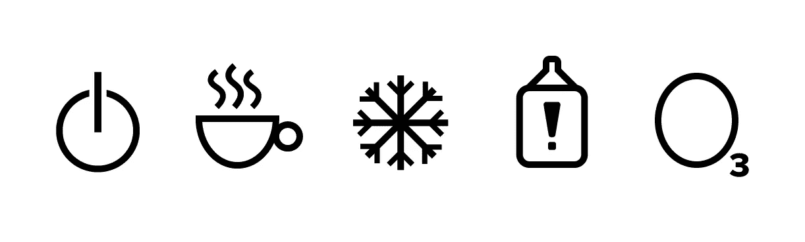

# 关于图标可用性的思考

> 原文：<https://medium.com/swlh/a-reflection-on-icon-usability-d57e2980a7a7>

图标可用性如何影响我们的日常生活，使事情变得更容易或更复杂。

## 图标如何引导我们并影响我们的生活

图标和标志在我们的日常生活中根深蒂固，以至于我们经常认为它们是理所当然的。无论是我们开车时看到的标志，还是我们电子设备或电器上的按钮，图标都发挥着更大的作用…