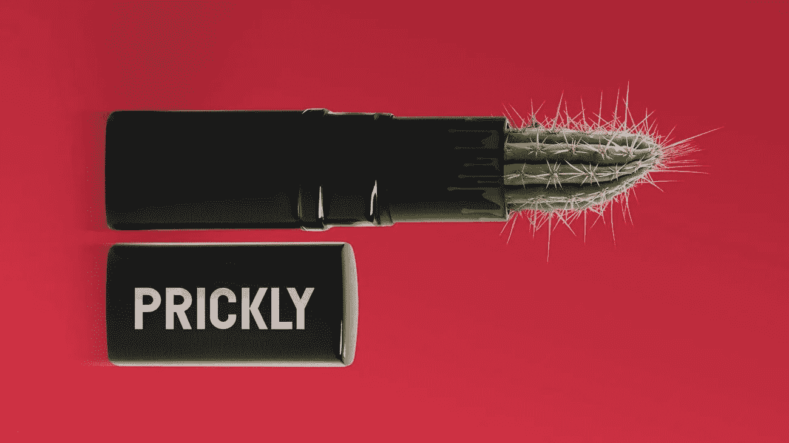

# 玛莲娜·斯泰尔《亲爱的影响者》的修辞分析

> 原文：<https://medium.com/swlh/a-rhetorical-analysis-of-dear-influencers-4f42d30204ae>

## 化妆极客的首席执行官公开谈论口红门和有毒的网络文化。

Marlena Stell 上周有话要说。这位社交媒体影响者兼首席执行官在她的 YouTube 频道上发布了一段名为“[亲爱的影响者](https://www.youtube.com/watch?v=cn96ZUGAdSw)”的视频在化妆品品牌朱慧珊化妆品的推出引起的公众争议中，斯泰尔的视频揭示了化妆品品牌、社交媒体影响者和消费者之间令人不安的动态的更大真相。

去年 8 月，在一场被称为“ [Drammageddon](https://www.reddit.com/r/OutOfTheLoop/comments/9fkzey/just_what_is_dramageddon/) 的公关灾难后，Stell 也站了出来，谴责那些不受约束的不诚实的影响者的行为。大约一年前，Stell 的视频“[我关于美容社区的真相](https://www.youtube.com/watch?v=fBNZrvGLmyQ)”因指控一些主要的社交媒体影响者收取高达 6 万美元的产品评论费而引起轩然大波。

Stell 自称是一个有影响力的人，她开始向 YouTube 上传化妆教程。如今，她经营着自己的化妆品品牌——“化妆极客”,也是当今 YouTube 上一些最成功的美容“大师”的早期支持者。众所周知，NikkieTutorials [在第一次开设自己的 YouTube 频道时曾向 Stell 寻求指导](https://www.youtube.com/watch?v=yyXUKniyKR8)，该频道目前拥有 1200 万订户。斯泰尔喊出了许多她曾经指导过的有影响力的人，包括韦恩·戈斯、曼尼·MUA 和帕特里克·斯塔尔。

Marlena Stell 在建立在线美容社区上的个人投资是显而易见的。她说她通过 YouTube 认识的许多人都支持她的个人生活和品牌。但不仅仅是 Stell 视频的情感诉求让我相信我们应该听她的。

> “我知道在过去的一年里，我一直沉浸在戏剧中。我的理由从来都不是我是一个戏剧化的人。”

# 口红门

近年来，公众对美女影响者的看法一直很混乱(包括我在内的许多人都对此很着迷，但那是另一篇文章)。目前，关于朱慧珊·希尔的丑闻仍在继续，这位成功的博图特在本周末删除她的 Instagram 和 Twitter 之前，已经在各个平台上积累了近 1300 万粉丝。

自 2013 年以来，希尔一直在谈论发布自己化妆品系列的计划。今年 6 月，希尔终于推出了她的品牌——朱慧珊化妆品，推出了一系列裸色口红。经过多年的期待，当他们的口红终于到来时，顾客们被激怒了。人们发现产品中含有纤维、毛发、塑料碎片和其他令人讨厌的东西。其他人抱怨的问题从引发恐锥症的孔洞形成到令人担忧的水滴。

6 月 7 日，Marlena Stell 开始通过 Twitter 帖子警告消费者不要使用该产品。斯泰尔没有对朱慧珊化妆品公司发生的事情进行猜测，而是以自己的亲身经历来讲述，她自己就曾推出过质量控制测试不合格的产品。

此后，许多人向朱慧珊化妆品公司施压，要求其正式召回口红，甚至在该公司发推文表示计划向每位顾客退款之后。

随着 7 月的临近，口红门仍然是一个持续的公共丑闻。对朱慧珊化妆品公司保持沉默的愤怒达到了白热化。一些化妆品化学家和好心人已经将唇膏提交进行微生物测试。

**更新，2019 年 7 月 3 日:**昨晚，vlogger 和微生物学家 Kenna Whitnell [公布了朱慧珊化妆品公司、Too Faced 和 Claire's 在口红上的受控微生物检测结果](https://www.youtube.com/watch?v=ztTqu4Rc0qY)。三项检测结果都是阴性。在她的视频中，惠特内尔说:

> 如果你能在产品中看到某些东西，那肯定是被污染了。我最担心的是人类健康和安全，以及你可能看不到的东西，所以从我的报告来看，这些产品中没有微生物污染。这并不意味着它们没有被其他东西污染，因为我们都看到了。

当 Marlena Stell 被迫在她漫长而坦诚的视频中做出回应时，距离她最初关于口红门的推文已经过去了两周，这位首席执行官承受了更多的反弹——其中很大一部分是关于她如何经营自己的公司。在解决对化妆极客自己的产品发布的担忧的同时，她的视频谈到了一个更大的问题，她认为影响者及其观众的态度中的毒性和不诚实正在恶化。

# 收据

## 朱慧珊·希尔

化妆迷们猜测斯泰尔和希尔之间的恩怨由来已久。去年，Stell 和 Hill 之间的电子邮件被泄露，这表明两人一直在讨论以化妆极客品牌共同发布眼影调色板，但合作失败了。希尔继续与墨菲发布朱慧珊希尔调色板。

许多人猜测，斯泰尔觉得被希尔背叛了，斯泰尔的“我的真相”视频是关于朱慧珊的秘密，斯泰尔彻底否认了这一点，并引用希尔对化妆极客的评论是她品牌成功的不可或缺的一部分。她承认，作为希尔的导师，她感到“被踢到了路边”，但声称两人之间“没有嫌隙”，并展示了 Instagram DM 表示支持希尔去年圣诞节组织的一项慈善活动的截图。

“我(对朱慧珊)没有仇恨。我从来没有。斯泰尔说:“我确实不喜欢不诚实。”他可能指的是希尔公司灾难性的产品发布模式。“我觉得，在她过去做的几个项目中，没有完全透明。”

当谈到口红门时，斯泰尔推测希尔可能与“一个可疑的实验室”合作，斯泰尔曾警告过她不要合作。虽然拒绝透露实验室的名称，但她表示，在美容行业，“众所周知，这个实验室产生了垃圾。”在社交媒体上，有人猜测这个实验室叫做氧气开发。

Stell 对这个实验室有第一手的经验。2016 年 6 月 6 日，Stell 通过她的日历应用程序将自己置于可疑的实验室，并声称她遇到了正在参观该设施的朱慧珊。在他们生产的产品没有通过化妆极客的质量控制测试后，Stell 继续解雇了实验室——这一事件导致了财务损失和产品发布的暂停。

根据 Stell 的说法，她从未推出过这个实验室生产的遮瑕膏，因为“它们里面有塑料碎片，有指纹，有毛发，有黑斑。”她问观众，“这听起来熟悉吗？”

在这里，我可以理解 Stell 的沮丧——化妆极客一直被批评无法跟上更大的品牌。她承认，由于停止生产，以及与希尔的合作失败，她受到了财务上的打击。但对 Stell 来说，重要的是她的品牌声誉，她觉得这是因为她的直言不讳而受到损害。“我希望你们停下来想一想:回顾一下过去 11 年。不仅仅是过去的一年——看看过去的 11 年。我很戏剧化吗？我有问题吗？”

与希尔形成鲜明对比。对许多人来说，口红门感觉似曾相识。Hill 之前与 Becca 在眼影调色板上的合作也存在严重的质量问题，原因是生产仓促，[让客户对定价过高的产品感到愤怒](https://www.more.com/beauty/makeup/controversial-eyeshadow-palette-being-recalled/)。朱慧珊山 x 墨菲保险库收藏也[收到了类似的批评](https://www.reddit.com/r/BeautyGuruChatter/comments/8t0prq/jaclyn_hill_vault_recall_exposing_dishonest_bgs/)。当然，Stell 认为没有必要指出这一点——很可能像我这样的观众已经自己把这些点联系起来了。

## 詹姆斯·查尔斯

当谈到“任何宣传都是好的宣传”时，詹姆斯·查尔斯有一个诀窍——作为 YouTube 上最年轻的“化妆男”之一，查尔斯一直被谈论他的才华和争议。在斯泰尔看来，查尔斯去年九月在两人激烈的推特交流中“越界”，她承认她对此仍然很生气。

这场争论始于 Stell 的一条推文(无伤大雅，但现在已被删除)，调侃网飞发布的一部关于美容行业的纪录片。这一声明让詹姆斯·查尔斯在推特上暴跳如雷，推断这个概念是从他那里“偷”来的。Stell 最不高兴的是一条指向网飞的推特(现已删除)，在这条推特上，拥有近 400 万推特粉丝的 Charles 评论 Marlena 说:

> “这个女人除了把自己糟糕的商业决策和个人问题归咎于影响者之外，对这个行业一无所知。网飞，这太荒谬了，我很想和你一起在一个房间里，看看我已经就这个问题写的不带偏见的概述，它记录了所有方面。”

Stell 表示，查尔斯的推文出现在她生命中的一个困难时期。近年来，除了生意上的挣扎，她还离开了一段充满暴力的婚姻，离婚，流产。“去年我处于人生的最低谷——过去的几年太可怕了。当网飞就这部纪录片与我联系时，这是幕后纯粹垃圾中的一束光。”

与 Tati Westbrook 不同，他[针对查尔斯](https://perezhilton.com/tati-westbrook-james-charles-cut-ties/)发布了一份公开呼吁，引发了一些人所说的“戏剧性的第二集”，Stell 依赖于查尔斯自己公开记录的声明——而不是对镜头外行为的指控。以查尔斯对斯泰尔的糟糕反应为例，凸显了美容界有毒的嫉妒和竞争文化。

在她的视频中，Stell 表示，她觉得查尔斯的推文是对她早些时候的“真相”视频的报复，暗示他可能是她批评的无名影响者之一。“我在那段视频中没有说出任何人的名字是有特殊原因的，”Stell 直视着她的相机说，她完美的橙色和银色眼影让人想起了火焰。

## 回应批评

Marlena 视频的最后三分之一是对 Nicol Concilio 说的，Nicol Concilio 在 James Charles 在网飞发脾气时公开支持他:

> “我完全同意詹姆斯·网飞的观点，这不是解决问题的方法。我看不出这个女人有什么好的意图，毕竟她也在努力推广自己的品牌。”

当回忆起 Concilio 的推文时，Stell 变得泪眼婆娑(同样是徒劳的——现已删除)。“我知道我的动机是什么。我不指望每个人都相信我。我控制不了大家的想法。但这让我非常心痛。”

Stell 提到了最近的其他一些争议，最引人注目的是美容博主 Temptalia。6 月 9 日，Temptalia 发表了一篇名为“[在你的口红中什么是正常的？朱慧珊希尔口红后续！](https://www.temptalia.com/just-what-is-normal-in-your-lipsticks-a-jaclyn-hill-lipsticks-follow-up/)”文章称，“我拍口红的特写镜头已经很久了。我见过口红上各种程度的异物，从灰尘斑点[原文如此]到微小颗粒，到短纤维，再到更长的纤维，”并包括一张 2016 年化妆极客口红中小纤维的特写镜头。Stell 发布了一份官方声明来回应这个帖子:

在《亲爱的影响者》中，Stell 说她的陈述可能有些过火，并为此道歉。这些年来，Temptalia 评论了许多化妆极客的产品——并不总是正面的——但 Stell 说，“她一直很公平。”

然后，Stell 重点介绍了其他几个反对去年“真相”视频的例子，首先是 Tina Fancy Face，她公开批评化妆极客没有赞助影响者的品牌旅行，并指责 Stell 抄袭她的视频。(顺便说一下，她最原始的想法是一种叫做“汽车聊天”的东西，听起来确实如此。)另一个是一个无名的有影响力的人，他的追随者较少，化妆师付给他 100 美元，以换取一张轮廓样本的照片。在 Stell 的“我的真相”视频之后，这位未透露姓名的影响者公开呼吁化妆极客，声称他们被剥削了。Stell 声称这位影响者还进行了法律威胁，要求和解 6 万美元。梅尔蕾·西格尔[去年秋天发布了一个关于被化妆师](https://www.youtube.com/watch?v=i0jugelQS1w)欺骗的视频，在她计划制作一个回应视频之前，她将斯特尔比作比尔·科斯比。

在她的视频快结束时，斯泰尔的一连串抱怨开始让人感到乏味，我想知道斯泰尔是否过于自我防卫了。但有一点是清楚的:Stell 的首要任务不是“打翻茶”，而是捍卫她的公司的声誉。鉴于自去年 8 月她的视频以来所发生的一切，Stell 说，“我觉得我非常重视并努力与你们保持了 11 年的诚实和正直已经被拖到污秽之中。”问题是，Stell 呼吁的宣泄会有助于化妆极客作为一家公司的成长，还是会导致影响者继续公开反对该品牌？我们将会看到斯泰尔这次愿意指名道姓是否会有所不同。

# 我的想法

就像她之前的视频一样，观看“亲爱的影响者”感觉像是在线社区的一股新鲜空气，在这个社区，消费主义和自我表达之间的差异充其量是模糊的。Stell 不仅仅依靠截图“曝光”人们，而是公开谈论她的经历，希望迫使人们做出改变。

> “我有这个平台。我讨厌不去利用它，去谈论对我来说真正重要的事情，也希望对其他人来说重要。”

斯泰尔的视频在短短几天内就获得了数百万的浏览量，视频最后谈到了她希望在这个世界上做的好事:她在家庭暴力庇护所的工作，她的励志视频系列“美女与老板”，以及她计划推出一个珠宝品牌，以造福新丈夫祖国的孤儿院。

当涉及到公众对美丽影响者的愤怒时，Stell 表示她没有进一步参与的计划。“我确实投身于戏剧，因为我在乎，”她承认。"但老实说，在这种情况下，伙计们，我必须离开."

目前还不知道这位最初的化妆师是否真的揭发了丑闻。现在，我们很容易钦佩她的坦率、她的行业知识和她对社区的热情。有一件事是肯定的——我们还没有听到玛莲娜·斯泰尔的最后消息，一点也没有。