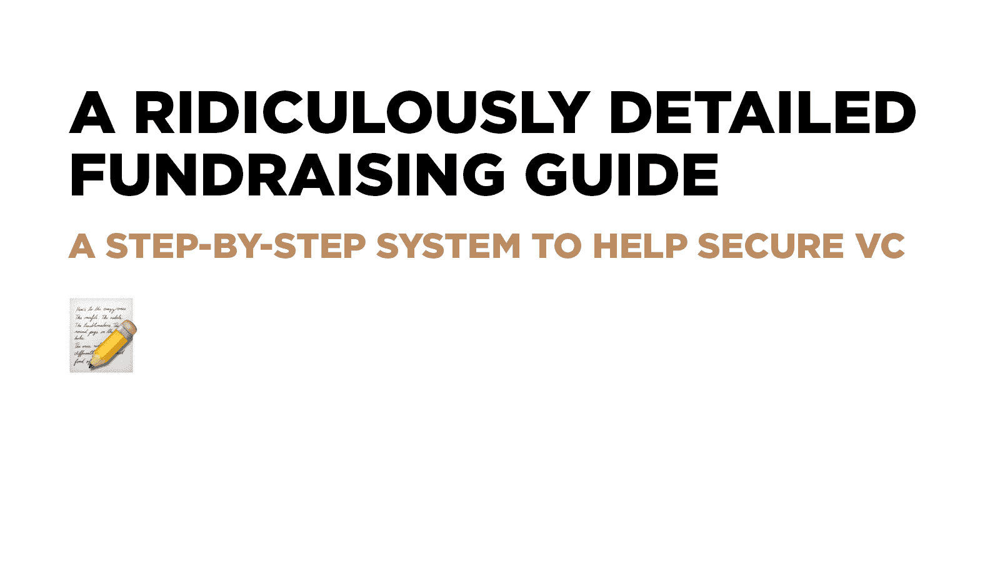
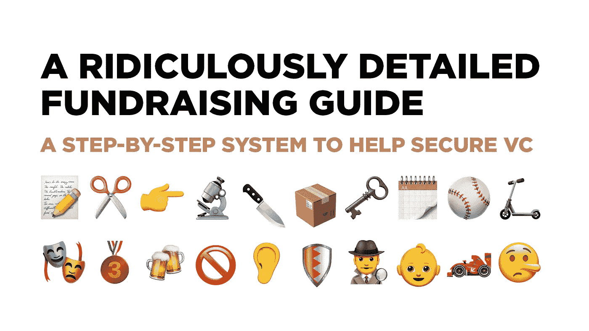

# 详细得离谱的筹款指南

> 原文：<https://medium.com/swlh/a-ridiculously-detailed-fundraising-guide-dec6f4f33790>

## 帮助获得风险资本的循序渐进的系统

即使对于实力雄厚的初创公司来说，融资也是一场马拉松，需要 8-12 周几乎不间断的关注。这个过程是惩罚性的，比你想象的还要危险。你需要像比赛一样认真地准备。

做好拒绝的准备。很多。一个有前途的创业公司会因为一个“是”而得到 17 或 18 个“否”这些拒绝通常与问题中的初创企业关系不大，更多的是每家风投公司的特殊背景或担忧。尽管如此，它刺痛。不要泄气。

更糟糕的是，随着不可避免的“通行证”越积越多，压力水平每周都会上升。许多交易以次优的方式完成，仅仅是因为创始人被这一过程压得喘不过气来，有点惊慌失措，想要一了百了。你可以避免这种命运！

关于如何准备一副牌的文章很多，但关于操作过程的技巧却很少。这里有一些想法，特别关注如何在这个征税时期利用你目前的投资者:

## 📝建立一个列表

创建一个 Google 工作表/Airtable。把你想推销的所有公司都放进去。然后退后一步，问问自己，为什么要向这些公司推销？他们在你的阶段做交易吗？在你的空间里？有投资组合冲突吗？找出最适合的伴侣。

## ✂️和你的风投们一起策划这个名单

创始人经常想和名人风投见面。一个天使可能会推动几个朋友的资金，这是不符合逻辑的。把这些从单子上删掉。“不合群”的会议会产生更多的工作，导致额外的压力+更多的拒绝。

## 👉专注于线索

这一点非常重要:不要和没有牵头的公司安排会议。如果你找到一个线索，你将毫无困难地填写一轮。相反，很多不冷不热的兴趣和没有线索会使交易看起来很弱，过程看起来没完没了。

## 🔬专注于这一轮——只有这一轮

你可能会感到压力，或者有机会与更适合未来融资的成长型公司会面。接受介绍，但前提是你要在这轮结束后安排这些会面。

## 🔪再切一刀

“只不过是再开一次会……”你会说每一个不太可能的介绍。乘以十，你会浪费很多时间，招致更多令人沮丧的拒绝。重要的是不要分心或制造不必要的噪音。

## 📦准备介绍包

写一封“可转发”的电子邮件，包括:

*   一个 1-2 段的关于你的创业的笑话
*   关于你的公司的 5-10 个要点:吸引人的数字、新闻剪辑、显著的里程碑
*   deck/Docsend 链接

## 🗝️选择最好的介绍

选择谁来做介绍很重要。你需要在接近目标和声望之间取得平衡。来自成功企业家的介绍比来自风险投资公司的介绍更好。但是你现在的风投是比服务提供商更好的引子。

## 🗓️计划约 10 次会议

按照偏好的顺序分批发送邀请&第一波尝试填满 10 个位置。当你得到潜在投资者的“不”时，送出更多的份额。越多不一定越好——往往越糟，而且会让专注的过程变得困难。

## 🛴填补了时间表

你不希望因为要赶去赴下一个约会而打断一个富有成效的会议。同样，不要因为交通堵塞或之前的会议而迟到，从而给人留下不好的第一印象。

## ⚾️练习你的推销技巧

一部中学版的《欢乐满人间》将排练数周，以打动一群家长。你不会用一个未经实践的推介打动世界上最好的风投。与友好的投资者和顾问就你的推销进行 2-3 次彩排。

## 🎭彩排

认真对待这些练习课。当你走过甲板时，避免“yadda-yaddaing”。让你的风投们给这个项目带来一些新鲜的信息。甚至在连接电脑时练习说话，当然还有处理异议。

## 🥉序列投资者

挑选一些排名最低的投资者，让他们成为你的第一次会议。你的第一个推销对象不应该是你的理想投资者。即使有大量的实践，也没有什么能打败实时反馈。你可能需要开几个会才能同步。

## 🍻采用伙伴系统

印象是主观的，因此至少有两名联合创始人在现场讨论会议反馈会有所帮助。确保你们两人都为推销做出了贡献，你们之间的氛围反映了公司的正能量。

## 🚫接受“异议回应”

有条不紊地解决甲板上的批评。将推板放入你的牌组。如果某个点不适合放在主流程中，就制作一个附录幻灯片。每个异议都应该提供数据，让你更接近“是”

## 👂客观报道

在你做了一些推销之后，再和你现在的风投们开会。利用这个机会重新整理你的资料/重新考虑你的叙述。请记住，尽可能提供客观的报告——你的风投的建议只会和你的叙述一样好。

## 🛡️保护你的团队(和风投)

不可避免的拒绝会改变员工和投资者(甚至你自己)对创业公司的看法。诚实，但是不要让你的团队经历起起落落和血淋淋的细节。保持乐观。即使是最好的公司也会面临大量的拒绝！

## 🕵️‍♂️使用秘密渠道

让你的风投们和你推介的投资者一起报到。你很少会得到直接的反馈，但通常会有一些可操作的见解，风投不会直接与创业者分享。

## 👶培养所有的兴趣

让每一个潜在的投资者都感觉自己是一个贵宾，即使是那些在你名单上最底层的人。最终谁来做这笔交易常常令人惊讶。没有什么比跟踪一个风投，然后在没人感兴趣的时候回来更糟糕的了。

## 🏎️跑到一个条款清单

这是最没帮助的建议，但却是最重要的。一旦你有了一份投资意向书，每个人都要抓紧时间做出决定。如果你感觉到有人接近了，想想你需要做什么来完成交易。然而…

## 🤥永远不要误导…

如果你告诉风投你有投资条款清单，或者口头承诺，而你没有，你可能会破坏信誉和交易的可能性——而且，你更广泛的声誉也会受到重大打击。

有一百万个细微差别和边缘案例，没有一个 tweetstorm 可以让你为筹款的枯竭做好准备。这就是为什么有一致的风投并像准备其他耐力赛一样准备非常重要。

*管理合伙人* [*埃里克佩利*](https://twitter.com/epaley) *最近分享了这个作为*[*tweet storm*](https://twitter.com/epaley/status/1112839094462267402)*。为了您的方便，我们收集了这些推文作为帖子。请分享给你认识的准备投风投的创业者！*

## 这篇文章发表在 [The Startup](https://medium.com/swlh) 上，这是 Medium 最大的创业刊物，拥有+445，678 名读者。

## 在这里订阅接收[我们的头条新闻](https://growthsupply.com/the-startup-newsletter/)。

