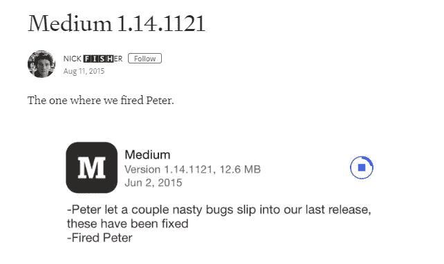
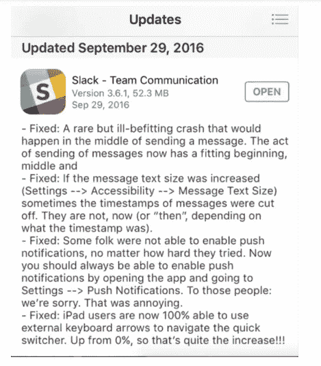
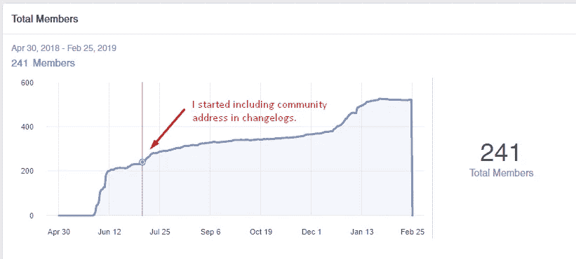
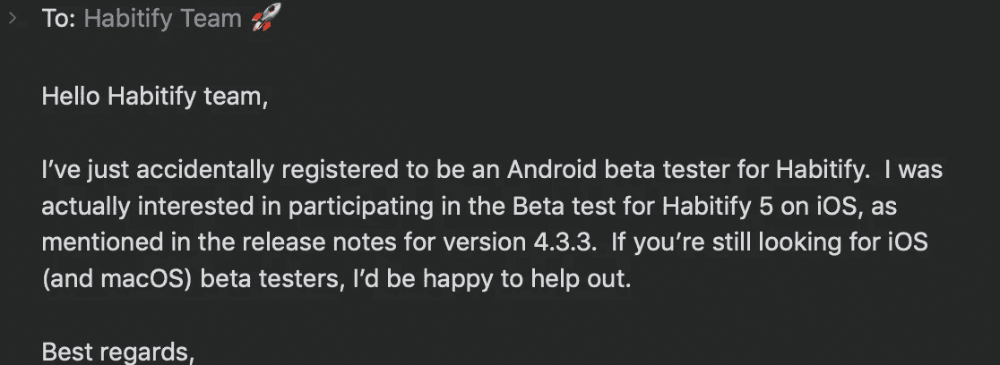
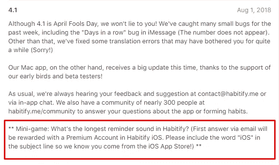
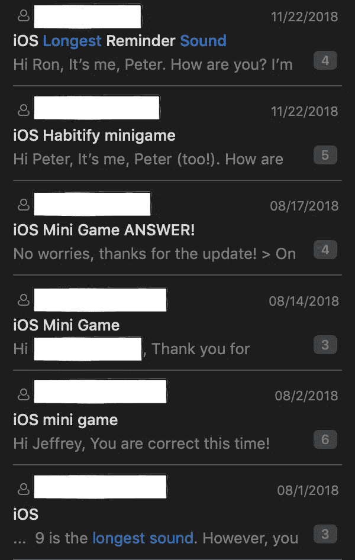
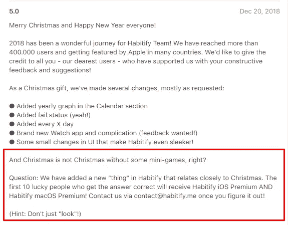
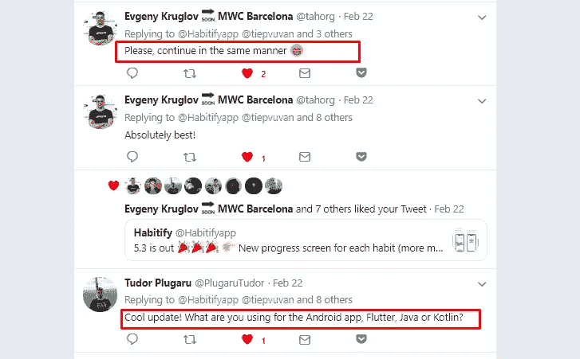

# 一个简单得可笑的方法来增加你的应用程序的用户参与度。

> 原文：<https://medium.com/swlh/a-ridiculously-simple-way-to-increase-user-engagement-for-your-app-fad6a6e75a4d>

有没有想过使用永远无聊的变更日志？我做到了。成功了。

“谁读过这些？”

这是我在做第一个应用的时候对自己的想法。

对我来说，i̶s̶变更日志只不过是我能在伸手可及的范围内找到的任何产品标签上令人生厌的小描述性文字。

“那我为什么要花时间在它身上呢？”

以下是大人物对我的回答:

Medium’s release note was so popular it was covered by [CNBC](https://www.cnbc.com/2015/06/18/is-this-the-best-running-app-store-joke-of-all-time.html)

The second sentence from Slack’s changelog was intentionally left unfinished lol!

为什么才华横溢的内容作者会在一篇小小的新闻稿上花费数小时？甚至他们[喝啤酒，喝醉](https://www.theverge.com/2016/2/10/10938420/medium-release-notes-drinking)只是为了得到像[凯西·牛顿](https://medium.com/u/b6e05447f2cf?source=post_page-----fad6a6e75a4d--------------------------------)一样的想法的火花？

因为，我的朋友，人们会看新闻稿的。他们对变更日志也是如此。

让我告诉你我的故事，变更日志改变了我与用户互动的方式。

—

# 变更日志给我的社区带来了用户和热情的测试者

用户阅读变更日志的一个具体证据是他们如何与提供的信息交互。

对我来说，是变更日志让人们不费吹灰之力就来到了我的脸书社区。

从 2018 年 7 月 19 日(我在 changelog 上公布社区的那天)到现在，成员从 241**增长到 523** ，增长了近一倍。

做了一些简单的计算，我意识到 changelog 每月给我的社区带来大约 40 个新用户。是啊，听起来很小，但它是一个常数(然而是免费的！)我的社区[流量来源。](https://community.habitify.me)

我付出了什么代价？只需 20 秒就能输入社区地址！

用同样的策略，我用一个 changelog 就获得了大约 15 个新的 beta 测试注册！这里有一个令人敬畏的 Habitify 爱好者的例子:

I often asked myself: “Why do I need beta testing services while I have this?”

# 用户参与度的爆发:迷你游戏。

在第一次获胜后，我决定尝试一下是否能与我的用户更密切地互动。

一些背景:当时，我收到了许多电子邮件，询问我们团队已经发布的功能(给一个习惯添加注释，跳过一个习惯……)

我突然意识到，我还没有很好地沟通应用程序的新变化(甚至是现有的，但无意识地隐藏的功能——我的错)

> 当微软推出“Office Ribbon”时，他们引用了一个统计数据，即他们收到的 87%的新功能请求是针对产品中已经存在的功能的。

所以我决定利用变更日志让用户更多地探索这个应用。开始时相当简单，音乐上也很有趣

15 个人加入了游戏。一点都不差！

我主持过的最受欢迎的迷你游戏是圣诞游戏*(不可否认提示是 gawddarn easy！)*

30 多人参加！真的很疯狂，有多少人对我天真地认为修改日志被忽视的想法嗤之以鼻。

总之，我在变更日志中总共包含了 4 个游戏，给我带来了超过 55 个高度参与的用户(他们后来成为 Habitify 最大的见解和建议来源)。

我所做的，只是在公司四处打听。如果有一个特点是大多数人都答错了*(没错，相信我，我可以说我的公司每场比赛都有超过一半的人失败)，*我会在比赛中问它。很简单。

***

# 继续尝试一种新的变更日志和一些早期的教训

所以当我厌倦了传统的新闻发布，我决定带来一些新的空气。

在[艾伦·吴的帮助下。](https://medium.com/u/3bf601090fda?source=post_page-----fad6a6e75a4d--------------------------------)我们在一个关于我的故事中加入了这个小游戏

发布已经一周了，只有一个人在玩这个游戏(悲伤)，尽管这个更新在 Twitter 上引起了一些关注…

我最初的两个假设是:

这个故事太长了，人们甚至懒得看完。(虽然我开始觉得这是无效的，因为我的 Android changelog——限制在 500 个字符以内——非常短，但仍然没有人关心)

这个奖品吸引力不够。我会用“同样的方式”再试一次(引用[叶夫根尼·克鲁格洛夫](https://medium.com/u/5d84afbb0549?source=post_page-----fad6a6e75a4d--------------------------------))，但是会有更大的奖励(嘿，球员们，听好了！)

如果你想知道这个实验的结果(还有更多)，请在评论中告诉我或者通过@tiepvuvan 给我发 DM！

— — — —

## “一个简单得可笑的方法来增加你的应用程序的用户参与度”是我在做了 5 年独立开发人员后学到的一系列无尽经验中的第 3 篇，从产品开发、市场营销、团队管理到客户管理。

## 如果你认为我的故事对你有用，你可以多鼓掌一次、两次或四十次👏👏👏帮助其他人更容易地找到这个:D

## 这篇文章发表在 [The Startup](https://medium.com/swlh) 上，这是 Medium 最大的创业刊物，拥有+430，678 名读者。

## 在这里订阅接收[我们的头条新闻](https://growthsupply.com/the-startup-newsletter/)。

