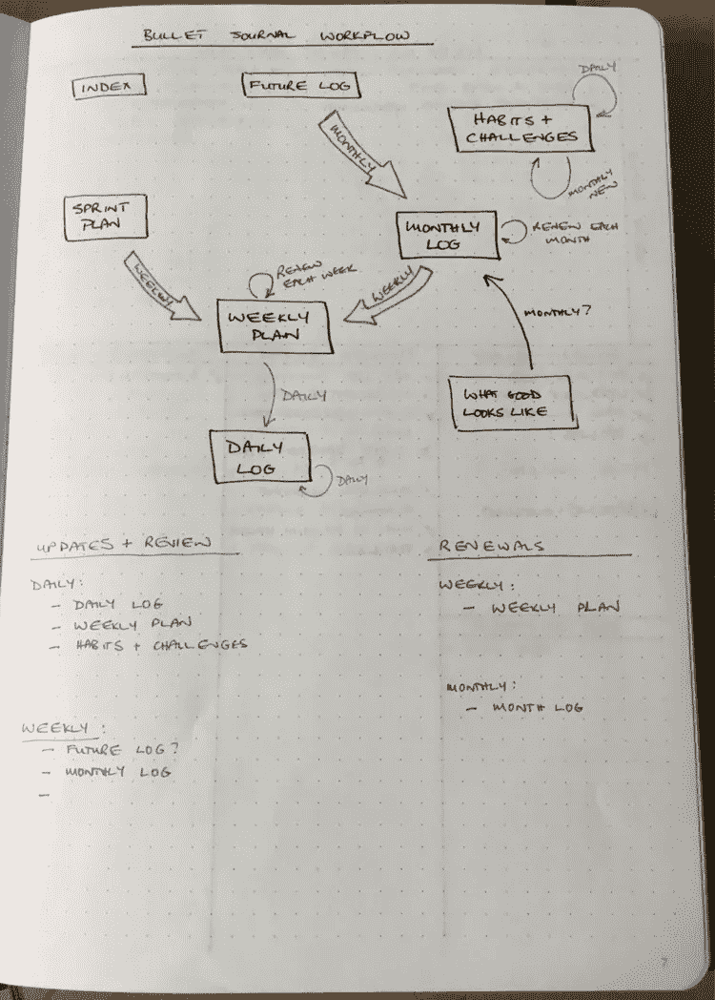
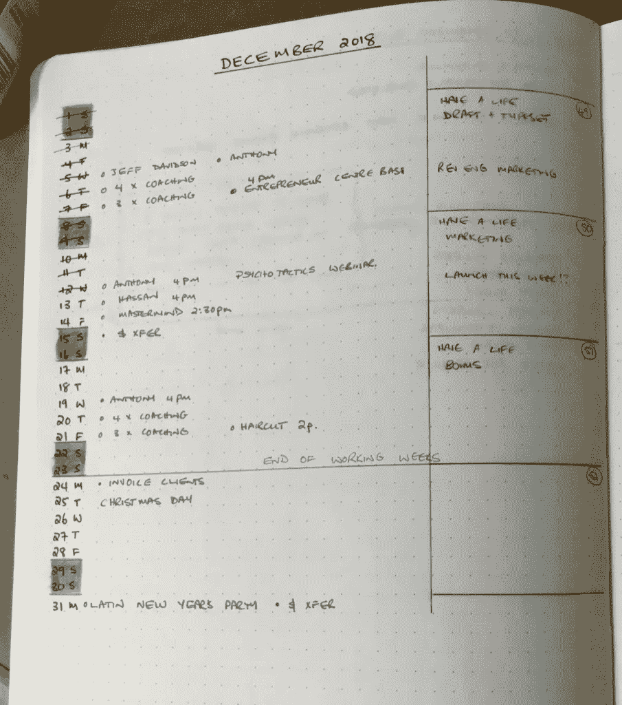
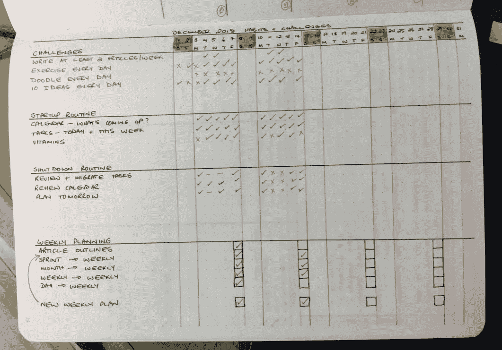

# 子弹日记的路线图

> 原文：<https://medium.com/swlh/a-roadmap-for-your-bullet-journal-3e603633111d>

Photo by [Aaron Burden](https://unsplash.com/photos/LNwn_A9RGHo?utm_source=unsplash&utm_medium=referral&utm_content=creditCopyText) on [Unsplash](https://unsplash.com/search/photos/journal?utm_source=unsplash&utm_medium=referral&utm_content=creditCopyText)

2016 年，我们在自助产品上花费了 190 亿美元。从年度计划到完成任务，再到控制压力，不胜枚举。

最有前途的新进入者之一是子弹杂志。

子弹日志是赖德·卡罗尔发明的一种日志方法。在与注意力缺失症的斗争中长大，他开始用一个简短的日记来记录他的想法、任务和项目。当其他人看到他在做什么时，他被鼓励向他们展示如何使用他的方法。这最终导致他出版了他的书《子弹记日志》,并与 Leuchtturm(一个文具品牌)合作开发了一种专门为子弹记日志设计的日志。

几个月前，我开始使用 Bullet Journalling，这是我对更有效率的永无止境的追求。到目前为止，结果非常有希望——但是我遇到了一个问题。

# 什么是项目符号日志？

Bullet Journalling 是一种高度可定制的、极简的日志记录方式。

有些人使用子弹日记法来记录传统的“亲爱的日记”，但它的主要吸引力在于你可以用它来记录你的目标、任务、要做的事情清单(例如，要读的书或要调查的想法)。

Ryder 的网站上有一些关于如何使用 Bullet Journalling 的非常清晰的视频和教程，点击这里查看。简而言之，该方法工作如下:

*   笔记本(任何笔记本)都可以。有些笔记本比其他的好；例如，页码有助于记录物品的位置。
*   您从一组核心*集合*——一组相关信息开始。核心集合包括索引、未来日志(用于记录未来发生的事情)、月度日志(用于记录当月发生的事情)和每日日志。
*   之后，您可以创建自己的收藏。我对一年中的每一周都有周计划，对更大的项目有冲刺计划。
*   每日日志和每月日志用于记录新任务、新想法和一天中发生的事情。项目符号日志不是长格式的条目，而是使用一组项目符号(点、圈和破折号)来表示你所记录的事物的类型。
*   子弹日志的一个关键概念是*将*任务迁移到集合或未来日期。这有助于确保你不会错过任何东西。

除此之外，我鼓励你去看看[子弹日志网站](https://bulletjournal.com/)上的教程。

# 子弹日志的优势

我一生都在研究生产力，我已经调查、测试和使用了几乎所有的系统。凭借我的软件背景，我甚至创建了自己的任务管理系统，最近我一直在使用我的日历、任务管理系统(东西)和其他零碎东西的组合来跟踪我的工作。

我目前所有的(即将过时的)系统都是电子的，我经历过的最大问题是，一旦它在某个地方的电子系统中，东西就会从你眼前消失。在某些方面这是好的，在其他方面则是坏的。

赖德将子弹日志描述为伪装成组织的头脑发热。每天、每周或每月结束时，记录纸质日志、手动写下东西并迁移它们的过程会让它们重新引起你的注意。这迫使你留意你盘子里有什么；你承诺要做的事情和不久的将来会发生的事情。

这个手动过程已经帮助我更好地了解我每天在做什么，以及我应该关注的地方，我可以看到这成为我生活方式的一个永久部分。

# 极端定制化的问题

虽然有关于如何使用 Bullet Journalling 的指导原则，但该系统具有无限的灵活性和可定制性。你可以根据自己的需要不断设计，添加产品系列(我刚刚在日记中添加了一系列产品创意)。

但这种极度的灵活性和定制化可能会成为一个问题。

为了让你的子弹日志保持最新，确保你不会错过任何东西，你必须定期*将*任务、事件或提醒转移到第二天、下周或未来日志。您添加的集合越多，您错过在适当的时间检查集合以查看是否有需要迁移的内容的机会就越大。

为了克服这个问题，我为我的子弹日记开发了一个可视化路线图。

# 如何创建你的子弹日志系统的路线图

我有一些收藏品需要定期检查。它们包括:

*   我的未来日志(今年剩余时间发生的事情)；
*   我的每月日志(当月发生的事情)；
*   一个周计划(这周我需要完成的事情)；
*   我的冲刺计划(重大项目的计划)；和
*   我的日志。

这些集合中的每一个都需要定期检查，以确保我将任务迁移到适当的位置。如果我做对了，任务或项目总是会出现在正确的地方(通常是周计划)，我不会错过任何重要的事情。

为了跟踪什么时候需要迁移，我创建了一个可视化的路线图。它看起来是这样的:

使用这个路线图，我可以看到我需要每月检查一次未来日志，并将未来日志中的内容迁移到每月日志中。每周，我都要将月日志中的东西转移到周计划中，并将任务从当前的 sprint 计划转移到周计划中。每天我都把任务从我的日志转移到下一天、下一周或未来的日志中。

我使用这个路线图在我的每月日志中创建一个清单——这样我就不会错过在适当的时间迁移任何东西(稍后会详细介绍)。

# 创建您自己的路线图

创建您自己的路线图是一个简单的四步流程:

1.  写下你可能需要定期查阅的所有收藏。
2.  画箭头来显示需要如何将东西从一个集合迁移到另一个集合(例如，从月日志迁移到周计划)。
3.  标记箭头以显示何时需要迁移任务(每天、每周或每月)。
4.  创建一个清单，确保您在正确的时间进行正确的迁移。

这听起来可能很复杂，但事实并非如此——一旦你开始，你会很快发现这是多么简单。你可能要画几次图才能把它画得恰到好处。

唯一需要多解释一点的是如何确保在正确的时间进行正确的迁移。

# 跟踪何时需要发生什么

我的每月日志由两部分组成；每月日志和*每月习惯和挑战跟踪*。

我的每月日志与项目符号日志方法中描述的每月日志非常相似——如下所示:

我的*月度习惯和挑战*跟踪器是我自己的发明(但肯定不是独一无二的)。它帮助我记录我想要养成的习惯、我为自己设定的挑战、我每天的启动和关闭程序以及我的每周计划清单。

它看起来是这样的:

正如你所看到的，我在挑战每天涂鸦方面做得不太好(我想展示我自己的信息产品，这是我如何挑战自己的——我必须找到一种方法来实现这一点)。

重要的一点是在页面的底部，在那里我记录了我每周需要做的所有迁移。比如我看到我需要把任务从我的冲刺计划迁移到下一个周计划；从这周到下周的计划，以此类推。

这就是我如何记录每周结束时需要做的事情。我可以添加发生在月末的任务；目前，我实际上使用我的视觉路线图来确保我不会错过任何东西。

# 摘要

子弹日记迫使我更加注意我生活中正在发生的事情。我已经看到了更冷静、更有条理和更好地跟踪我需要做的事情的好处，我的产出已经在提高。

创建我自己的定制收藏帮助我把我的子弹日记变成了我自己的，但是如果我不跟踪什么时候需要发生什么，那就会产生一个潜在的问题。

视觉路线图解决了这个问题，我可以看到子弹日志成为我生活中永久的一部分。

如果你没有看过 Bullet Journalling，我建议你试一试。创造更多的平静和组织从来都不是一件坏事。

# 行动呼吁

使用子弹日记是我安排生活的一部分，其他部分在我的 2019 年生活指南中有所描述。[点击这里查看](https://britewrx.com/diy-2/have-a-life/)。

祝你新年快乐！

*原载于 2019 年 1 月 21 日*[*【blog.britewrx.com*](https://blog.britewrx.com/a-roadmap-for-your-bullet-journal/)*。*

## 这篇文章发表在 [The Startup](https://medium.com/swlh) 上，这是 Medium 最大的创业刊物，拥有+414，678 名读者。

## 在此订阅接收[我们的头条新闻](http://growthsupply.com/the-startup-newsletter/)。

