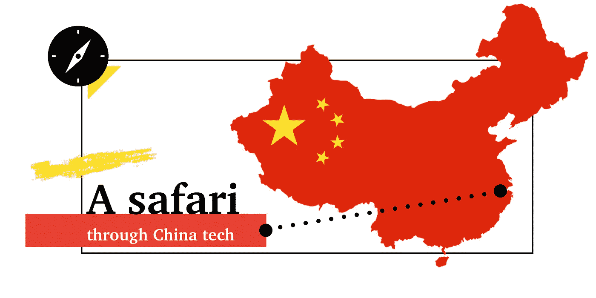

# 中国科技之旅:关于一只猫、一只河马和真正奇妙的盛宴

> 原文：<https://medium.com/swlh/a-safari-through-china-tech-about-a-cat-a-hippo-and-truly-fantastic-feasts-a4f3149e4f4d>

我是一个科技爱好者。我被中国迷住了。我喜欢探索。于是，我收拾好行李，登上了飞往杭州的下一班飞机，开始了为期两周半的“中国科技之旅”。

在这篇文章中，我想简单地与你分享我探险中一些最令人震惊的发现和经历。把这当成一次浓缩的旅行…