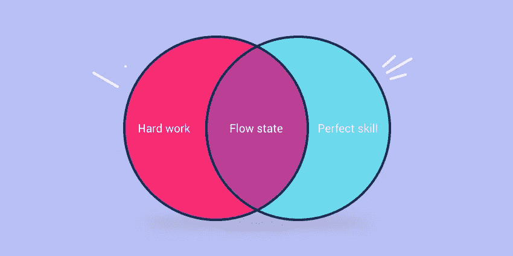

# 一篇短文，开始行动，结束拖延

> 原文：<https://medium.com/swlh/a-short-essay-to-get-you-to-start-doing-and-end-procrastination-e475360df9e5>

A not totally accurate image describing the topic.

# 我今天不想去

我今天醒来去了健身房。之后，在我去办公室的路上，我感觉到自己不想开始工作的冲动。我内心的声音一直想说服我先看一些视频，或者只是做一些其他的事情。