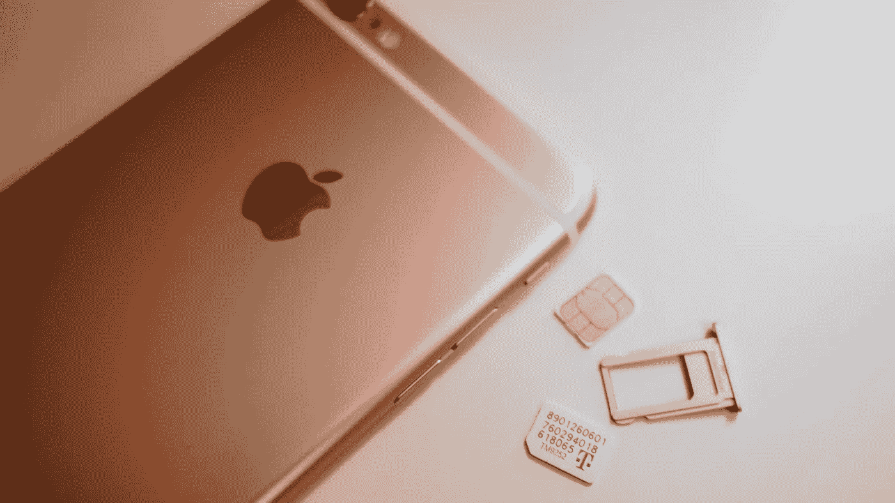

# SIM 卡互换欺诈可能会给你留下数百万美元的债务和被摧毁的信用评分

> 原文：<https://medium.com/swlh/a-sim-swap-fraud-can-leave-you-with-thousands-of-dollars-in-debt-and-a-destroyed-credit-score-ccc3c1cfc64b>

[SIM 卡互换欺诈](https://www.digitaltrends.com/mobile/sim-swap-fraud-explained/)并不新鲜。我们已经看到人们因此损失了数百万，最近，青少年黑客在加州完成了一桩[价值 3500 万美元的 sim 卡交换盗窃案](https://www.ccn.com/teen-hackers-pinch-35-million-in-california-sim-scam-crypto/)。

然而，即使在如此多的高调盗窃之后，银行在做什么来保护我们呢？